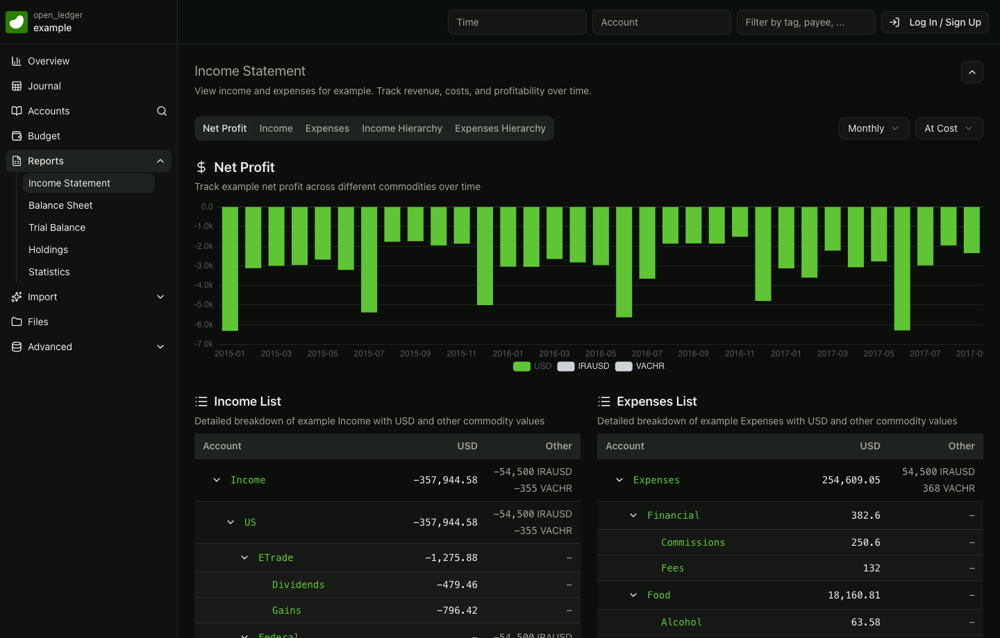
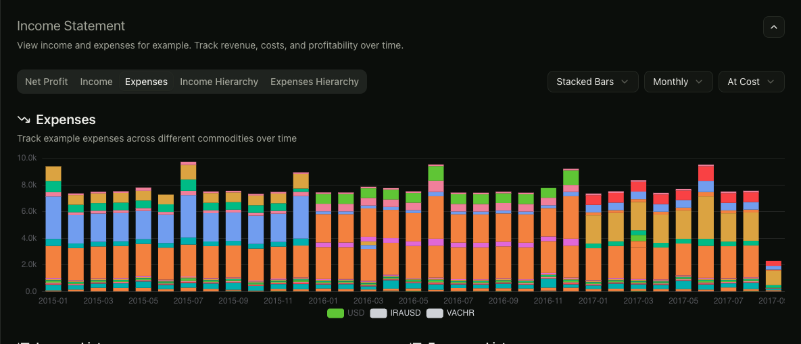
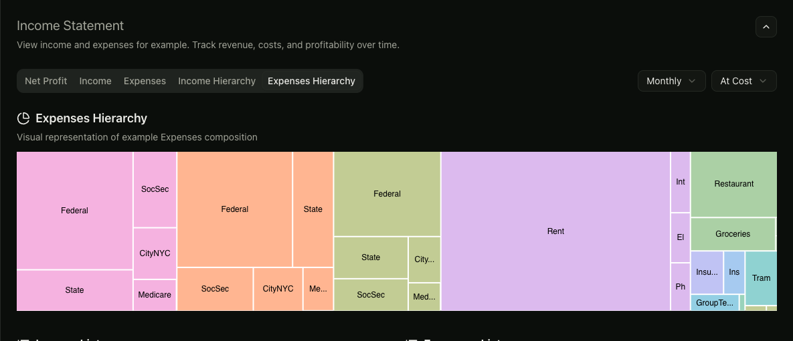
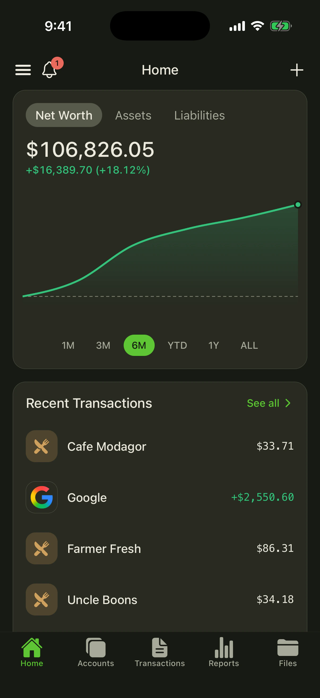
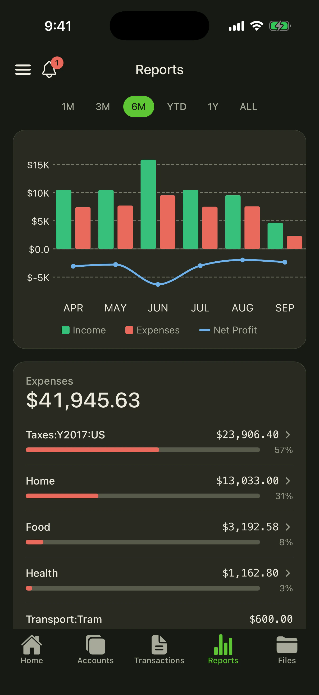
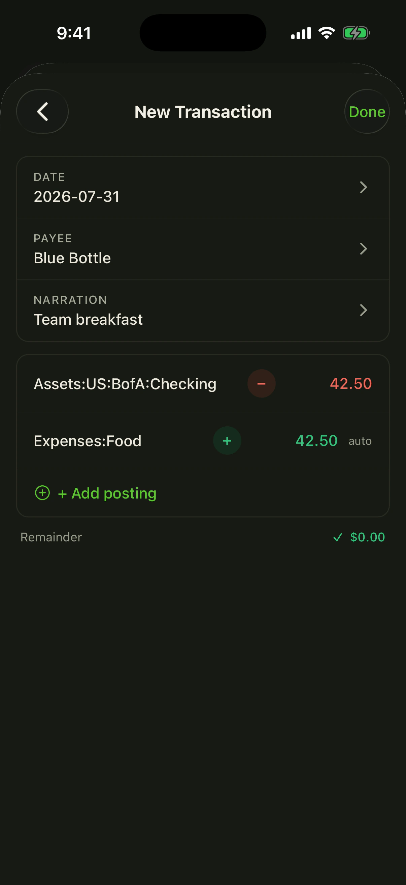

<p align="center">
  <a href="https://beancount.io/?utm_source=github.com&utm_medium=readme&utm_campaign=oss">
    
  </a>
</p>

<h1 align="center">Beancount.io</h1>

<p align="center">
  <strong>Plain-text accounting, from every surface you work in.</strong>
  <br>
  Open-source web and mobile clients, a Python CLI and reporting library, and skills for coding agents.
</p>

<p align="center">
  <a href="https://github.com/bex-co/beancount-io"><strong>⭐ Star on GitHub</strong></a>
  ·
  <a href="https://beancount.io/">Web app</a>
  ·
  <a href="#mobile-apps">Mobile apps</a>
  ·
  <a href="#choose-your-entry-point">Start building</a>
  ·
  <a href="./CONTRIBUTING.md">Contribute</a>
  ·
  <a href="./.pm/README.md">Roadmap</a>
  ·
  <a href="https://github.com/bex-co/beancount-io/issues">Issues</a>
</p>

<p align="center">
  <a href="https://github.com/bex-co/beancount-io"></a>
  <a href="https://github.com/bex-co/beancount-io/actions/workflows/ci.yml"></a>
  <a href="https://github.com/bex-co/beancount-io/actions/workflows/ci-dashboard.yml"></a>
  <a href="https://github.com/bex-co/beancount-io/actions/workflows/ci-cli.yml"></a>
  <a href="https://github.com/bex-co/beancount-io/actions/workflows/secret-scan.yml"></a>
  <a href="./LICENSE"></a>
</p>

<p align="center">
  <a href="https://beancount.io/ledger/open_ledger/example/income-statement">
    
  </a>
</p>

<p align="center">
  <sub>Turn a plain-text ledger into reports you can explore — <a href="https://beancount.io/ledger/open_ledger/example/income-statement">open the live example</a>.</sub>
</p>

<p align="center">
  <a href="https://beancount.io/ledger/open_ledger/example/income-statement"></a>
  <a href="https://beancount.io/ledger/open_ledger/example/income-statement"></a>
</p>

Beancount.io is a developer-friendly workspace for [Beancount](https://beancount.github.io/docs/) ledgers. Your books remain readable plain text while the surrounding tools add polished reports, transaction entry, Git-backed collaboration, automation, and access from the browser, phone, terminal, or a coding agent.

## Mobile apps

Review your finances, add transactions, scan receipts, and edit ledger files from the native Beancount client. The same open ledger remains available from the web, terminal, Python, and agent workflows.

<p align="center">
  <a href="./mobile/README.md"></a>
  <a href="./mobile/README.md"></a>
  <a href="./mobile/README.md"></a>
</p>

<p align="center">
  <a href="https://apps.apple.com/us/app/beancount/id1527950512"></a>
  &nbsp;
  <a href="https://play.google.com/store/apps/details?id=io.beancount.android"></a>
</p>

<p align="center"><sub><a href="./mobile/README.md">Explore the mobile product tour</a> or run the Expo app locally.</sub></p>

## Why developers build with it

- **Open, inspectable data** — ledgers are text files that work with Git, scripts, editors, and the wider Beancount ecosystem.
- **Useful at every layer** — use the finished interfaces, automate local `.bean` files from Python, or build new workflows on the parsing and reporting library.
- **Modern, typed stacks** — React 19, React Native, TypeScript, GraphQL, Python 3.12, strict type checking, and package-scoped CI.
- **Agent-ready workflows** — the CLI and reusable skills give coding agents structured ways to create, validate, query, and update ledgers.
- **MIT licensed** — clients, developer tools, and libraries can be studied, adapted, and extended.

## What is here today

| Package | Status | What you can build with it |
| --- | --- | --- |
| [`dashboard/`](./dashboard) | Active web client | Ledgers, journal, reports, Monaco editor, imports, collaboration, and an AI assistant. React 19 + TanStack Start + Apollo. |
| [`mobile/`](./mobile) | Active iOS & Android client | Native transaction entry, account views, receipt capture, ledger editing, light/dark themes, and 13 locales. Expo + React Native + Apollo. |
| [`cli/`](./cli) | `0.1.0` | Read and write directives, check and format files, run BQL and reports, manage remote ledgers, or chat with a local-ledger agent. Python + Typer. |
| [`fava-slim/`](./fava-slim) | `0.1.0` | Load and filter ledgers, build account trees, query data, and generate financial statements without the Fava web UI. Typed Python. |
| [`skills/`](./skills) | Active skills | The agent-native accounting loop: scaffold a ledger, import bank exports with dedup, author tested beangulp importers, reconcile against statements, migrate from Mint/Monarch/QuickBooks, query your finances in plain language, run a month-end close, and record options trades — all confirm-gated and `bean-check`-verified. |

The dashboard and mobile app are clients for the hosted Beancount.io API. The **backend** behind that API will be open-sourced soon. The CLI, `fava-slim`, and ledger skills also support local-first workflows that do not require the hosted service.

## Choose your entry point

There is no root package to install. Each package owns its dependencies and checks.

### Web dashboard

Requires Node.js 22, Yarn 4 through Corepack, and a Beancount.io API endpoint.

```zsh
cd dashboard
corepack enable
yarn install --immutable
cp .env.example .env
yarn dev
```

The app runs at `http://localhost:5173`. See the [dashboard setup guide](./dashboard/README.md) for environment variables and architecture.

### Mobile app

Requires Node.js 20.19.4 or newer and Yarn Classic.

```zsh
cd mobile
yarn install
yarn start
```

Expo will guide you to iOS, Android, or a connected device. See the [mobile development guide](./mobile/README.md) for the full workflow.

### CLI and Python tooling

Requires Python 3.12 and [uv](https://docs.astral.sh/uv/).

```zsh
cd cli
uv sync --all-groups
uv run beancount-cli --help
```

The [CLI reference](./cli/docs/USAGE.md) covers local reads and writes, validation, formatting, queries, reports, authentication, and ledger management. Library contributors can start independently in [`fava-slim/`](./fava-slim).

## Quality bar

Every active package has path-filtered CI so unrelated changes stay fast:

| Package | Run before opening a PR |
| --- | --- |
| Dashboard | `cd dashboard && yarn format:check && yarn lint && yarn test && yarn build` |
| Mobile | `cd mobile && yarn lint && yarn typecheck && yarn test:unit` |
| CLI | `cd cli && make check-all` |
| fava-slim | `cd fava-slim && make check-all` |

A repository-wide secret scan also gates every push and pull request.

## Contributing

Contributions are welcome across product UI, accounting workflows, accessibility, translations, tests, Python tooling, and agent skills. Start with the [contributing guide](./CONTRIBUTING.md), browse [open issues](https://github.com/bex-co/beancount-io/issues) and the public [adoption roadmap](./.pm/README.md), and keep changes focused on one package when possible.

If Beancount.io is the kind of open, programmable finance software you want to see more of, [star the repository](https://github.com/bex-co/beancount-io) and help more developers find it.

## Community

- Website: [beancount.io](https://beancount.io/)
- Chat: [Telegram](https://t.me/beancount)
- Mobile: [App Store](https://apps.apple.com/us/app/beancount/id1527950512) · [Google Play](https://play.google.com/store/apps/details?id=io.beancount.android)

## License

[MIT](./LICENSE) © Beancount.io
