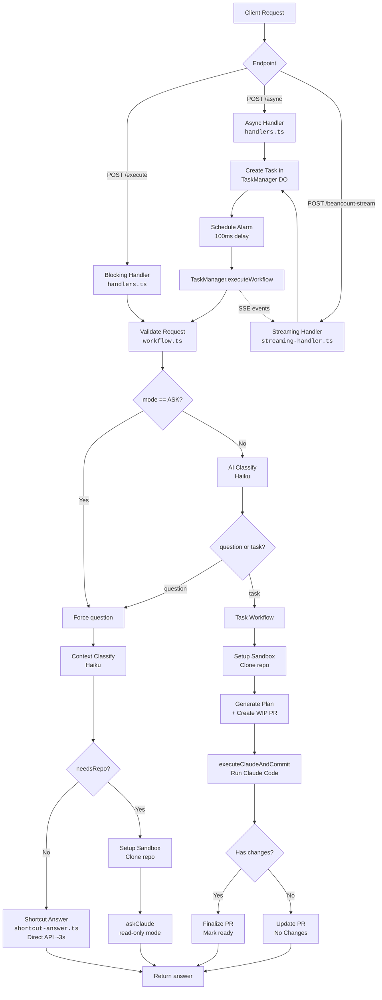

# Architecture: Core Request Flow

Claude Code Sandbox is a Cloudflare Workers service that receives natural-language requests, classifies them as **questions** or **tasks**, and executes them in isolated sandboxes — optionally creating GitHub/Gitea pull requests for tasks, or answering directly via API for simple questions.

## Request Flow Diagram



## Execution Modes

| Mode | Endpoint | Behavior | Typical Duration |
|------|----------|----------|-----------------|
| **Blocking** | `POST /execute` | Waits for full completion, returns JSON | 30s–5min |
| **Async** | `POST /async` | Returns `taskId` immediately, polls via `GET /status/:id` | instant return; background 30s–5min |
| **Streaming** | `POST /beancount-stream` | Returns SSE stream with real-time progress events | 30s–5min (streamed) |

All three modes execute the same classification and workflow pipeline. Async and streaming use a **Durable Object** (`TaskManager`) with alarms to avoid the 30-second `waitUntil` timeout.

## Classification Pipeline

Requests go through a 2-step classification before execution:

### Step 1: Request Type (question vs task)

| Condition | Result |
|-----------|--------|
| `mode == 'ASK'` | Forced **question** (no AI call) |
| `mode == 'AGENT'` or unset | AI classification via **Haiku** (~1s) |

- **Question**: read-only, no PR created
- **Task**: full PR creation workflow

### Step 2: Context Classification (questions only)

Determines if the question needs repository context:

| Result | Path | Latency |
|--------|------|---------|
| `needsRepo: false` | **Shortcut** — direct Anthropic API call, no sandbox | ~3s |
| `needsRepo: true` | **Full** — clone repo into sandbox, run Claude Code in read-only mode | 30s–2min |

Both classifiers use `claude-3-5-haiku` for speed and cost efficiency. On any classification error, the system defaults conservatively (task / needsRepo=true).

## Key Files

| Component | File | Purpose |
|-----------|------|---------|
| HTTP routing | `src/index.ts` | Hono router, endpoint registration, CORS, auth |
| Blocking handler | `src/handlers.ts` | `handleBlockingRequest()` — synchronous JSON endpoint |
| Async handler | `src/handlers.ts` | `handleAsyncRequest()` — returns taskId, schedules alarm |
| Streaming handler | `src/features/beancount-stream/service/streaming-handler.ts` | SSE entry point, polls TaskManager DO |
| Task manager | `src/task-manager.ts` | Durable Object storing task state, alarm-based workflow |
| Workflow phases | `src/workflow.ts` | `validateRequestData`, `setupSandboxEnvironment`, `generatePlanAndCreatePR`, `executeClaudeAndCommit`, `askClaude`, `finalizePR` |
| Classification | `src/github.ts` | `classifyRequest()`, `classifyQuestionContext()`, PR lifecycle |
| Shortcut answer | `src/shortcut-answer.ts` | Direct API answer bypassing sandbox |
| Sandbox ops | `src/sandbox.ts` | `setupNonRootUser`, `configureGit`, `runClaudeCode`, `commitAndPushChanges` |
| Config | `src/config.ts` | Timeouts, models, heartbeat intervals |
| Types | `src/types.ts` | `SSEEventType`, `TaskState`, `RequestData`, `Env` |

## SSE Event Lifecycle

Streaming and async modes emit these events in order:

```
init → validating → classifying → [classifying_context]
  → shortcut_answering → completed                        (shortcut path)
  → cloning → setting_up → executing → completed          (question path)
  → cloning → setting_up → generating_plan → creating_pr
    → executing → committing → updating_pr → completed    (task path)
```

Error at any stage emits an `error` event. See [`SSE-STREAMING.md`](./SSE-STREAMING.md) for the full event reference.

## Related Documentation

- [SSE-STREAMING.md](./SSE-STREAMING.md) — SSE event types and client integration
- [IMPLEMENTATION-SUMMARY.md](./IMPLEMENTATION-SUMMARY.md) — Historical implementation notes
- [CORS-FIX.md](./CORS-FIX.md) — CORS configuration
- [Root README](../README.md) — API endpoints and project setup
