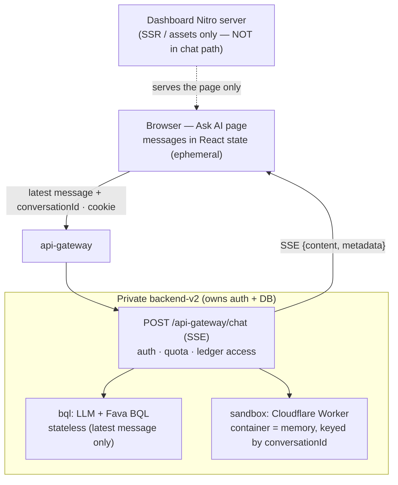
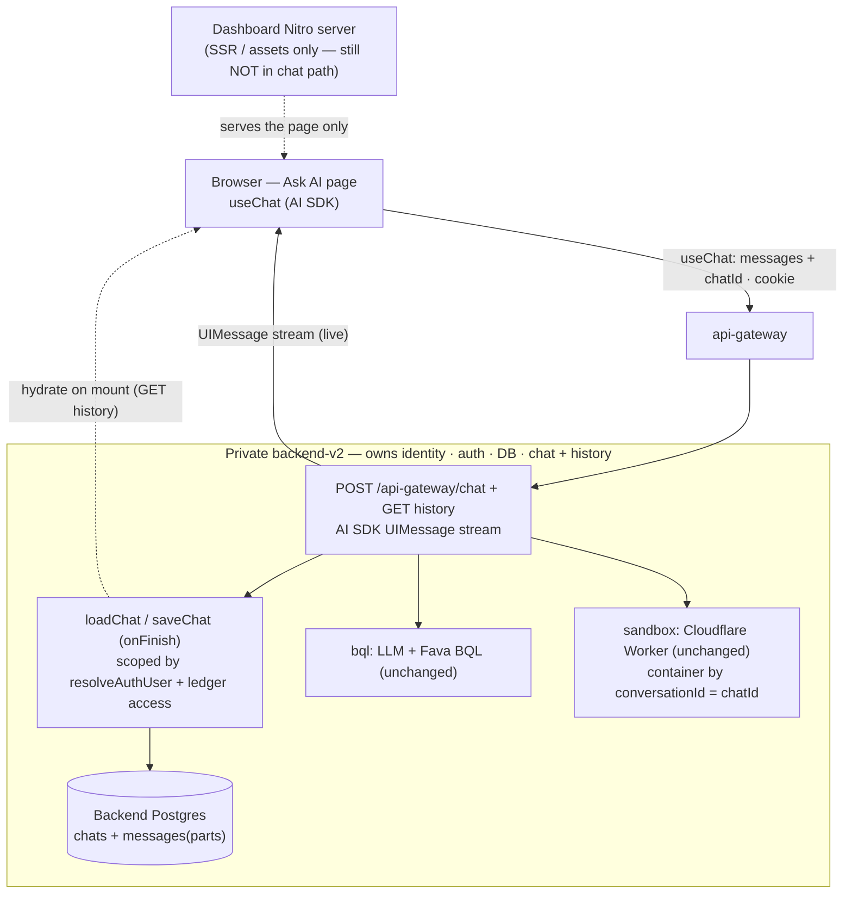
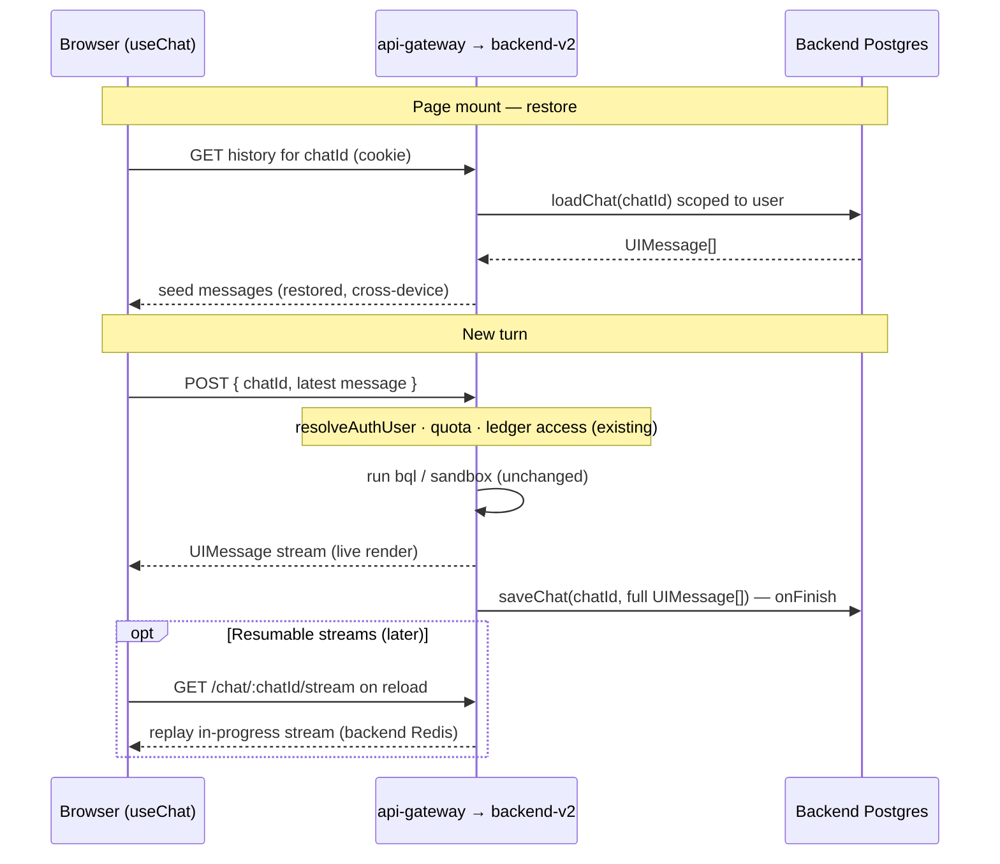
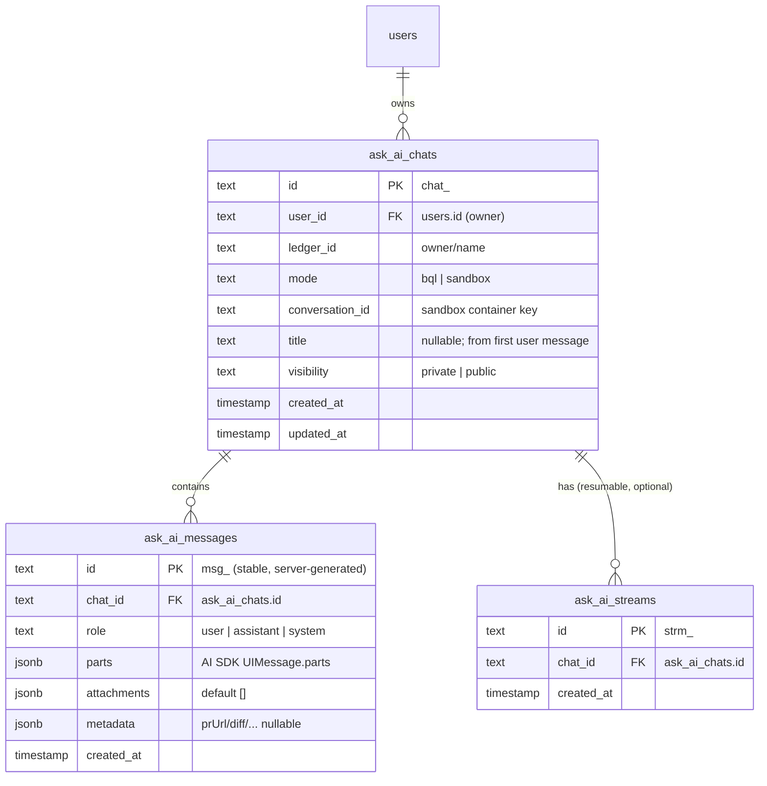

# ADR 001: Ask AI Chat History Persistence

- Status: Proposed
- Date: 2026-08-17
- Decision owners: Backend (persistence + endpoint), Dashboard (client)
- Scope: Persisting the Ask AI conversation in `dashboard/src/features/ai-agent/pages/ask-ai/` — what survives reload/navigation, **which service owns the store**, and which mechanism to reuse.

## Context

The Ask AI chat is w1's flagship agent surface. Today its conversation state is **ephemeral**:

- `messages` is initialized to a single welcome bubble on every mount, and `conversationId` is generated fresh per mount (`ask-ai/index.tsx` — *"A fresh page mount starts a new conversation."*). A reload or navigation wipes the visible history.
- **No durable history exists anywhere.** The client sends only the latest message; the backend `POST /api-gateway/chat` (Koa, in `backend-v2`) runs one of two modes: **bql** — local LLM + Fava BQL tool-calling, *stateless* with no memory of prior turns — or **sandbox** — proxied to a **Cloudflare Worker whose container is the conversation memory, keyed on `conversationId`**. Because the client regenerates `conversationId` on every mount, even the sandbox container is abandoned on reload. Neither mode persists chat history.
- The backend chat route **already owns the trust boundary**: it does `resolveAuthUser` (cookie/session → Beancount user), AI-CFO quota checks, and `assertLedgerAccess`, and it already runs on the service that owns the product **Postgres/Drizzle database** and user identity.
- The chat fetch goes **browser → api-gateway → backend directly** (`${config.apiUrl}chat`, cookie auth); the dashboard's own **Nitro server is not in the chat data path** today (it serves only SSR HTML/assets). The chat is a **hand-rolled `fetch` + SSE reader** and does **not** use the Vercel AI SDK, so we get none of that ecosystem's history/resume machinery for free.

## Decision Drivers

- Restore the conversation across reload/navigation, and enable **durable, cross-device** history — not device-local scratch state.
- **Persistence must live with the service that already owns identity, auth, and the database.** Durable user records do not belong in the presentation/SSR layer.
- Reuse a **standard, maintained history mechanism** instead of a bespoke store.
- Keep the model/brain and its two modes **unchanged**.
- Control **data custody** for financial chat text (prefer our own database over a third party).
- Enable **resumable streaming** as a natural next step.

## Decision

Persist chat history in **backend-v2 — the service that already owns the database, user identity, auth, quota, and the chat route** — using the **Vercel AI SDK ecosystem's history mechanism** (server-side `loadChat`/`saveChat`, the `UIMessage` "parts" shape, stable server IDs, optional resumable streams). The **dashboard stays a pure client**: swap the hand-rolled `fetch`+SSE for **`@ai-sdk/react` `useChat`** pointed at the backend endpoint, and hydrate history from a backend read.

Explicitly **rejected**: the dashboard's Nitro server owning a datastore (it would duplicate the backend's identity/auth/schema/ops and split user data across two stores — a presentation layer should not own durable records), and client-only `localStorage` (device-local, non-authoritative, bespoke).

Reusable ecosystem components (implemented **in the backend**, consumed by the dashboard client):

- **Backend**: the AI SDK message-persistence pattern — `loadChat(chatId)`, `saveChat(chatId, messages)` on the stream's **`onFinish`**, the **`UIMessage`** shape as the stored source of truth, `createIdGenerator()` for stable IDs, and a `UIMessage`-format stream response (`toUIMessageStreamResponse` / `createUIMessageStream`). The store is the **backend's existing Postgres/Drizzle**, using the Chat SDK schema shape (`chats`, `messages` with `parts`). Persistence reuses the route's existing `resolveAuthUser` + `assertLedgerAccess`, so chats are scoped to the owning user + ledger for free.
- **Dashboard (client only)**: `useChat` + `DefaultChatTransport` against the backend endpoint (cookie auth, exactly like today's direct call); initial messages hydrated from a backend history read; a per-ledger **history list** and **New chat** action reusing the Chat SDK history-list pattern.
- **Later**: `vercel/resumable-stream` + `useChat({ resume: true })`, backed by a **backend-side Redis**, to rejoin an in-progress generation after reload.

Ownership / process: the substantive work is **backend work** and lands on the **backend repo's board**; this public dashboard board's scope is the **client `useChat` migration + history read/list** (consistent with inbox note 001's precedent that backend-owned changes are tracked on the backend board). Keeping the store in the backend's own Postgres also **avoids any third-party data-custody surface** for financial chat text.

## Architecture

### Before — current architecture (ephemeral)

The dashboard server is **not** in the chat path; the browser calls the backend directly and nothing is persisted.



Reload / navigation wipes the React state and regenerates `conversationId`, so the sandbox container is abandoned and history is lost. **No store anywhere.**

### After — proposed architecture (backend owns history)

The **backend** gains the AI SDK history mechanism and persists to **its own** database. The dashboard stays a pure client and is **still not in the data path**; the datastore stays where identity and auth already are.



History is durable and cross-device; the store lives in the backend's own Postgres (no new data owner, no third-party). The model, its two modes, and the trust boundary stay exactly where they are.

### After — turn sequence



## Database Schema (backend-v2 Postgres / Drizzle)

New tables in the backend's existing database, following its conventions: `text` primary keys generated in app code with `prefixedNanoidBase58("<prefix>_", 20)` (e.g. `chat_…`, `msg_…`), `text` `user_id` (Beancount user IDs are Mongo ObjectIds/UUIDs — not numeric), `jsonb` for the AI SDK message parts, and `timestamp(...).defaultNow()`.

### Entity relationships



### Drizzle definitions

```ts
// backend-v2: src/features/ai-agent/data/ask-ai-chat-model/schema.ts
import { pgTable, text, jsonb, timestamp, index } from "drizzle-orm/pg-core";
import { users } from "@/features/auth/data/user-model/schema";

// id: prefixedNanoidBase58("chat_" | "msg_" | "strm_", 20)

export const askAiChats = pgTable(
  "ask_ai_chats",
  {
    id: text("id").primaryKey(), // chat_<base58>
    userId: text("user_id")
      .notNull()
      .references(() => users.id, { onDelete: "cascade" }),
    ledgerId: text("ledger_id").notNull(), // "owner/name"
    mode: text("mode").notNull().default("bql"), // "bql" | "sandbox"
    conversationId: text("conversation_id").notNull(), // sandbox container key
    title: text("title"), // derived from first user message
    visibility: text("visibility").notNull().default("private"),
    createdAt: timestamp("created_at").notNull().defaultNow(),
    updatedAt: timestamp("updated_at").notNull().defaultNow(),
  },
  (t) => [
    // List a user's chats within a ledger, most-recent first.
    index("ask_ai_chats_user_ledger_updated_idx").on(
      t.userId,
      t.ledgerId,
      t.updatedAt,
    ),
  ],
);

export const askAiMessages = pgTable(
  "ask_ai_messages",
  {
    id: text("id").primaryKey(), // msg_<base58>, stable + server-generated
    chatId: text("chat_id")
      .notNull()
      .references(() => askAiChats.id, { onDelete: "cascade" }),
    role: text("role").notNull(), // "user" | "assistant" | "system"
    parts: jsonb("parts").notNull(), // AI SDK UIMessage.parts (text/tool/data)
    attachments: jsonb("attachments").notNull().default([]),
    metadata: jsonb("metadata"), // app extras: prUrl, prNumber, diff, isQuestion, stopped, retryable
    createdAt: timestamp("created_at").notNull().defaultNow(),
  },
  (t) => [
    // Load one chat's messages in order.
    index("ask_ai_messages_chat_created_idx").on(t.chatId, t.createdAt),
  ],
);

// Optional — only if Phase 3 (resumable streams) is adopted; pairs with Redis.
export const askAiStreams = pgTable(
  "ask_ai_streams",
  {
    id: text("id").primaryKey(), // strm_<base58>
    chatId: text("chat_id")
      .notNull()
      .references(() => askAiChats.id, { onDelete: "cascade" }),
    createdAt: timestamp("created_at").notNull().defaultNow(),
  },
  (t) => [index("ask_ai_streams_chat_idx").on(t.chatId)],
);
```

### Design notes

- **`parts` is the source of truth.** Store the AI SDK **`UIMessage.parts`** (not the provider `ModelMessage` shape) as `jsonb`. `loadChat(chatId)` selects rows ordered by `(chat_id, created_at)` and rebuilds `UIMessage[]`; `saveChat` (on `onFinish`) inserts the turn's new messages with **stable, server-generated IDs** (`createIdGenerator`) so restored messages never collide. Validate with `validateUIMessages` on load.
- **App-specific extras** (PR URL/number, branchName, diff, isQuestion, stopped, retryable — today's `message.data`) live in `metadata`, or equivalently as typed **data-parts** inside `parts`; either way today's Ask AI features survive the transport migration.
- **Scoping & auth.** Every query filters by `user_id` (from `resolveAuthUser`) and `ledger_id` (from `assertLedgerAccess`) — chats are private to owner + ledger. `visibility` is reserved for a future share/public-chat feature.
- **`conversation_id` vs `id`.** `chats.id` is the durable **history** handle; `conversation_id` is the **sandbox container** key sent to the backend (defaults to `chats.id`), kept separate so a container can expire/recycle without losing chat identity or history. Restored history is authoritative for *display*, best-effort for server *context* (the container may have expired).
- **Ordering.** `(chat_id, created_at)` is indexed for load; ties break by `id`. Add a per-chat `seq integer` only if strict ordering under identical timestamps ever matters.
- **Deletion & retention.** `ON DELETE CASCADE` from `ask_ai_chats` → messages/streams, so "delete my history" deletes chat rows and cascades. An optional retention job can prune on `updated_at`. Backups/replicas must honor deletion.
- **At rest.** Rows live in the backend's own Postgres (encryption at rest per infra). For stronger guarantees on financial text, `pgcrypto` column encryption of `parts`/`metadata` is an option (trade-off: defeats server-side search/analytics).
- **`ask_ai_messages` as an append-only log** keeps writes simple (insert per message) and makes the resumable-stream and multi-part flows natural; the `chats` row's `updated_at` is bumped on each turn for the history list ordering.

## Migration Plan

### Backend-v2 (private repo — the substantive work)
- Add the `ask_ai_chats` / `ask_ai_messages` tables (Drizzle — see [Database Schema](#database-schema-backend-v2-postgres--drizzle)) alongside the existing schema, plus a migration.
- Implement the AI SDK server pattern on the chat feature: stable IDs, a `UIMessage`-format stream response, `saveChat` on `onFinish`, and a **history GET** scoped to the authed user + ledger — reusing the route's existing `resolveAuthUser`, quota, and `assertLedgerAccess`.
- Leave the bql / sandbox handlers and the Cloudflare container behavior unchanged.
- Later: resumable streams via a backend-side Redis + a `streams` table.

### Dashboard (this repo — client only, behind a flag)
- Migrate the Ask AI page from the hand-rolled SSE reader to `useChat` + `DefaultChatTransport` against the backend endpoint; hydrate initial messages from the backend history GET.
- Re-express existing behaviors (stop, retry, suggestion chips, PR/diff/limit) as `UIMessage` parts/metadata.
- Add the per-ledger **history list** + **New chat** surface once the backend list endpoint exists.

## Alternatives Considered

### Dashboard Nitro server owns the datastore (rejected)
The presentation/SSR layer would become a stateful data-owning service — duplicating identity resolution, auth, schema, migrations, backups, and retention that `backend-v2` already provides, and splitting the same user's data (and two auth checks) across two stores. A frontend/BFF should not own durable user records. This is the design this ADR explicitly moves **away** from.

### Dashboard as a thin proxy, backend owns the store (viable interim)
The dashboard Nitro route could wrap the backend SSE as a `UIMessage` stream and call backend history endpoints — keeping the store in the backend but adding a hop and a second service in the path. Acceptable only if the backend cannot emit the `UIMessage` protocol directly; otherwise prefer the client-talks-to-backend form.

### Client-only `localStorage` (rejected)
Device-local, non-authoritative display-only continuity, storage-limited, and a bespoke format we carry forever. Rejected for a durable, server-owned mechanism.

### Vercel Marketplace store (Upstash/Neon) as system of record (rejected)
The clients are host-agnostic and would work, but placing financial chat text on third-party infra adds custody/DPA/subprocessor surface for no compute benefit — and the backend already has Postgres. Allowed only as a backend-side Redis hot/resumable layer, and even then self-hosted is preferred.

### Migrate dashboard hosting to Vercel (`preset: 'vercel'`) — out of scope
A runtime-model shift with no persistence-specific benefit; unrelated to where history is stored.

### Vercel Blob / Global Config (rejected)
Object storage (no querying/TTL) and read-optimized config (slow global writes) — wrong tools for per-user mutable chat data.

## Consequences

### Positive
- **Correct ownership**: history lives with the service that already owns identity, auth, quota, ledger access, and the database — no split-brain, no second data tier.
- **Durable and cross-device**; a real system of record.
- Financial chat text stays in **our own Postgres** — no third-party custody/DPA surface.
- The dashboard stays a **pure client**; the model and its two modes are untouched.
- Reuses a standard ecosystem mechanism (`useChat`, `UIMessage`, `loadChat`/`saveChat`, resumable streams); `UIMessage` is a portable schema.

### Negative
- The substantive work is **backend work** (cross-repo coordination; not landable entirely in this public repo).
- The backend must adopt the AI SDK stream protocol (emit `UIMessage`) — a change to the chat route's response shape, coordinated with the client cutover.
- Client transport rewrite (hand-rolled SSE → `useChat`); existing behaviors re-expressed as parts/metadata.
- More moving parts than a localStorage hack; delivered behind a flag and in phases.

## Open Questions

- Backend endpoint shape: extend `POST /api-gateway/chat` vs. a new versioned route; where the history GET lives.
- `chatId` scheme and its relationship to the sandbox `conversationId` / container lifetime and expiry.
- Which `UIMessage` parts to persist (text only vs. PR URL / diff / tool metadata).
- Retention/TTL and **deletion** ("delete my history" must purge rows and any replicas/backups).
- Whether resumable streams justify a backend Redis for this surface.
- Cross-repo sequencing (backend tables + endpoint before the client cutover; feature-flag both).

## References

Internal:
- `dashboard/src/features/ai-agent/pages/ask-ai/index.tsx` — current ephemeral chat + hand-rolled SSE
- `backend-v2` `src/features/ai-agent/api/chat-route.ts` — the authenticated chat route (bql / sandbox), the natural home for persistence
- `.pm/DO_NOT_DO.md` — backend-owned work is tracked on the backend board

Vercel AI SDK history mechanism:
- https://ai-sdk.dev/docs/ai-sdk-ui/chatbot-message-persistence — `loadChat`/`saveChat`, `onFinish`, `UIMessage`, `createIdGenerator`
- https://ai-sdk.dev/docs/ai-sdk-ui/chatbot-resume-streams — `useChat({ resume: true })`
- https://github.com/vercel/resumable-stream — Redis-backed resumable streams
- https://github.com/vercel/ai-chatbot/blob/main/lib/db/schema.ts — Chat / Message / Stream schema
- https://vercel.com/blog/introducing-chat-sdk — Chat SDK overview

Store / hosting / residency (for the rejected third-party options):
- https://vercel.com/docs/marketplace-storage — Vercel Marketplace storage (Upstash / Neon)
- https://github.com/upstash/redis-js and https://neon.com/docs/serverless/serverless-driver — host-agnostic clients
- https://neon.com/security and https://upstash.com/docs/redis/help/compliance — encryption / residency posture
