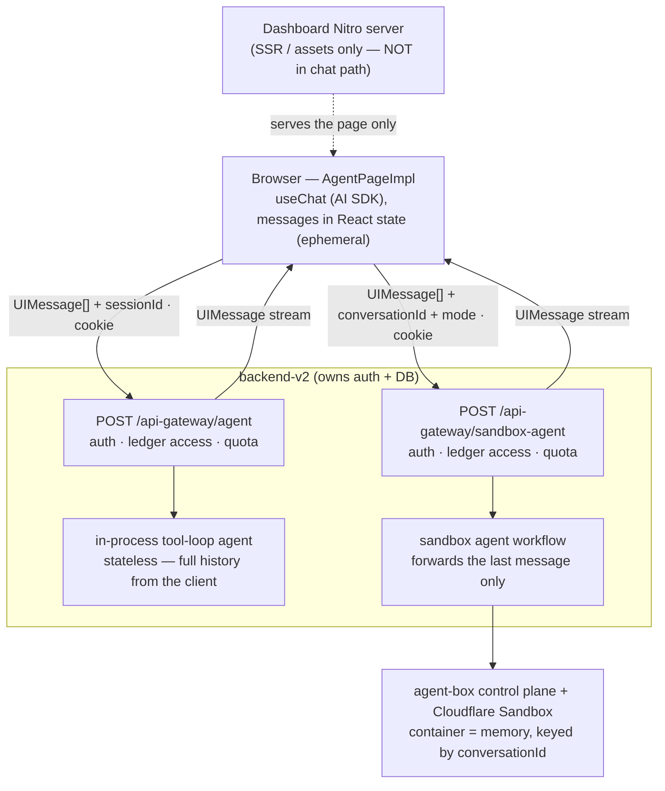
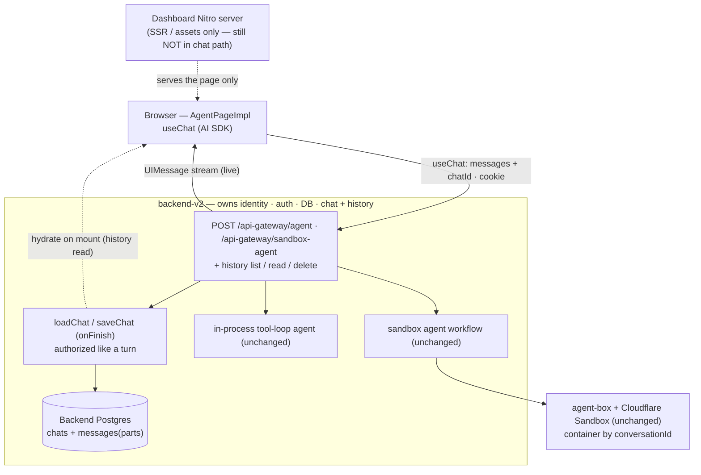
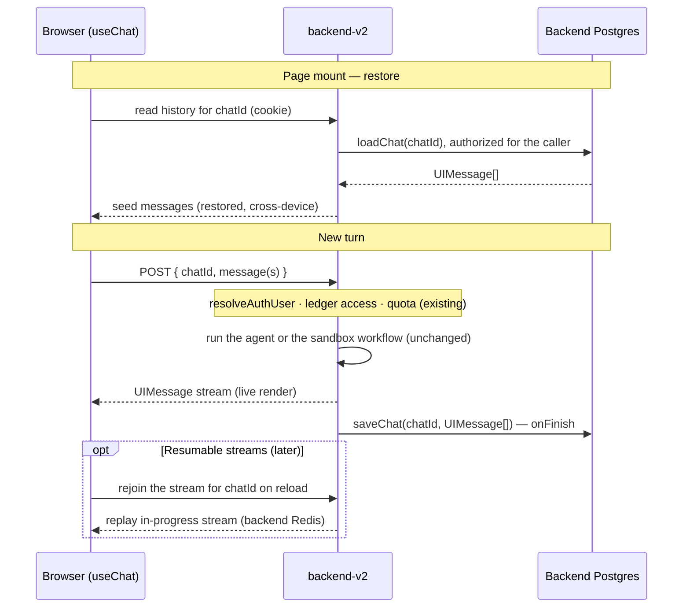
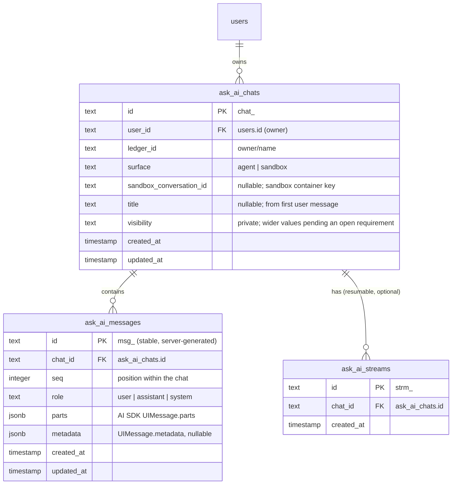

# ADR 001: Ask AI Chat History Persistence

- Status: Proposed
- Date: 2026-08-17
- Decision owners: Backend (persistence + endpoint), Dashboard (client)
- Scope: Persisting the Ask AI conversations of the dashboard's two chat surfaces in `dashboard/src/features/ai-agent/pages/` (`agent/` and `sandbox-agent/`) — what survives reload/navigation, **which service owns the store**, and which mechanism to reuse.

## Context

The dashboard has two Ask AI surfaces. Both render the same component, `AgentPageImpl` in `dashboard/src/features/ai-agent/pages/agent/page.tsx`, which already uses the Vercel AI SDK: **`useChat` + `DefaultChatTransport`** from `@ai-sdk/react` / `ai`, cookie auth (`credentials: "include"`), calling the backend directly at `${config.apiUrl}<route>`. Both backend routes already answer with the AI SDK **`UIMessage` stream**. The protocol half of a history mechanism is therefore in place; the storage half is not.

| | Agent | Sandbox agent |
| --- | --- | --- |
| Dashboard route | `/ledger/:owner/:name/agent` | `/ledger/:owner/:name/ask?mode=sandbox\|agent` (a mode-less `/ask` redirects to `/agent`) |
| Page | `dashboard/src/features/ai-agent/pages/agent/` | `dashboard/src/features/ai-agent/pages/sandbox-agent/` |
| Backend route | `POST /api-gateway/agent` (`backend-cluster/backend-v2/src/features/ai-agent/api/agent-route.ts`) | `POST /api-gateway/sandbox-agent` (`backend-cluster/backend-v2/src/features/ai-agent/api/sandbox-agent-route.ts`) |
| Brain | In-process tool-loop agent (BQL, list/read/edit ledger files, receipt parse + insert), capped at ten steps | Claude Code in a Cloudflare Sandbox, reached through the `backend-cluster/agent-box` control plane |
| What the client sends each turn | The **full `UIMessage[]`** plus `ledgerId` and `sessionId` | The full `UIMessage[]` plus `ledgerId`, `conversationId`, and `mode` |
| What the server uses | The full client-supplied history, converted to model messages; `sessionId` is only logged | **Only the text of the last message**; earlier turns come from the sandbox container |
| Conversation memory | None on the server — the client is the memory | The sandbox container, keyed on `conversationId` (it is also the harness session id) |
| Client identifier | `sessionId` (`aisess_…`), kept in `sessionStorage` under `ai-agent-session` by `dashboard/src/features/ai-agent/hooks/use-agent-session.ts`; survives a reload in the same tab | `conversationId` (`conv_…`), minted in component state on every mount |

Conversation state is **ephemeral** on both:

- `useChat` is seeded with a single welcome bubble on every mount. A reload or navigation wipes the visible history. On the agent surface the `sessionId` survives the reload, but nothing is keyed on it, so it restores nothing.
- On the sandbox surface a reload mints a new `conversationId`, which abandons the container that held the conversation.
- **No durable history exists anywhere.** There are no chat or message tables in backend-v2, no history read, and no history list. The dashboard has no "New chat" action either; `useAgentSession` exposes `startNewSession`, but nothing calls it.
- Both routes **already own the trust boundary**: `resolveAuthUser` (`backend-cluster/backend-v2/src/features/ai-agent/utils/route-guards.ts`) resolves the caller, `resolveAgentAccessMode` (`backend-cluster/backend-v2/src/features/ai-agent/agent-access.ts`) authorizes the ledger and decides read vs. write tools, and the AI-CFO quota is checked before the turn and debited after it. They run on the service that owns the product **Postgres/Drizzle database** and user identity.
- The dashboard's own **Nitro server is not in the chat data path** (it serves only SSR HTML/assets).
- Two things on the agent surface shape what "a stored message" means. Ledger edits and receipt inserts are `needsApproval` tools: the stream ends with a tool part in `approval-requested` state, and the client re-sends the conversation with an approval response (`sendAutomaticallyWhen`), so **an existing assistant message changes after it was first produced**. Attachments travel as `file` parts plus `data-file-upload` parts carrying a temp-asset `objectKey`.

`backend-v2` lives in this monorepo (`backend-cluster/backend-v2`), so the backend and dashboard halves of this work land in one repository and can be tracked on one board. A third client exists: the mobile app's gated-off agent screen speaks the same `/api-gateway/agent` route (`docs/adrs/ADR002-mobile-ai-assistant.md`) and would hydrate from the same history endpoints.

## Decision Drivers

- Restore the conversation across reload/navigation, and enable **durable, cross-device** history — not device-local scratch state.
- **Persistence must live with the service that already owns identity, auth, and the database.** Durable user records do not belong in the presentation/SSR layer.
- Reuse a **standard, maintained history mechanism** instead of a bespoke store.
- Keep the two brains **unchanged**.
- Control **data custody** for financial chat text (prefer our own database over a third party).
- Honor the repository's **REST / GraphQL / MCP parity** rule for the new history capability.
- Enable **resumable streaming** as a natural next step.

## Decision

Persist chat history in **backend-v2 — the service that already owns the database, user identity, auth, quota, and both chat routes** — using the **Vercel AI SDK ecosystem's history mechanism** (server-side `loadChat`/`saveChat`, the `UIMessage` "parts" shape, stable server IDs, optional resumable streams). The **dashboard stays a pure client**: it already runs `useChat` against the backend, so its remaining work is to hydrate from a backend history read and to add a history list.

Explicitly **rejected**: the dashboard's Nitro server owning a datastore (it would duplicate the backend's identity/auth/schema/ops and split user data across two stores — a presentation layer should not own durable records), and client-only `localStorage` (device-local, non-authoritative, bespoke).

Reusable ecosystem components (implemented **in the backend**, consumed by the dashboard client):

- **Backend**: the AI SDK message-persistence pattern — `loadChat(chatId)`, `saveChat(chatId, messages)` on the stream's **`onFinish`**, the **`UIMessage`** shape as the stored source of truth, and `createIdGenerator()` for stable IDs. The store is the **backend's existing Postgres/Drizzle**, using the Chat SDK schema shape (`chats`, `messages` with `parts`). Persistence reuses the routes' existing `resolveAuthUser` + `resolveAgentAccessMode`, so reads and writes are authorized by the same checks as a turn.
- **Dashboard (client only)**: keep `useChat` + `DefaultChatTransport`; send a `chatId` with each turn; hydrate initial messages from a backend history read; add a per-ledger **history list** and a **New chat** action, reusing the Chat SDK history-list pattern.
- **Later**: `vercel/resumable-stream` + `useChat({ resume: true })` to rejoin an in-progress generation after reload. backend-v2 already connects to Redis, so this needs no new datastore.

Keeping the store in the backend's own Postgres also **avoids any third-party data-custody surface** for financial chat text.

This record stays **Proposed**. Nothing below is built, and the [requirements to settle before implementation](#requirements-to-settle-before-implementation) are open product and policy questions that this record does not decide.

## Architecture

### Current architecture (ephemeral)

The dashboard server is **not** in the chat path; the browser calls the backend directly and nothing is persisted.



Reload / navigation wipes the React state. The sandbox surface also regenerates `conversationId`, so its container is abandoned. **No store anywhere.**

### Proposed architecture (backend owns history)

The **backend** gains the AI SDK history mechanism and persists to **its own** database. The dashboard stays a pure client and is **still not in the data path**; the datastore stays where identity and auth already are.



History is durable and cross-device; the store lives in the backend's own Postgres (no new data owner, no third-party). The two brains and the trust boundary stay exactly where they are.

### Proposed turn sequence



## Database Schema (backend-v2 Postgres / Drizzle)

New tables in the backend's existing database, following its conventions: `text` primary keys generated in app code with `prefixedNanoidBase58("<prefix>_", 20)` (e.g. `chat_…`, `msg_…`), `text` `user_id` (Beancount user IDs are Mongo ObjectIds/UUIDs — not numeric), `jsonb` for the AI SDK message parts, and `timestamp(...).defaultNow()`. The shape below is the proposal; columns marked as depending on an open requirement are not final.

### Entity relationships



### Drizzle definitions

```ts
// New file: backend-cluster/backend-v2/src/features/ai-agent/data/ask-ai-chat-model/schema.ts
import {
  pgTable,
  text,
  integer,
  jsonb,
  timestamp,
  index,
  uniqueIndex,
} from "drizzle-orm/pg-core";
import { users } from "@/features/auth/data/user-model/schema";

// id: prefixedNanoidBase58("chat_" | "msg_" | "strm_", 20)

export const askAiChats = pgTable(
  "ask_ai_chats",
  {
    id: text("id").primaryKey(), // chat_<base58>
    userId: text("user_id")
      .notNull()
      .references(() => users.id, { onDelete: "cascade" }),
    ledgerId: text("ledger_id").notNull(), // "owner/name"
    surface: text("surface").notNull(), // "agent" | "sandbox"
    // Sandbox surface only: the container key sent as `conversationId`.
    sandboxConversationId: text("sandbox_conversation_id"),
    title: text("title"), // derived from first user message
    visibility: text("visibility").notNull().default("private"),
    createdAt: timestamp("created_at").notNull().defaultNow(),
    updatedAt: timestamp("updated_at").notNull().defaultNow(),
  },
  (t) => [
    // List a user's chats within a ledger, most-recent first.
    index("ask_ai_chats_user_ledger_updated_idx").on(
      t.userId,
      t.ledgerId,
      t.updatedAt,
    ),
  ],
);

export const askAiMessages = pgTable(
  "ask_ai_messages",
  {
    id: text("id").primaryKey(), // msg_<base58>, stable + server-generated
    chatId: text("chat_id")
      .notNull()
      .references(() => askAiChats.id, { onDelete: "cascade" }),
    seq: integer("seq").notNull(), // position within the chat
    role: text("role").notNull(), // "user" | "assistant" | "system"
    parts: jsonb("parts").notNull(), // AI SDK UIMessage.parts (text/tool/file/data)
    metadata: jsonb("metadata"), // UIMessage.metadata
    createdAt: timestamp("created_at").notNull().defaultNow(),
    updatedAt: timestamp("updated_at").notNull().defaultNow(),
  },
  (t) => [
    // Load one chat's messages in order.
    uniqueIndex("ask_ai_messages_chat_seq_idx").on(t.chatId, t.seq),
  ],
);

// Optional — only if resumable streams are adopted.
export const askAiStreams = pgTable(
  "ask_ai_streams",
  {
    id: text("id").primaryKey(), // strm_<base58>
    chatId: text("chat_id")
      .notNull()
      .references(() => askAiChats.id, { onDelete: "cascade" }),
    createdAt: timestamp("created_at").notNull().defaultNow(),
  },
  (t) => [index("ask_ai_streams_chat_idx").on(t.chatId)],
);
```

### Design notes

- **`parts` is the source of truth.** Store the AI SDK **`UIMessage.parts`** (not the provider `ModelMessage` shape) as `jsonb`. `loadChat(chatId)` selects rows ordered by `(chat_id, seq)` and rebuilds `UIMessage[]`; validate with `validateUIMessages` on load. File parts and `data-file-upload` parts are ordinary parts, so there is no separate attachments column.
- **Messages are upserted, not appended.** On the agent surface an assistant message is not final when first streamed: a tool part moves from `approval-requested` to its result after the user answers, in a later request. `saveChat` therefore upserts by message `id` and bumps `updated_at`; an insert-only log would store the pending state forever. `seq` gives a stable order that does not depend on timestamps.
- **`surface` replaces the old "mode".** A chat belongs to one of the two surfaces for its whole life, because they keep memory differently. On the **agent** surface the stored `UIMessage[]` is the complete conversation and can drive the next turn. On the **sandbox** surface the stored messages are a **display copy**: the container is the working memory, the backend forwards only the latest message text, and a restored chat whose container has gone resumes without the agent's earlier context unless a replay is designed. The sandbox `ask`/`agent` access mode stays a per-request input and is not stored on the chat.
- **`sandbox_conversation_id` vs `id`.** `chats.id` is the durable **history** handle. On the sandbox surface the container key is kept separately so a container can expire or be recycled without losing chat identity or history. On the agent surface the column is null.
- **Scoping & auth.** Every query filters by the caller's `user_id` (from `resolveAuthUser`) and passes the same ledger authorization as a turn (`resolveAgentAccessMode`). As drawn, chats are private to their owner within a ledger; `visibility` is reserved, and whether anything wider is ever allowed is an open requirement below.
- **Deletion.** `ON DELETE CASCADE` from `ask_ai_chats` → messages/streams, and from `users` → chats, so deleting a chat or a user removes the rows. Retention policy and what deletion must reach beyond these tables are open requirements below.
- **At rest.** Rows live in the backend's own Postgres (encryption at rest per infra). For stronger guarantees on financial text, `pgcrypto` column encryption of `parts`/`metadata` is an option (trade-off: defeats server-side search/analytics).

## Migration Plan

Nothing in this plan is started, and it is not scheduled on the `.pm` board. It begins only after the [requirements below](#requirements-to-settle-before-implementation) are settled.

### Already in place

- Both surfaces use `useChat` + `DefaultChatTransport` against the backend, and both routes emit the `UIMessage` stream. The transport migration this record originally planned is done; no response-shape change or client cutover remains.
- Stop, retry, tool activity, approval cards, attachments, and the quota upgrade panel are already expressed as `UIMessage` parts and `useChat` state.

### Backend-v2 (`backend-cluster/backend-v2`)

- Add the `ask_ai_chats` / `ask_ai_messages` tables (Drizzle — see [Database Schema](#database-schema-backend-v2-postgres--drizzle)) with a migration under `backend-cluster/backend-v2/src/drizzle/migrations`.
- Accept a `chatId` on both routes and persist the turn: on the agent route in the handler that pipes the stream (`backend-cluster/backend-v2/src/features/ai-agent/service/agent-handler/self-hosted-agent-handler.ts`), on the sandbox route around the workflow's response stream (`backend-cluster/backend-v2/src/features/ai-agent/workflow/sandbox-agent-workflow.ts`). Assign stable server message IDs.
- Add history **list**, **read**, and **delete** as service operations exposed on REST, GraphQL, and MCP, following `backend-cluster/backend-v2/docs/api-parity.md`.
- Leave the two brains and the Cloudflare container behavior unchanged.
- Later: resumable streams on the backend's existing Redis + the `ask_ai_streams` table.

### Dashboard (`dashboard/`) — client only, behind a flag

- Send `chatId` with each turn and hydrate `useChat`'s initial messages from the history read instead of the welcome bubble alone.
- Decide what the existing `sessionId` and per-mount `conversationId` become once a `chatId` exists, and stop minting a new sandbox `conversationId` on every mount.
- Add the per-ledger **history list** and a **New chat** action.

### Mobile (`mobile/`)

- No work under this record. The mobile agent screen is gated off and frozen (`docs/adrs/ADR002-mobile-ai-assistant.md`); if it is ever revived it hydrates from the same history read.

## Alternatives Considered

### Dashboard Nitro server owns the datastore (rejected)
The presentation/SSR layer would become a stateful data-owning service — duplicating identity resolution, auth, schema, migrations, backups, and retention that `backend-v2` already provides, and splitting the same user's data (and two auth checks) across two stores. A frontend/BFF should not own durable user records. This is the design this ADR explicitly moves **away** from.

### Dashboard as a thin proxy, backend owns the store (rejected)
The dashboard Nitro route could wrap the backend stream and call backend history endpoints — keeping the store in the backend but adding a hop and a second service in the path. It was only ever justified if the backend could not emit the `UIMessage` protocol directly. Both routes now do, so the client talks to the backend.

### Client-only `localStorage` (rejected)
Device-local, non-authoritative display-only continuity, storage-limited, and a bespoke format we carry forever. Rejected for a durable, server-owned mechanism.

### Vercel Marketplace store (Upstash/Neon) as system of record (rejected)
The clients are host-agnostic and would work, but placing financial chat text on third-party infra adds custody/DPA/subprocessor surface for no compute benefit — and the backend already has Postgres and Redis.

### Migrate dashboard hosting to Vercel (`preset: 'vercel'`) — out of scope
A runtime-model shift with no persistence-specific benefit; unrelated to where history is stored.

### Vercel Blob / Global Config (rejected)
Object storage (no querying/TTL) and read-optimized config (slow global writes) — wrong tools for per-user mutable chat data.

## Consequences

### Positive
- **Correct ownership**: history lives with the service that already owns identity, auth, quota, ledger access, and the database — no split-brain, no second data tier.
- **Durable and cross-device**; a real system of record.
- Financial chat text stays in **our own Postgres** — no third-party custody/DPA surface.
- The dashboard stays a **pure client**; the two brains are untouched.
- Reuses a standard ecosystem mechanism the client already runs (`useChat`, `UIMessage`), adding only `loadChat`/`saveChat` and, later, resumable streams; `UIMessage` is a portable schema.
- Backend and dashboard changes land in one repository.

### Negative
- A new class of stored personal financial data: chat text, tool inputs and outputs, and attachment references, with the retention, deletion, and access obligations that brings.
- Three API surfaces to build and keep in parity for list/read/delete, not one history GET.
- The two surfaces persist differently (authoritative history vs. display copy), and the approval round-trip forces upsert semantics — more moving parts than an append-only log.
- The agent route's contract changes if the server stops accepting client-supplied history, which also affects the mobile client.

## Requirements to settle before implementation

These are open. This record does not decide them; implementation does not start until each has an answer.

- **REST / GraphQL / MCP parity.** History list, read, and delete are customer-facing capabilities, and the repository rule requires them on all three surfaces wherever protocol and credential policy permit, with identical inputs, results, authorization, and failure behavior. Settle the operation shapes on each surface, which credentials (session, API key, OAuth token) may read or delete chat history, and whether any surface gets a documented exemption.
- **Retention and deletion.** How long chats are kept; whether there is a TTL or a per-user limit; whether "delete my history" is per chat, per ledger, or account-wide; and how deletion reaches backups, replicas, and logs.
- **Collaborator visibility on shared ledgers.** Whether a chat about a shared ledger is visible only to its author or to other collaborators, and what `visibility` may hold.
- **Access revoked.** What happens to a user's chats about a ledger once they lose access to it, or once the ledger is deleted or transferred: hidden, read-only, or purged. A stored chat contains ledger data the user may no longer be allowed to read.
- **Persisted tool outputs.** Tool parts carry query results and file contents. Decide which parts are stored in full, which are truncated or dropped, and whether a restored chat may show data that has since changed or been removed from the ledger.
- **Attachment keys.** `data-file-upload` parts reference temp-asset object keys. Decide whether history stores those keys, what a restored chat shows once the object is gone, and whether attachments need durable storage of their own.
- **Account deletion and export.** How chat history is covered by account deletion and by any data-export obligation.
- **Not trusting client-supplied history.** The agent route takes the full `UIMessage[]` from the client and the sandbox route takes the last message from it. Once the server holds the record, decide whether the server loads history itself and accepts only the new message (and the approval response), and how a client-sent message that contradicts the stored one is handled. Persisting whatever the client sends would let a client rewrite its own history, including tool results.

## Open Questions

- Endpoint shape: where `chatId` travels on the two existing routes, and the names of the history operations on each surface.
- `chatId` scheme and its relationship to today's `sessionId` (agent) and `conversationId` (sandbox), including sandbox container lifetime and expiry.
- Whether a restored sandbox chat should replay stored history into a fresh container or resume without it.
- Whether resumable streams are worth building for this surface.
- Sequencing and feature-flagging of the backend and dashboard changes.

## References

Internal:
- `dashboard/src/features/ai-agent/pages/agent/page.tsx` — `AgentPageImpl`: `useChat`, `DefaultChatTransport`, approvals, attachments
- `dashboard/src/features/ai-agent/pages/sandbox-agent/index.tsx` — the sandbox surface and its per-mount `conversationId`
- `dashboard/src/features/ai-agent/hooks/use-agent-session.ts` — the `sessionStorage`-backed `sessionId`
- `backend-cluster/backend-v2/src/features/ai-agent/api/agent-route.ts` and `sandbox-agent-route.ts` — the two authenticated chat routes
- `backend-cluster/backend-v2/src/features/ai-agent/service/agent-handler/self-hosted-agent-handler.ts` — ledger authorization, quota, and the piped `UIMessage` stream
- `backend-cluster/agent-box/AGENTS.md` — the Cloudflare Worker control plane for the sandbox
- `backend-cluster/backend-v2/docs/api-parity.md` and `docs/adrs/ADR008-backend-v2-surface-parity.md` — the parity rule the history operations must meet
- `docs/adrs/ADR002-mobile-ai-assistant.md` — the mobile client of the agent route

Vercel AI SDK history mechanism:
- https://ai-sdk.dev/docs/ai-sdk-ui/chatbot-message-persistence — `loadChat`/`saveChat`, `onFinish`, `UIMessage`, `createIdGenerator`
- https://ai-sdk.dev/docs/ai-sdk-ui/chatbot-resume-streams — `useChat({ resume: true })`
- https://github.com/vercel/resumable-stream — Redis-backed resumable streams
- https://github.com/vercel/ai-chatbot/blob/main/lib/db/schema.ts — Chat / Message / Stream schema
- https://vercel.com/blog/introducing-chat-sdk — Chat SDK overview

Store / hosting / residency (for the rejected third-party options):
- https://vercel.com/docs/marketplace-storage — Vercel Marketplace storage (Upstash / Neon)
- https://github.com/upstash/redis-js and https://neon.com/docs/serverless/serverless-driver — host-agnostic clients
- https://neon.com/security and https://upstash.com/docs/redis/help/compliance — encryption / residency posture
