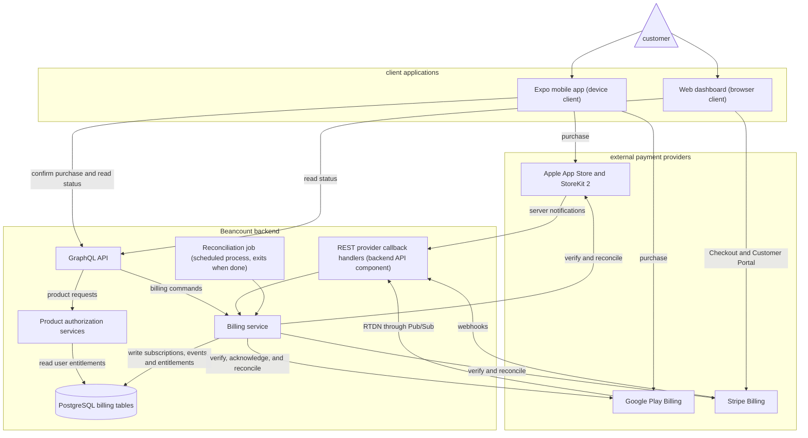

# ADR 001: Self-Built Cross-Platform Mobile Billing

- Status: Proposed
- Date: 2026-07-27
- Decision owners: Mobile and Backend
- Scope: Beancount Web, iOS, and Android subscription entitlements

## Context

Beancount currently sells subscriptions on the Web through Stripe Checkout. The backend creates Checkout sessions, receives Stripe webhooks, stores Stripe customer records, and derives a user's subscription tier from Stripe subscriptions and Price IDs.

The mobile application needs to sell the same digital service on iOS and Android. For a globally distributed application, consumer purchases that unlock features in the app must use Apple In-App Purchase and Google Play Billing by default. Stripe Checkout may remain available on the Web and may be offered from a mobile app only in storefronts and programs where external purchasing is explicitly allowed. A region-specific external-purchase implementation is not part of this decision.

The desired product behavior is:

- A subscription purchased through Stripe, the App Store, or Google Play unlocks the same Beancount account entitlement.
- Existing Stripe subscribers retain their subscriptions without migration of payment credentials, renewal dates, invoices, or customer management.
- Authorization decisions are made by the Beancount backend, not by a mobile client or an individual payment provider.
- Users are prevented, where possible, from buying the same entitlement through more than one provider.
- Subscription management remains with the provider that created the subscription.

The current backend billing model is Stripe-specific. In particular, `paid_customers` requires a Stripe customer ID, full subscription reads call Stripe, and tier resolution maps Stripe Price IDs directly to Beancount tiers. That model cannot safely represent App Store or Google Play subscriptions.

## Decision Drivers

- Compliance with App Store and Google Play payment policies.
- One entitlement model across Web, iOS, and Android.
- Server-authoritative authorization and fraud resistance.
- Preservation of the existing Stripe integration and subscribers.
- A small initial catalog: Premium monthly and Premium annual.
- Control of customer and billing data without a required subscription-platform vendor.
- Acceptable engineering and operational complexity for the Backend team.
- Idempotent recovery from duplicate, delayed, missing, and out-of-order provider notifications.

## Decision

Beancount will build and operate a provider-neutral billing service in the existing backend.

The payment providers will be:

- Web: Stripe Billing and the existing Stripe Checkout and Customer Portal flows.
- iOS: StoreKit 2 and App Store In-App Purchase.
- Android: Google Play Billing.

RevenueCat will not be introduced for the initial implementation. It remains a future option if the operational cost of the self-built integration exceeds its benefit.

The mobile client will use an Expo-compatible native IAP library, initially `expo-iap`, to access StoreKit and Play Billing. Adding the dependency still requires the repository's normal dependency approval. IAP features require an Expo development build and cannot be tested in Expo Go.

The backend will use Apple's official App Store Server Node Library for JWS verification and App Store Server API access. It will use the Google Play Developer API for purchase verification, acknowledgement, and subscription reconciliation.

### Authoritative Entitlements

Payment-provider records are evidence for an entitlement; they are not the authorization interface used by product features.

All product limits, including ledger, collaborator, directive, and AI quota limits, will read a Beancount entitlement projection. Product code must not call Stripe, Apple, or Google directly to decide whether a request is allowed.

The entitlement projection will contain, at minimum:

- the Beancount user ID;
- the entitlement ID, initially `premium`;
- the resolved Beancount tier;
- whether access is currently granted;
- the access expiration time, when applicable;
- the subscription that currently grants access;
- the time at which the projection was last verified.

If more than one valid subscription grants the same entitlement, access remains available, but the account is flagged as having duplicate billing sources. The UI must not intentionally create a second subscription while an equivalent entitlement is active.

### High-Level Architecture

Provider notifications are triggers to fetch or verify current provider state. They are not trusted as the sole source of truth.

## Domain Model

The exact Drizzle schema may evolve during implementation, but it must preserve the following concepts.

### `billing_identities`

Stores stable, non-secret identifiers used to associate provider purchases with a Beancount account.

| Field                          | Purpose                                       |
| ------------------------------ | --------------------------------------------- |
| `user_id`                      | Beancount account ID                          |
| `apple_app_account_token`      | Stable UUID supplied to StoreKit purchases    |
| `google_obfuscated_account_id` | Stable one-way value supplied to Play Billing |
| timestamps                     | Audit and lifecycle metadata                  |

The existing Beancount user ID is text and must not be assumed to be a UUID. Apple requires `appAccountToken` to be a UUID, so it will be generated and stored separately. The Google identifier must not expose an email address or other direct personal data.

### `billing_subscriptions`

Stores normalized current state while retaining enough provider information for reconciliation.

| Field                      | Purpose                                         |
| -------------------------- | ----------------------------------------------- |
| `id`                       | Internal subscription ID                        |
| `user_id`                  | Owning Beancount account                        |
| `provider`                 | `STRIPE`, `APP_STORE`, or `GOOGLE_PLAY`         |
| `environment`              | `SANDBOX` or `PRODUCTION`                       |
| `external_subscription_id` | Provider-unique stable identifier               |
| `external_customer_id`     | Optional provider customer identifier           |
| `product_id`               | Provider product identifier                     |
| `base_plan_id`             | Optional Google Play base plan identifier       |
| `tier`                     | Normalized Beancount tier                       |
| `provider_status`          | Provider-native status for diagnosis            |
| `normalized_status`        | Beancount lifecycle status                      |
| `current_period_start`     | Current service period start                    |
| `current_period_end`       | Current service period end                      |
| `will_renew`               | Whether automatic renewal is currently expected |
| `revoked_at`               | Refund or revocation time, if any               |
| `provider_updated_at`      | Provider event or transaction time              |
| timestamps                 | Local persistence metadata                      |

There must be a unique constraint on provider, environment, and external subscription ID. A provider purchase token or original transaction must not grant access to two Beancount users.

For Apple, the stable external subscription ID is the original transaction ID. For Google Play, the purchase token is the primary identifier and linked purchase tokens must be processed during upgrades, downgrades, and resubscriptions. For Stripe, the identifier is the Stripe Subscription ID rather than the Stripe Customer ID.

### `billing_events`

Provides an idempotent notification inbox.

| Field               | Purpose                              |
| ------------------- | ------------------------------------ |
| `provider`          | Notification source                  |
| `environment`       | Provider environment                 |
| `external_event_id` | Provider or Pub/Sub event identifier |
| `event_type`        | Provider event type                  |
| `received_at`       | Receipt time                         |
| `processed_at`      | Successful processing time           |
| `attempt_count`     | Retry count                          |
| `last_error`        | Redacted failure information         |

The unique key is provider, environment, and external event ID. Raw provider payloads may be retained only when needed for replay, with secrets and unnecessary personal information removed and with a documented retention period.

### `user_entitlements`

Materializes the authorization result so product requests do not depend on provider availability.

| Field                    | Purpose                                |
| ------------------------ | -------------------------------------- |
| `user_id`                | Beancount account ID                   |
| `entitlement_id`         | Initially `premium`                    |
| `tier`                   | Effective tier                         |
| `is_active`              | Authorization result                   |
| `active_until`           | Expiration time, if applicable         |
| `source_subscription_id` | Subscription currently granting access |
| `verified_at`            | Last successful verification time      |

Entitlements are updated in the same database transaction as normalized subscription changes whenever possible.

## Product Catalog

Provider products have different identifiers but map to the same canonical entitlement.

| Canonical product | Stripe                  | App Store                      | Google Play                     |
| ----------------- | ----------------------- | ------------------------------ | ------------------------------- |
| Premium monthly   | Stripe monthly Price ID | `io.beancount.premium.monthly` | `premium` / `monthly` base plan |
| Premium annual    | Stripe annual Price ID  | `io.beancount.premium.annual`  | `premium` / `annual` base plan  |

The mapping from provider product ID to canonical product, tier, and entitlement will be version-controlled backend configuration. Provider credentials and signing keys remain environment configuration or secrets.

The client must display the localized price and subscription terms returned by the current store. It must not hard-code a Stripe price, currency, or formatted amount for App Store or Google Play purchases.

Growth and Organization are not included in the first mobile purchase release. Before release, Product and Legal must determine whether those plans are true organization-only enterprise services or consumer-accessible multiplatform subscriptions. Consumer-accessible features may require corresponding App Store products.

## Purchase and Lifecycle Flows

### iOS Initial Purchase

1. The authenticated app requests current App Store products.
2. Before purchase, the app obtains the user's stable Apple app account token from the backend.
3. The app starts the StoreKit purchase with that token.
4. The app sends the signed transaction or a transaction identifier to the backend.
5. The backend verifies Apple's JWS and, when necessary, queries the App Store Server API.
6. The backend verifies bundle ID, environment, product ID, transaction state, ownership token, and revocation state.
7. The backend transactionally upserts the subscription and entitlement.
8. The client finishes the StoreKit transaction only after durable backend acceptance. Failed submissions remain recoverable on the next app launch.

App Store Server Notifications V2 update renewals, renewal preference, billing issues, expiration, refunds, and revocations. All signed notification data is verified before use. Out-of-order notifications must not overwrite newer provider state.

### Android Initial Purchase

1. The authenticated app queries Play Billing `ProductDetails` and eligible offers.
2. The app starts the billing flow with the stable obfuscated account ID.
3. Pending purchases remain pending and do not grant access.
4. When a purchase becomes purchased, the app sends the product ID and purchase token to the backend.
5. The backend calls `purchases.subscriptionsv2.get` and verifies package name, product, account association, purchase state, and expiration.
6. The backend transactionally upserts the subscription and entitlement.
7. After durable processing, the backend acknowledges an unacknowledged initial purchase through the Google Play Developer API.

Google Real-time Developer Notifications are delivered through Pub/Sub. On every relevant notification, the backend calls the Google Play Developer API for current state instead of deriving access from the notification type alone. New purchases must be acknowledged within Google's required window.

### Stripe Purchase and Lifecycle

The existing Stripe Checkout and Customer Portal remain the systems of interaction for Web billing.

On Checkout completion and relevant subscription, invoice, refund, and deletion events, the Stripe integration will also upsert `billing_subscriptions` and `user_entitlements`. Existing Stripe behavior may continue during migration, but new authorization code must read the provider-neutral entitlement.

Stripe subscription management, payment method changes, invoices, proration, and refunds remain in Stripe. This ADR does not move existing subscriptions or payment credentials to another provider.

## Normalized Access Rules

Provider status values will be preserved for support, but entitlement decisions use explicit Beancount rules.

- Active, trialing, and recognized grace-period subscriptions grant access until their verified access end.
- Turning off automatic renewal does not immediately revoke access. Access remains until the paid period expires.
- Pending purchases do not grant access.
- A Google account-hold state does not grant access unless a separate verified grace period applies.
- Expired subscriptions do not grant access.
- Refunded and revoked subscriptions stop granting access according to the provider's verified effective time.
- A billing-retry state grants access only when the provider reports an active grace period or a still-valid service period.
- Provider state with an unknown product ID fails closed and creates an operational alert.

The detailed provider-to-normalized-state table must be implemented and unit tested before production rollout.

## Backend API Surface

The public API will expose provider-neutral operations. Exact GraphQL names may be adjusted during schema design, but the responsibilities are:

- query the current entitlement, tier, expiration, renewal expectation, and billing source;
- confirm an App Store purchase using provider-signed evidence;
- confirm a Google Play purchase using a purchase token;
- request a fresh provider reconciliation when the user explicitly restores a purchase;
- return a provider-appropriate subscription management destination.

The client never submits a tier, expiration date, active flag, price, or currency as trusted billing data.

Provider callbacks use REST endpoints because they require provider-specific raw bodies, signatures, JWS payloads, or Pub/Sub envelopes:

- App Store Server Notifications V2 endpoint;
- Google Pub/Sub push endpoint or subscriber;
- the existing Stripe webhook endpoint.

## Restore and Account Ownership

Restore is an account-linking operation, not merely a local UI refresh.

- A restored purchase is verified by the backend before access is granted.
- A provider subscription already owned by another Beancount account is not silently transferred.
- The app presents a recoverable support path for legitimate account mistakes.
- Transfer behavior must be documented before launch, including how deleted and merged accounts are handled.
- The UI shows the current billing source and prevents an equivalent purchase when an entitlement is already active.

Cross-provider upgrades do not receive automatic proration. A user moving between Stripe, Apple, and Google must cancel the original subscription and switch at the end of its service period unless a separately designed migration offer exists.

## Migration Plan

### Phase 1: Introduce the Billing Domain

- Add provider-neutral tables, models, service interfaces, and product mapping.
- Make Stripe webhook processing dual-write to the existing model and the new billing model.
- Add a provider-neutral entitlement query.
- Keep existing Stripe authorization active while shadow-comparing both results.

### Phase 2: Backfill Existing Stripe Subscribers

The current database stores Stripe Customer IDs but does not persist every Stripe Subscription ID. The backfill will:

1. enumerate existing paid customer records;
2. list subscriptions for each Stripe customer;
3. normalize active, trialing, and canceled-but-not-expired subscriptions;
4. persist Stripe Subscription IDs and entitlement projections;
5. record and manually investigate mismatches.

The backfill is idempotent and supports dry-run reporting before mutation.

### Phase 3: Add Store Providers

- Configure App Store products, keys, Sandbox notifications, and production notifications.
- Configure Google Play products, service account access, Pub/Sub, license testers, and production notifications.
- Add the native IAP library and mobile purchase, restore, status, and management UI.
- Release behind independent iOS and Android feature flags.

### Phase 4: Switch Authorization

- Run shadow comparison long enough to cover at least one renewal and cancellation test cycle in each provider environment.
- Switch tier and quota checks to `user_entitlements`.
- Retain the Stripe-specific tables and API only for Stripe customer and billing management until a separate cleanup decision is made.

## Reliability and Operations

- Every notification handler is idempotent.
- Provider timestamps or a fresh provider read prevent stale events from overwriting newer state.
- Processing failures are retried and visible in metrics and alerts.
- A scheduled reconciliation job verifies recently changed and currently active subscriptions with each provider.
- Purchase tokens, signed transactions, private keys, and service credentials are never logged.
- Production and sandbox data are strictly separated.
- Provider secrets are server-only and rotated according to provider guidance.
- Metrics cover notification lag, verification failures, acknowledgement failures, reconciliation mismatches, unknown products, and duplicate billing sources.
- Support tooling can inspect normalized state and initiate safe reconciliation but cannot fabricate an active provider purchase.

## Testing Strategy

- Unit-test every provider-to-normalized-state transition and access rule.
- Contract-test JWS verification, Google API response parsing, product mapping, and idempotency using recorded redacted fixtures.
- Test StoreKit with a local StoreKit configuration, Apple Sandbox, and TestFlight.
- Test Play Billing with license testers, pending transactions, accelerated renewals, grace period, account hold, cancellation, refund, and revocation.
- Test Stripe with test-mode Checkout, renewal, failed payment, cancellation, upgrade, and refund events.
- End-to-end test purchase interruption, app termination, restore, delayed notification, duplicate event, out-of-order event, missed notification followed by reconciliation, and an attempted duplicate cross-provider subscription.
- Verify the purchase and management UI in light and dark themes and in supported locales.

## Consequences

### Positive

- Beancount controls its entitlement domain and customer mapping.
- Existing Stripe subscribers and Web billing remain unchanged.
- Product authorization is independent of any single billing provider.
- There is no required subscription-management SaaS dependency or associated platform fee.
- Provider behavior is explicit, testable, and available to internal operations.
- The architecture can add additional providers without changing product authorization code.

### Negative

- Beancount owns three provider integrations and their policy/API changes.
- The team must operate notification delivery, verification, acknowledgement, retries, reconciliation, and support tooling.
- Subscription lifecycle edge cases create more implementation and testing work than the purchase UI itself.
- Provider dashboards remain necessary for payment operations and financial reporting.
- Engineering and on-call costs may exceed the monetary cost of a managed service.

## Alternatives Considered

### RevenueCat

RevenueCat can wrap StoreKit and Play Billing, validate purchases, receive provider notifications, and import existing Stripe Subscription IDs into unified entitlements.

It is not selected initially because Beancount already has a backend, database, Stripe integration, user identity, and a small product catalog, and the team prefers to own the entitlement system. RevenueCat should be reconsidered if:

- subscription lifecycle incidents consume material on-call time;
- the catalog or number of apps grows substantially;
- Product requires hosted paywalls, rapid experiments, or managed offer targeting;
- provider API maintenance delays roadmap delivery;
- self-built reconciliation cannot meet reliability objectives.

### StoreKit 2 Without a Shared Backend Billing Domain

Rejected because StoreKit is Apple-only and device-local state cannot authorize Web or Android access. Cross-platform entitlements require server-owned state.

### Stripe Checkout for All Mobile Purchases

Rejected as the default because external digital-goods purchasing is not globally available under App Store and Google Play policies. A future storefront-specific external-purchase ADR may supplement this architecture.

### Consumption-Only Mobile App

The mobile app could allow existing Web subscribers to sign in without offering mobile purchases. This is simpler but does not satisfy the requirement to sell a subscription in the app.

## Rollback and Failure Containment

- Mobile purchase entry points are protected by remote feature flags per platform.
- A provider can be disabled without removing access already verified through other providers.
- During migration, the existing Stripe authorization path remains available until shadow comparison is accepted.
- If notification processing is degraded, cached entitlements continue only until their verified access end; the system does not extend access indefinitely based solely on a failed provider read.
- Reconciliation is safe to repeat and is the recovery path for missed events.

## Open Questions and Release Gates

- Confirm the Premium annual price, trial, introductory offer, and regional availability in each store.
- Decide whether Growth and Organization are enterprise-only or require mobile IAP products.
- Approve the mobile IAP and server library dependencies.
- Define purchase-transfer rules between Beancount accounts.
- Define account-deletion behavior for active store subscriptions.
- Finalize grace-period access policy for each provider.
- Decide the retention period for billing event payloads and financial audit data.
- Confirm support ownership and operational response targets.

No production mobile billing release may occur until these items have owners and the account ownership, duplicate subscription, refund/revocation, and reconciliation paths have passing end-to-end tests.

## References

- [Apple App Review Guidelines](https://developer.apple.com/app-store/review/guidelines/)
- [Apple In-App Purchase](https://developer.apple.com/documentation/storekit/in-app-purchase)
- [Apple App Store Server Library](https://developer.apple.com/documentation/AppStoreServerAPI/simplifying-your-implementation-by-using-the-app-store-server-library)
- [Apple App Store Server Notifications](https://developer.apple.com/documentation/AppStoreServerNotifications)
- [Google Play Payments policy](https://support.google.com/googleplay/android-developer/answer/9858738?hl=en)
- [Google Play backend integration](https://developer.android.com/google/play/billing/backend)
- [Google Play subscription lifecycle](https://developer.android.com/google/play/billing/lifecycle/subscriptions)
- [Expo in-app purchase guide](https://docs.expo.dev/guides/in-app-purchases/)
- [RevenueCat Stripe external purchase import](https://www.revenuecat.com/docs/web/integrations/stripe/track-external-purchases)
