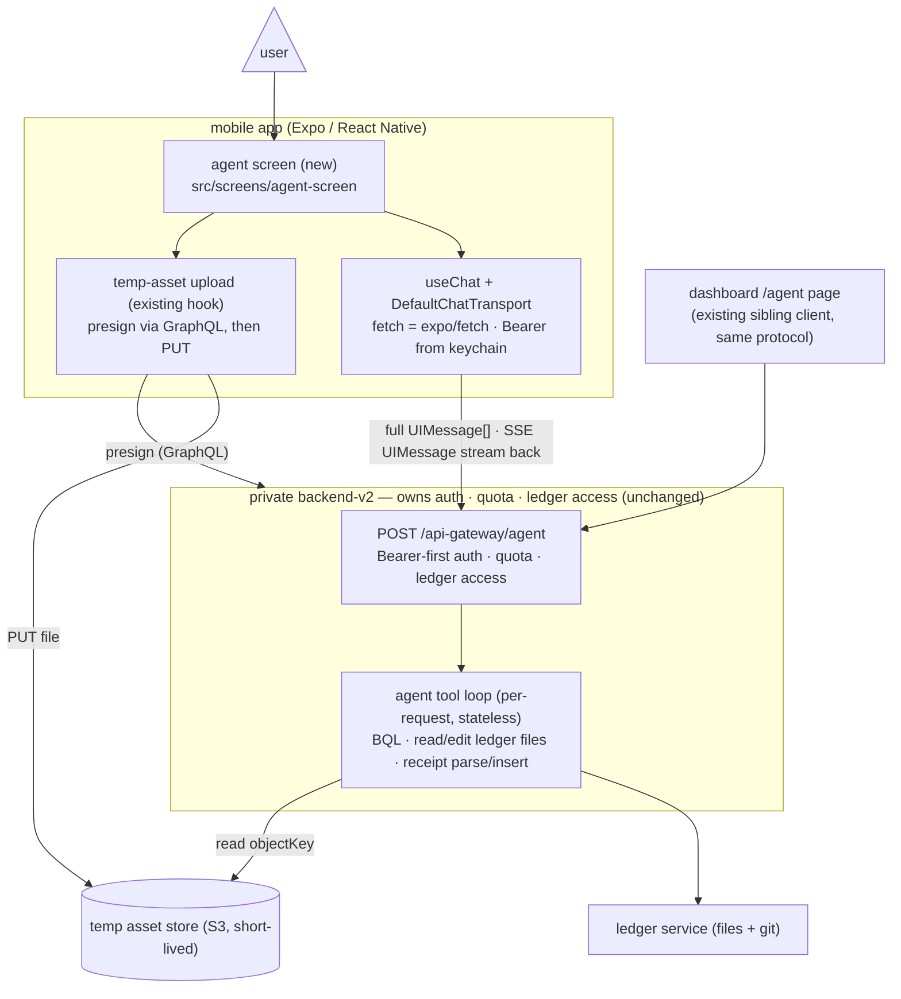
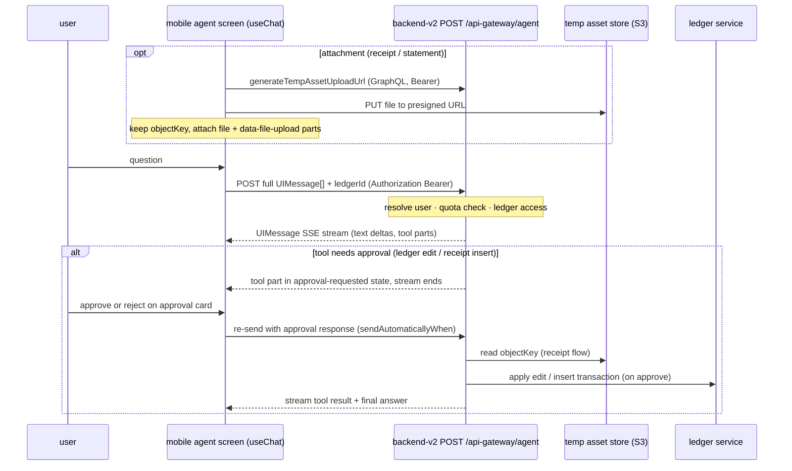

# ADR 002: Mobile AI Assistant

- Status: Accepted — P0/P1 implemented 2026-08-19 (`.pm/w1/done/m32/`); see [Implementation notes](#implementation-notes-2026-08-19)
- Date: 2026-08-18
- Decision owners: Mobile (client); Backend (no changes required)
- Scope: Adding the platform's agent chat — "Ask Beancount.io" — to the mobile app: which endpoint and protocol to use, which client mechanism to adopt, how attachments and tool approvals work, and what stays out of scope.

## Context

The mobile app has **no AI surface**. All of its screens are ledger CRUD, reports, and capture flows, while agent mode became the platform's **primary** chat mode: the dashboard's `/ask` page was retired in favor of `/agent` (the backend unregistered the old `/api-gateway/chat` route), and the dashboard's agent page is a mature reference client.

What already exists, on each side of the wire:

- **Backend (private `backend-v2`, reference by path only):** `POST /api-gateway/agent` (`src/features/ai-agent/api/agent-route.ts`) accepts `{ messages: UIMessage[], ledgerId, sessionId? }` and replies with the **AI SDK UIMessage SSE stream** (`pipeUIMessageStreamToResponse`). Auth resolves the token **`Authorization: Bearer` header first, cookie second** — the header path exists explicitly for API clients and the mobile app. The route enforces the AI-CFO monthly quota (a rate-limit error carrying current/max usage) and per-ledger access before streaming. The handler is **stateless per request**: the client sends the full message history each turn; `sessionId` is accepted but not currently used for server-side memory.
- **Agent capabilities (visible in the stream):** BQL queries, listing/reading ledger files, editing ledger files, and receipt parse + insert — running in a bounded tool loop. Ledger edits and receipt inserts are declared `needsApproval`, so the stream pauses with a tool part in `approval-requested` state until the client sends an approval response.
- **Dashboard reference client** (`dashboard/src/features/ai-agent/pages/agent/page.tsx`): `useChat` + `DefaultChatTransport` from the AI SDK, `sendAutomaticallyWhen: lastAssistantMessageIsCompleteWithApprovalResponses` for the approval round-trip, `addToolApprovalResponse` wired to approval cards (file-edit diff, receipt insert), attachments staged through the temp-asset upload hook and sent as `file` + `data-file-upload` parts.
- **Mobile already has most of the plumbing:** a keychain-stored Bearer token (`src/common/apollo/secure-session-storage.ts`, sent as `Authorization: Bearer` by the Apollo client), an endpoint helper (`getEndpoint` in `src/common/request.ts`) pointing at the same `api-gateway/` base, and — in the receipt-capture screen — the exact attachment pipeline the agent needs: `generateTempAssetUploadUrl` → presigned PUT → `objectKey` (`src/screens/receipt-capture-screen/use-receipt-workflow.ts`).
- **Streaming on device:** the app is on Expo SDK 57; `expo/fetch` provides a WinterCG-compliant `fetch` with streaming response bodies, which the AI SDK accepts as a custom `fetch` (this is the AI SDK's documented Expo setup).

## Decision Drivers

- **One backend surface, zero backend changes.** Mobile should be a second client of the exact route and protocol the dashboard uses, so the two clients stay behaviorally identical and the backend team is not in the critical path.
- **Reuse a maintained protocol client.** The UIMessage stream is rich (text deltas, streamed tool inputs, tool states including approvals, typed data parts) and evolves with the AI SDK; a bespoke parser is protocol maintenance we would carry forever.
- **Approval-gated writes must be first-class.** The agent can edit ledger files; mobile users must see and approve diffs with the same clarity the dashboard gives them, or trust evaporates.
- **New dependencies need an explicit decision** (repo rule) — this ADR is that decision record.
- **Mobile conventions apply:** theme tokens in light and dark, skeleton loading states, `useTranslations()` across 13 locales (including RTL Persian), analytics on mount, Expo Router file-based routes.
- **Clear degradation:** quota exhaustion and offline states must render as understandable UI, not spinners or raw errors.

## Decision

Build the assistant as a **native screen that is a protocol-faithful sibling of the dashboard client**, on the existing `POST /api-gateway/agent` route.

- **Adopt the AI SDK on mobile**: add `ai` and `@ai-sdk/react` (version-matched to the dashboard's majors) as new dependencies. Use `useChat` + `DefaultChatTransport` with:
  - `api: getEndpoint("api-gateway/agent")`
  - `fetch: expo/fetch` (streaming-capable)
  - `headers`: `Authorization: Bearer <token from sessionVar>` and `Accept-Language` from the active locale (as the dashboard sends)
  - `body: { ledgerId, sessionId }` with `ledgerId` from the selected-ledger reactive var
- **New screen + route**: `src/screens/agent-screen/` mounted from `app/(app)/agent.tsx`. Message list rendering agent answers as markdown (via `react-native-marked` — see [Rendering markdown](#rendering-markdown-react-native-marked)), input bar, streaming indicator, stop, inline error + retry. Entry points: a Home-screen "Ask" affordance and the deep link `beancount:///(app)/agent?q=…`, which **prefills the input and never submits** — deliberately unlike the dashboard's `?q=`, because any app can open a URL scheme with text it chose (see [Implementation notes](#implementation-notes-2026-08-19)).
- **Tool approvals**: port the dashboard's approval-card pattern to React Native — a file-edit card showing the change description and diff, and a receipt-insert card showing the proposed transaction — wired to `addToolApprovalResponse` with `sendAutomaticallyWhen` completing the round-trip.
- **Attachments**: reuse the receipt-capture upload leg (`generateTempAssetUploadUrl` → presigned PUT), then send `file` parts plus `data-file-upload` parts `{ objectKey, filename }`, exactly as the dashboard does. Camera capture can feed the same staging path later.
- **Conversation state is client-held** (the server is stateless per request): keep the `UIMessage[]` in memory for the app session with a New-chat reset. **Durable, cross-device history is explicitly deferred** to the backend-owned persistence design (see `docs/adrs/ADR001-dashboard-chat-history-persistence.md`); when its history endpoints exist, this screen hydrates from them without a transport change.
- **Quota exhaustion** renders an upgrade prompt that links to the mobile subscription surface (see `docs/adrs/ADR001-mobile-billing.md`), mirroring the dashboard's upgrade panel.

## Architecture

### Components — mobile as a second client of the same agent route

### Turn sequence — including the approval round-trip

## Rollout Plan

Phased, each phase shippable on its own (OTA-updatable; releases cut via `yarn bump`):

1. **P0 — live smoke (before any UI):** a read-only question against the production route with a real device token, proving Bearer auth and `expo/fetch` streaming end to end. This is the only integration risk; it is cheap to retire first.
2. **P1 — core chat:** screen + route, text-only turns, streaming render, stop, inline error + retry, New chat. Both themes; skeletons for any loading state.
3. **P2 — approvals:** file-edit and receipt-insert approval cards; until P2 ships, prompts that trigger approval-gated tools end with a "continue on the web" notice rather than a silently hung stream.
4. **P3 — attachments:** stage files/photos through the temp-asset pipeline; receipt flow parity with the dashboard.
5. **P4 — surface polish:** Home entry point, `?q=` deep link, preset first-question chips, full locale pass (RTL included), analytics events, App Store screenshot refresh.

## Alternatives Considered

### Hand-rolled SSE + UIMessage parser (no new dependencies) — rejected

Avoids adding `ai`/`@ai-sdk/react`, but re-implements a rich, versioned protocol — streamed tool inputs, tool states, approval semantics, data parts — that the platform will keep evolving with the SDK. The approval round-trip (`addToolApprovalResponse`, `sendAutomaticallyWhen`) alone is subtle state-machine work the SDK provides and tests. A bespoke parser is permanent protocol-maintenance debt against upstream.

### WebView embedding the dashboard `/agent` page — rejected

Fast to ship but wrong on every axis that matters here: the dashboard page authenticates with cookies (mobile holds a Bearer token in the keychain), the UI would ignore the app's theme/i18n/RTL conventions, native capture and haptics are unavailable, analytics go dark, and store review treats thin web wrappers poorly.

### Non-streaming Q&A over GraphQL mutations — rejected

Mobile already calls `parseReceipt` via GraphQL, so a request/response "ask" is tempting — but it forfeits streaming, the tool loop, and approvals, producing a second, lesser chat that diverges from the platform's primary mode. The platform's direction is the agent route.

### Wait for chat-history persistence before shipping — rejected

The backend-owned history design (dashboard ADR 001) is orthogonal: this client works today with client-held history and gains hydration when the history endpoints land. Sequencing mobile behind a backend roadmap item adds delay without reducing any risk in this decision.

## Consequences

### Positive

- Mobile becomes a full citizen of the platform's primary AI mode with **zero backend changes**, and the two clients speak one protocol — fixes and capabilities land on both.
- Ledger-write safety is preserved: every edit is user-approved on device, same as the web.
- The attachment pipeline and auth plumbing already exist on mobile; the genuinely new work is UI.
- Deferring history keeps this ADR small and consistent with the backend-owned persistence direction.

### Negative

- Two new dependencies (`ai`, `@ai-sdk/react`) in a Yarn 1 workspace, version-coordinated with the dashboard's copies during protocol upgrades.
- Client-held history means a killed app forgets the conversation until backend persistence lands — accepted interim state.
- The approval cards are real RN UI work (diff rendering on small screens) and must be built before write-capable prompts feel safe.
- `expo/fetch` streaming behavior differs from browser fetch in edge cases (backgrounding, connection loss); needs explicit testing on both platforms.

## Implementation notes (2026-08-19)

P0 and P1 shipped as `w1/m32`. The decision held; four things it did not anticipate are recorded here because they change what a reader should do next.

### `credentials: "omit"` is required, not hygiene

The P0 smoke ran four cases from inside the app. Bearer with cookies suppressed → **200**, streaming. A deliberately invalid Bearer → **401** (so the header is read and preferred, as `getTokenFromCtx` promises). **No header with cookies allowed → 200**: `expo/fetch` shares the native cookie store, the app holds a session cookie for the same origin, and the route falls back to it. No header with `credentials: "omit"` → 401.

That third case is the one to remember. Without `credentials: "omit"`, a client whose `Authorization` header broke would go on working — until the cookie expired, on a fresh install, or on someone else's device. The transport therefore omits cookies so the Bearer token is the only credential and an auth defect fails loudly and immediately.

### The error envelope is JSON, not a stream frame

Failures arrive as `application/json` with `{"ok":false,"error":{"code":"…","message":"…"}}` — `UNAUTHENTICATED` (401) and `RATE_LIMITED` (429, the AI-CFO quota). Clients should classify on `code` and treat quota as terminal for that turn: retrying a refusal earns a second refusal, so the quota case offers the upgrade path instead of a retry button.

### A turn can end without an answer

The server caps the agent at ten steps. A vague write request ("add a $5 coffee expense") spent all ten on `listLedgerFiles` + `readLedgerFiles` and finished with no text at all. Any client rendering this stream needs a state for _finished, ran tools, said nothing_ — otherwise the screen simply falls silent. This is separate from the error and approval states and easy to miss, because it only appears on questions that send the agent exploring.

### The approval refusal works, and the model's narration does not track it

Reaching `approval-requested` took a request naming the target file; vaguer phrasing exhausted the step budget first. When it was reached, the agent's own text said _"Proceeding with this operation"_ while the tool sat unexecuted, and the ledger's git history was identical before and after. The refusal is structural — `sendAutomaticallyWhen` is never passed to `useChat` and `addToolApprovalResponse` is never called — and it is what makes P2 safe to defer. It also means **a client must not infer that a write happened from what the model says about it.**

### Rendering markdown: `react-native-marked`

Agent answers are markdown, and the app renders them with **`react-native-marked`** (v8.1.1) rather than a hand-written reader. Adopted 2026-08-19, after the first implementation shipped a bespoke parser and the question "is there an off-the-shelf option for this stack?" was asked directly.

**Why this one.** `react-markdown` — what the dashboard uses — emits DOM and cannot cross to React Native, which is why mobile could not simply copy the web client. Of the RN options, `react-native-markdown-display` has been untouched since 2023 and its maintained fork carries the usual fork risk; `react-native-marked` is current, is built on `marked`, renders to real RN components, and its `react-native-svg` peer was **already installed** for the d3 charts.

**How it is wired.** The default export renders into a `FlatList`, which must not nest inside the chat's `ScrollView`; the library's `useMarkdown(value, { styles })` hook returns `ReactNode[]` instead and is what the message bubble uses. All colours are passed in from our theme tokens rather than using the library's own light/dark palette, so there is one source of truth for colour.

**What it bought, measured on device.** Correct hanging indents on wrapped list items, real heading weight, and — the one that matters — **correct list-marker placement under RTL for free**. The hand-rolled version had a Persian defect there that took a device walk to find and a layout fix to close; the library simply gets it right. It also brings tables, links and blockquotes, none of which the bespoke reader supported and all of which a BQL result could plausibly want.

**What it costs.** Seven transitive dependencies, and the bundle went from 3124 to 3175 modules.

**One accepted rough edge.** LaTeX preprocessing needs matched delimiters, so mid-stream a display block whose closing `\]` has not arrived yet shows its opening bracket as an escaped character for a moment. It resolves on the next delta; a test pins the behaviour so it reads as understood rather than missed.

### The feature ships gated off

`config.features.agentChat` in `src/config.ts` is a plain `false`. It gates **both** the Home entry card and the `/agent` route, so with it off the screen is unreachable even through a `beancount:///(app)/agent` deep link — gating only the card would leave the route open to anything that can fire a URL scheme.

Deliberately a constant rather than an `EXPO_PUBLIC_*` variable: the switch is then visible in the diff of whoever changes it, and no build can end up shipping the feature because of what happened to be in someone's shell. Turning it on is a code change, reviewed like one. (`__DEV__` was also rejected — it is false in TestFlight, which would hide the feature from exactly the people meant to try it.)

The gate stays until at least the P2 approval cards land: until then the surface can spend a user's AI quota and cannot review its own ledger writes.

### Amendments to the plan above

- **Deep links prefill and never submit, whatever opened them.** The P4 sketch had Home chips submitting on tap; that needs a signal a deep link cannot forge, and every Expo Router param is forgeable. The submitting chips live on the agent screen's empty state instead, where a tap is unambiguously human, and Home is a door. One rule, no second channel. (A related bug: reading `?q=` only in a `useState` initializer drops the question when the screen is already on the stack — it needs an effect, still prefill-only.)
- **Markdown is not optional, and it is not ours to write.** "Render text parts plainly" produced `**Cash/Assets**: 906.58 USD` on screen. That was first answered with a hand-rolled ~100-line reader; it has since been **replaced by `react-native-marked`** — see [Rendering markdown](#rendering-markdown-react-native-marked) below. What stays hand-written is only the part that is _not_ markdown: the LaTeX the model wraps arithmetic in.
- **Multiple text parts mean multiple steps** and must be joined as paragraphs, or the answer reads as `Let me try again.It seems…`.
- **Metro caches resolution across installs.** The first bundle after adding the SDK failed on a transitive `@opentelemetry/api` path that exists on disk; `npx expo start --clear` fixed it. Do not debug that error as a packaging problem.

## Open Questions

- `sessionId` is currently unused server-side; mobile will send it for forward compatibility — confirm its intended semantics before any server-side memory returns.
- Hydration shape once the backend history endpoints (dashboard ADR 001) exist: per-ledger chat list on mobile, or most-recent-chat restore only?
- Should `Accept-Language` steer the agent's answer language on mobile the way the dashboard sends it, given mobile's 13 locales?
- Tablet/iPad layout and whether the agent screen joins the tab bar or stays reachable from Home only.
- Whether P2 approval cards should reuse a shared diff-rendering component with the ledger-file screens.

## References

Internal (public repo):

- `dashboard/src/features/ai-agent/pages/agent/page.tsx` — reference client: `useChat`, transport, approvals
- `dashboard/src/features/ai-agent/pages/agent/file-edit-approval.tsx`, `receipt-insert-approval.tsx` — approval-card UX to port
- `mobile/src/screens/receipt-capture-screen/use-receipt-workflow.ts` — existing presign → PUT → `objectKey` pipeline
- `mobile/src/common/apollo/secure-session-storage.ts`, `mobile/src/common/request.ts` — Bearer token custody and endpoint base
- `docs/adrs/ADR001-dashboard-chat-history-persistence.md` — backend-owned durable history (deferred dependency)
- `docs/adrs/ADR001-mobile-billing.md` — subscription surface the quota upsell links to

Internal (private `backend-v2`, path + operation only):

- `src/features/ai-agent/api/agent-route.ts` — `POST /api-gateway/agent`: body shape, guards, UIMessage stream response
- `src/features/auth/utils/auth.ts` — Bearer-header-first token resolution (the mobile auth path)
- `src/features/ai-agent/tools/` — tool set; `needsApproval` on ledger-edit and receipt-insert tools

AI SDK:

- https://ai-sdk.dev/docs/getting-started/expo — Expo setup, `expo/fetch` streaming
- https://ai-sdk.dev/docs/ai-sdk-ui/chatbot — `useChat`, transports
- https://ai-sdk.dev/docs/ai-sdk-ui/stream-protocol — the UIMessage stream this client consumes
