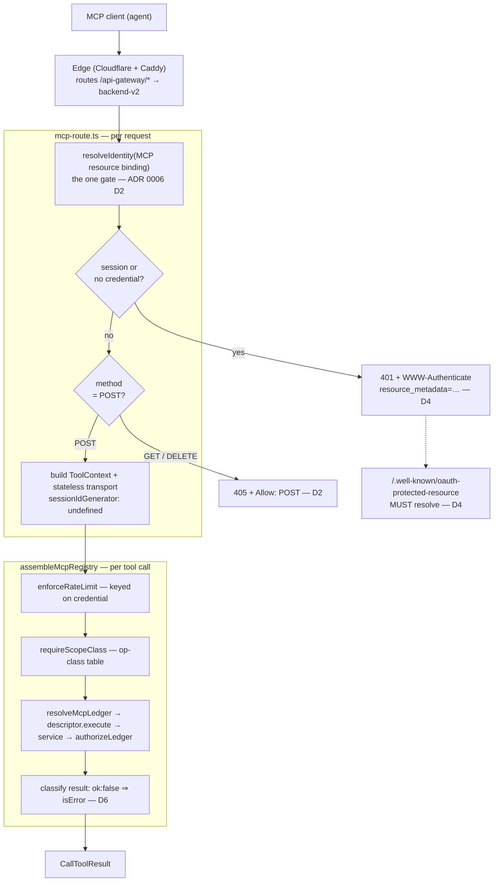
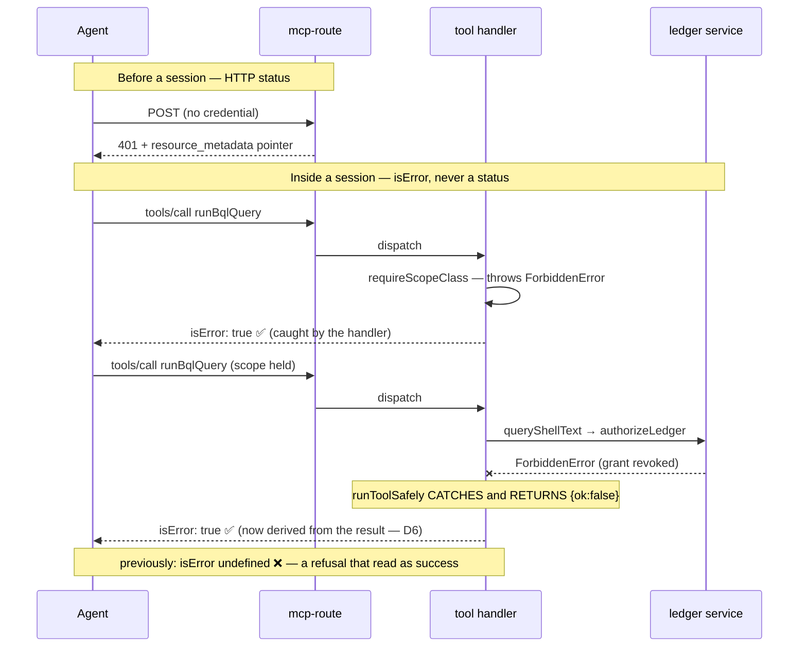

# ADR 0007: The MCP surface — one stateless endpoint, and the rules that keep it honest

- Status: Rejected (2026-09-27) — the ledger-pinning policy in D3/D11 is rejected for every credential type, OAuth grants and API keys alike, in favor of access to all authorized ledgers. The code still enforces pins; see [Rejection rationale](#rejection-rationale-2026-09-27). Cross-surface parity remains in [ADR 0008](./ADR008-backend-v2-surface-parity.md).
- Date: 2026-08-24
- Decision owners: Backend (route, registry, transport, error translation), Deploy (routing, secrets, migrations)
- Scope: `POST /api-gateway/mcp` — the Model Context Protocol endpoint an external agent connects to. What its address is, which HTTP methods it answers, which credentials reach it, how a refusal is phrased, and which deployment facts are part of its contract rather than tribal knowledge. Extends ADR 0006, which established the three-surface model; this ADR is about the third surface specifically. ADR 0006 was written before backend-v2 was imported into this repository and was never committed here; its decisions survive in the code this record cites (`composition-root.ts`, `identity.ts`, `op-class.ts`) and in ADR 0008.

## Rejection rationale (2026-09-27)

A credential should access **all ledgers the authenticated user is authorized to use**, subject to its granted operation scopes. Connection setup, consent, and key creation should not require choosing one ledger or a subset. One connection that follows the user's ledger access is simpler to configure and maintain.

This rejects D3's required ledger pin and D11's policy of keeping pins as the default with all-ledger access as an opt-in. The rejection covers **both credential types**: an OAuth grant approved on the consent page and a `bcio_` API key. No credential type supports pinning going forward. Ledger-specific calls still identify their target through a `ledger` argument or resource URI; `listLedgers` provides discovery. Each operation still checks scopes and ledger permissions, including revocation, on every call.

**Credentials already issued with a pin keep it** until they expire or are revoked. A pinned grant or key is never silently widened to the user's other ledgers, and its holder is not forced to re-authorize.

The independent transport, OAuth resource separation, error handling, and schema rules remain valid. The decisions and diagrams below are retained because they explain the endpoint; their ledger-pinning rules describe what the code does today, not the intended policy.

### Not yet implemented

The code still issues and enforces pins. Removing issuance is the work; enforcement stays for the credentials that already carry one (see [Open Questions](#open-questions)). Paths that start with `src/` are relative to `backend-cluster/backend-v2/`.

Still issuing pins:

- `src/features/oauth/api/oidc-route.ts` — the third-party consent handler requires "either one ledger or explicit account-wide access" and encodes a chosen ledger into the grant's account id.
- `dashboard/src/features/oauth/pages/consent.tsx` — the consent page renders the ledger picker beside the all-ledgers option.
- `src/features/apikeys/service/api-key-service.ts` and `src/features/ai-agent/tools/api-key-tools.ts` — key creation accepts `ledgerScope`, and a pinned caller's new key inherits its pin.

Still enforcing pins:

- `src/server/api/identity.ts` — `identityAllowsLedgerScope`, and the `ledgerScope` each credential kind resolves to.
- `src/features/ai-agent/api/mcp-context.ts` — `resolveMcpLedger` defaults to the pin and refuses any other ledger.
- `src/features/ai-agent/api/mcp-resources.ts` and `mcp-prompts.ts` — a pinned credential lists only its ledger and gets pin-specific prompt text.
- `src/features/ledger/workflow/ledger-workflow.ts` — `restrictToPin` and the one-item `listLedgers` catalog.
- `src/features/ledger/utils/resolve-legacy-ledger.ts` — the legacy default ledger falls back to the pin.

Two board milestones were designed while pins were expected to persist and need redesign before they resume: `.pm/w2/blocked/m34` (its definition of done includes "a pinned credential still sees only its ledger") and `.pm/w5/blocked/m5` (its evaluation uses keys pinned to the eval ledger). No board item tracks the removal itself.

## Context

ADR 0006 settled that GraphQL, REST, and MCP are three dialects of one decision: one identity gate (`resolveIdentity`), one op-class table (`op-class.ts`), one rate limiter, one audit hook, and per-feature fragments assembled by `composition-root.ts`. MCP's fragment is `MCP_TOOLS` — at the time of the probe below, seven tools (`runBqlQuery`, `listLedgerFiles`, `readLedgerFiles`, `editLedgerFiles`, `listApiKeys`, `createApiKey`, `revokeApiKey`) — turned into an `McpServer` named `beancount-mcp` by `assembleMcpRegistry`, and served over `StreamableHTTPServerTransport` by `mcp-route.ts`.

That much was decided. What was never written down is everything _around_ the tools: the endpoint's address, its method set, what happens when a credential is refused, and which deployment facts the endpoint silently depends on. Those gaps do not show up in unit tests — the backend's 2596 tests all passed while every one of the following was true in production.

### What a live probe found (2026-08-24)

| Probe                                           | Result                                                                       | Cause                                                                                                                                                                                                  |
| ----------------------------------------------- | ---------------------------------------------------------------------------- | ------------------------------------------------------------------------------------------------------------------------------------------------------------------------------------------------------ |
| `POST https://beancount.io/mcp`                 | `500 {"error":"Only HTML requests are supported here"}`                      | Not routed to the backend; falls through to the dashboard's SSR catch-all. The real path is `/api-gateway/mcp`.                                                                                        |
| `GET /.well-known/oauth-protected-resource`     | `503 oauth_not_configured`                                                   | `OAUTH_JWKS` unset, so `oidc-route.ts` replaces every OAuth route with a 503 — including the one the MCP `401` names.                                                                                  |
| `POST /api-gateway/mcp` with any `bcio_` bearer | `500` carrying the full `api_keys` SQL statement and its bound parameters    | Migration `0018` never applied to the production database, and `restErrorMiddleware` returned the raw error message.                                                                                   |
| `GET /api-gateway/mcp`, authenticated           | `200 text/event-stream`, zero bytes, connection never closes                 | Stateless transport opened a standalone SSE stream; `handleRequest` does not resolve until that stream ends, so the `finally` that closes the server never ran. One leaked `McpServer` per connection. |
| Tool call against a revoked ledger grant        | `isError: undefined` — a **successful** result whose payload said `ok:false` | `runToolSafely` is an error boundary that _returns_ rather than throws, so the handler's `catch` never saw it.                                                                                         |
| `tools/list`                                    | 7 tools, 0 `outputSchema`, every result carrying `structuredContent`         | Each tool defines a zod `*OutputSchema` that is never registered.                                                                                                                                      |

Read together these are not six unrelated bugs. They are one omission repeated: **the parts of the MCP contract that live outside a tool handler were never anybody's stated responsibility.** The address belonged to the edge, the signing key to the deploy manifest, the migration to an ops runbook, the method set to the SDK's defaults, the refusal dialect to whoever wrote the wrapper. Each was individually defensible and collectively produced an endpoint that no client could reach, authenticate to, or trust the answers from.

## Decision Drivers

- **An MCP client is an agent, not a developer.** It cannot read a runbook, try the other URL, or notice that "success" meant failure. Every ambiguity is resolved wrongly and silently.
- **Failures must be legible at the layer that can fix them.** A hang, a 503 discovery document, and a masked 500 all look identical from the outside — "it doesn't work" — unless the endpoint is specific about which one it is.
- **Nothing may be true of MCP that is not also true of GraphQL and REST**, unless it is written down as an exception with a reason (ADR 0006 D3).
- **Deployment facts the surface depends on belong in the manifest**, where a reviewer sees them, not in an operator's memory.
- **Conformance is a test, not a discipline** — the same standard ADR 0006 D9 set for the other two surfaces.

## Decision

Eleven rules. D1–D3 fix the shape of the endpoint, D4–D7 fix what it says when it refuses, D8–D10 fix what must be true before it is considered deployed. D11 is the multi-ledger design that replaced D3's pin and was itself rejected.

### D1 — One endpoint, one address, and the address is part of the contract

MCP is served at **`POST {issuer}/api-gateway/mcp`** and nowhere else. A friendlier public path (`/mcp`) is permitted only as an **edge alias that reaches the same handler** — never a second mount, and never a path the edge does not actually route.

An unrouted vanity path is worse than no vanity path. `https://beancount.io/mcp` reached the dashboard's SSR catch-all and returned `500 Only HTML requests are supported here`, which tells a client neither that the path is wrong nor that a right one exists. A 404 would have been more useful; a working alias more useful still.

Corollary: the address a client is told to use, the address the edge routes, and the address the router mounts are **three facts that must agree**, and the only way to know they do is to request the public URL. Edge routing is therefore in scope for this ADR, not adjacent to it.

### D2 — The transport is stateless, and the method set follows from that

The transport is constructed with `sessionIdGenerator: undefined`: one `McpServer` and one transport per HTTP request, closed in a `finally`. This is the right default — it needs no session store, no sticky routing, and no eviction policy, and it is what makes a mid-session revocation checkable per call (D5).

Statelessness has a consequence that must be enforced explicitly: **there is no session for a server-initiated stream to belong to.** Therefore:

- `POST` is the only method this endpoint serves.
- `GET` and `DELETE` are answered **`405` with `Allow: POST`**, decided in the route **before a transport is constructed**.

This is what the Streamable HTTP spec prescribes for both — `405` for `GET` when the server offers no stream at the endpoint, and for `DELETE` when it does not let clients terminate sessions — but the concrete reason is sharper than conformance. The SDK's transport does not know it is stateless. It answers `GET` by opening a standalone SSE stream and holding it open, and `handleRequest` does not resolve until that stream ends. The `finally { await server.close() }` therefore never runs, and the stream that would have been closed by it stays open forever. Observed: headers in 14ms, then nothing, connection alive at 8s, one leaked `McpServer` per connection.

**The general rule: never register a route for a method whose handler cannot guarantee the response completes.** A method that hangs is worse than a method that 405s, because a client waiting on a stream has no timeout to distinguish "slow" from "never".

### D3 — Authentication is the shared gate's job; MCP states only its extra requirement

`mcp-route.ts` does not authenticate. It calls `resolveIdentity` with the MCP resource binding from the shared OAuth catalog — the one seam (ADR 0006 D2) — and then decides what an unacceptable _MCP_ credential looks like:

- **A browser session is not an MCP credential.** MCP clients are agents that completed an OAuth ceremony. A session is refused exactly as no credential is, discovery hint included, so a browser-hosted client goes and gets a real token instead of half-working.
- **The credential must be pinned to one ledger — rejected.** As first decided, MCP had no per-call ledger argument to fall back on, so an unpinned token — legitimate on GraphQL and REST — was refused with a `ForbiddenError` rather than guessed at, and API keys were minted with `ledgerScope: "owner/name"` for this reason. [D11](#d11--a-credential-may-reach-more-than-one-ledger-and-the-call-says-which) added the `ledger` argument, the route stopped refusing unpinned credentials, and pinning was then [rejected for every credential type](#rejection-rationale-2026-09-27).

The session refusal is decided _before_ the tool context is built, so an unusable credential never reaches a registry.

MCP and the application API intentionally remain separate OAuth resources. MCP tokens carry `{issuer}/api-gateway/mcp`; Mobile tokens for GraphQL and REST carry the historical `{issuer}/v1` audience. The latter is a protocol identifier, not an HTTP endpoint. An earlier migration direction proposed converging MCP on the application audience, but that would let a credential minted for one trust boundary be replayed at the other. The split is therefore permanent, while `{issuer}/v1` remains stable for released native clients and their persisted refresh grants despite its version-shaped name.

### D4 — A `401` must hand back a pointer that resolves

Every "go get a proper token" refusal carries the RFC 9728 header:

```
WWW-Authenticate: Bearer resource_metadata="{issuer}/.well-known/oauth-protected-resource"
```

That is how an unauthenticated MCP client discovers the authorization server, and it is the only discovery mechanism the endpoint offers. It follows that **the protected-resource and authorization-server metadata documents are part of the MCP endpoint's contract, not a neighbouring OAuth feature.**

A deployment that serves the `401` correctly but answers the URL it names with `503 oauth_not_configured` is **broken, not degraded**: the client is handed a pointer into a hole, and no amount of retrying or re-reading gets it a token. Concretely:

- `OAUTH_JWKS` must be declared in **every** production deploy target, not only `deploy/docker-mac`. Without it `oidc-route.ts` swaps every OAuth route for a 503.
- Discovery reachability — `GET {issuer}/.well-known/oauth-protected-resource` returns `200` — is a **post-deploy check**, in the same class as "the service is listening".

### D5 — Authorization is per call, never per session

Restating ADR 0006 D4/D9 because the stateless transport is what makes it cheap: every tool authorizes itself, per call, through its service's own `authorizeLedger` seam. Target resolution (`resolveMcpLedger`) deliberately touches no database — a once-at-connect check could not make a mid-session revocation bite on the next call, and this one does. The scope gate (`requireScopeClass`) and the rate limiter run per call in the handler for the same reason.

### D6 — Every refusal speaks MCP's dialect, and a payload that says `ok:false` **is** a refusal

There are exactly two boundaries, and they use different vocabularies:

- **Before a session exists** — bad address, bad method, no credential — the answer is an **HTTP status**. The client is not yet in a conversation; there is nothing to interrupt.
- **Inside a tool call** — scope denied, rate limited, ledger revoked, query invalid, file missing — the answer is a **`CallToolResult` with `isError: true`**. A thrown transport error would end the session instead of telling the agent what it lacked, and an agent that is told what it lacked can often fix it.

The rule that was missing: **`isError` must be derived from the result, not only from the control flow.** `runToolSafely` is the tools' error boundary and it _returns_ `{ ok: false, error }` rather than throwing, so a handler that sets `isError` only in its `catch` classifies half the refusals as successes. The two dialects then disagreed with each other — a scope denial (thrown by the gate, outside the boundary) set `isError`, while a revoked ledger grant (thrown inside a service, caught by the boundary) did not. The wrapper must inspect the returned value:

```ts
const failed = typeof result === "object" && result !== null &&
  (result as { ok?: unknown }).ok === false;
return { ...(failed && { isError: true }), content: [...], structuredContent: result };
```

This is the single most consequential rule in this ADR. Every other failure here made the endpoint _unreachable_, which is loud. This one made it **wrong while appearing to work**, which is not: an agent told that a write to a revoked ledger succeeded will report that to a user and carry on.

### D7 — No surface returns an internal error message, and masking lives in one place

An unexpected error's message is written by whatever threw it, for whoever reads logs — not for a client. Drizzle's is the whole SQL statement plus its bound parameters. Because `restErrorMiddleware` wraps `resolveIdentity`, the recipient was an **unauthenticated** caller, who received the `api_keys` query and the digest they had just probed with.

`graphql/format-error.ts` has masked `INTERNAL_SERVER_ERROR` in production since it was written. REST and MCP had not. **Masking is a property of the transport middleware, applied once, identically on all three surfaces**: in production an unexpected error becomes `"Internal server error"` with its category preserved; a `DomainError` keeps its message, because a `DomainError` was written for a client to read. The full message and stack still go to the logger.

### D8 — A tool that returns `structuredContent` declares an `outputSchema`

Every tool returning `structuredContent` publishes the schema for it, so a client can validate what it receives instead of trusting it. The uniform shape is the contract worth publishing: a client branches on `ok` rather than string-matching.

**The obvious implementation is a trap, and it fails loudly in the wrong place.** Each tool already defines its schema as a discriminated union (`toolOutputSchema`), so registering that union looks like a one-line change. It is not: the MCP SDK normalizes a tool's `outputSchema` through `normalizeObjectSchema`, which returns an object schema **or nothing at all** — a union normalizes to `undefined`. The result is strictly worse than declaring no schema: `tools/list` advertises nothing _and_ every call fails with `Cannot read properties of undefined (reading '_zod')`, because the output validator dereferences what the normalizer declined to produce. Verified against `@modelcontextprotocol/sdk` 1.30.0.

So `mcpOutputSchema` derives the publishable form from that same union: `ok` widens from a literal discriminant to a plain boolean, and both payload members become optional. The **payload does not change** — a result still arrives as `{ ok: true, result }` or `{ ok: false, error }`. Only the published description loosens, trading the union's "`ok: true` implies `result`" for a schema that exists at all; field descriptions carry the implication the schema can no longer state. Deriving rather than hand-writing keeps one source of truth, and the helper throws at construction if the union ever stops having an `ok: true` branch — publishing nothing is the failure it exists to prevent, so it must not be able to fail silently.

Note the interaction with D6: an `isError` result skips output validation in the SDK, so the two rules compose rather than conflict — publishing a schema does not start rejecting refusals.

### D9 — Conformance is tested, and transport behavior is tested against a real socket

Three properties must be guarded, in the style ADR 0006 D9 set:

1. **Method set** — `GET` and `DELETE` return `405` + `Allow: POST`; an _unauthenticated_ `GET` still returns `401` with the discovery hint, not `405`, so discovery is not lost to the method check.
2. **Refusal dialect** — both a gate denial and an in-tool refusal produce `isError: true`. One test per dialect, in the same suite, because a surface that quietly stopped enforcing looks identical to one where the caller happened to be allowed.
3. **Error masking** — an unexpected error is masked in production; a `DomainError` is not.

Property 1 must be exercised **through a real HTTP server and a real socket, draining the response body**. The hang in D2 was invisible to every form of test that does not have to finish reading a response: headers arrived in 14ms and looked perfect. A fabricated `ctx` cannot express "the response never ended", which is precisely why the bug survived a suite this size.

### D10 — Required secrets and schema migrations gate the surface, and both are declared where a reviewer sees them

The endpoint depends on two deployment facts that no code path can supply:

- **`OAUTH_JWKS`** — declared in every production manifest (`bex.yaml`, `deploy/docker/docker-compose.yml`), not only the local stack. Absent it, D4's discovery chain dead-ends.
- **The `api_keys` and `audit_events` tables** (migrations `0018`, `0019`) — the second credential kind and the audit hook. On the hosted target migrations run from inside a running instance (`bex ssh` → `yarn migrate:deploy`), because the pre-deploy job cannot reach the datastore across namespaces; that is a documented constraint, which makes "did they run?" a **release checklist item**, not an assumption.

Both fell through the same crack: `backend-v2/AGENTS.md` already requires a new environment variable to be added to `.env.example`, the README, the local compose file, _and_ `bex.yaml`. `OAUTH_JWKS` reached the README and `deploy/docker-mac` — and stopped there. It was in neither `.env.example` nor either production manifest, so the one deployment that actually needed it was the one place it was never written down. The checklist was right; nothing enforced it.

### D11 — A credential may reach more than one ledger, and the call says which

> **Rejected.** This is the design the code implements today (shipped with [w1/m10](../../.pm/w1/done/m10/README.md)), kept for its tradeoffs. The intended policy has no pins on any credential type; see [Rejection rationale](#rejection-rationale-2026-09-27).

D3's pin is kept as the default and stops being the only mode. The four ledger tools take an optional `ledger` argument (`owner/name`), resolved in this order:

| Credential | `ledger` argument | Result                                       |
| ---------- | ----------------- | -------------------------------------------- |
| pinned     | absent            | the pin                                      |
| pinned     | equals the pin    | allowed                                      |
| pinned     | any other ledger  | **refused.** A pin never widens              |
| unpinned   | present           | that ledger, authorized on this call         |
| unpinned   | absent            | refused, with a message naming `listLedgers` |

Three things make this smaller than it looks:

- **`authorizeLedger` needs no change.** It already takes the ledger id as a per-call argument (D5) — the seam that makes mid-session revocation bite is the same seam that makes a per-call ledger safe. Nothing about authorization moves.
- **Target resolution stops being a gate and becomes a default.** `resolveMcpLedger` in `mcp-context.ts` is the only place that had to change.
- **Nothing existing breaks.** A pinned credential that never sends the argument behaves exactly as it does today, so every live client keeps working and the change is purely additive.

**`listLedgers` becomes a tool**, reversing its `mcpExempt` — which read _"Not agent-shaped: no agent workflow reaches for it."_ That was true, and it was true **only because of D3's pin**: with exactly one reachable ledger, listing them is a tool that can only ever return the answer the agent already had. The moment a credential can reach several, it is the first call an agent has to make. See ADR 0008 D3 — an exemption inherited from a constraint has to be re-derived when that constraint moves, and this is the worked example.

#### What this gives up, stated plainly

For a **pinned** credential nothing changes: the agent still cannot write to the wrong book, and that is still enforced by the token rather than by the model choosing correctly.

For an **unpinned** one, that guarantee is genuinely weaker. "Do not write to the wrong ledger" moves from the credential to the model's choice of argument, and `editLedgerFiles` commits. That is a real reduction in safety, not a neutral generalization, and it is why unpinned is opt-in rather than the default: a client that wants the strong property keeps it by minting a pinned key, which stays the documented recommendation for anything unattended.

Three things blunt the remaining edge, none of which removes it: `editLedgerFiles` already has `dry_run`; every tool result should echo the ledger it acted on, so a wrong choice is visible in the transcript rather than silent; and the audit trail already records the ledger per call.

#### Why not the alternatives

- **A ledger-selection tool that sets session state** — impossible as specified: the transport is stateless by D2, one server per request. There is no session to hold the selection.
- **One endpoint per ledger** (`/api-gateway/mcp/{owner}/{name}`) — would keep the token-enforced property for every mode, since each path is its own RFC 8707 resource. Rejected for now because it multiplies endpoints, discovery documents, and audiences by the number of ledgers a user owns, and because a client would have to be reconfigured whenever a ledger is added. Worth revisiting if the unpinned mode proves too loose in practice.
- **Making every tool take a required `ledger`** — would break every pinned credential in use and move the safety property from "cannot" to "should not" for all clients, not just the ones that opted in.

## Architecture

### Request lifecycle — every gate, in order



### The two refusal dialects — where D6 was breaking



## Alternatives Considered

### Stateful sessions with `Mcp-Session-Id` and an event store (rejected for now)

Would make `GET` meaningful — a standalone stream for server-initiated notifications, and `Last-Event-ID` resumability. It costs a session store, sticky routing or a shared backplane, an eviction policy, and it reopens the question D5 closes: a long-lived session invites a once-at-connect authorization check. Nothing in the current tool set pushes to the client, so the capability would be scaffolding for a use case we do not have. Revisit when a tool needs to notify (long-running imports are the plausible first).

### Keep `GET` registered and let the transport answer it (rejected)

This _is_ the bug. The transport cannot know the endpoint is stateless, and its default answer is a stream that never ends and never closes.

### Return `405` from `router.allowedMethods()` instead of the handler (rejected)

Simpler, and wrong on ordering: `allowedMethods()` fires before authentication, so an unauthenticated `GET` would receive `405` instead of the `401` that carries the discovery pointer. D4 depends on that pointer being reachable by a client holding nothing. Authenticate first, then refuse the method.

### Let `runToolSafely` throw instead of returning `{ok:false}` (rejected)

Would make the handler's `catch` sufficient and D6 unnecessary. But the same executors are shared with the chat/agent routes, where the returned envelope is the contract, and ADR 0006 D1's whole point is that a verb behaves identically wherever it is invoked. Classifying at the MCP boundary is the smaller change and keeps the shared shape.

### Mask REST errors only for unauthenticated callers (rejected)

Tempting — the leak is worst pre-authentication — but "who is asking" is exactly what an unexpected error means we could not establish. The masking must not depend on the thing that failed.

### Serve MCP from the dashboard, or from a dedicated service (rejected)

MCP's authorization is the backend's authorization; a second implementation is a second place for it to drift. ADR 0006 D1 already settled that a tool and a resolver invoking the same verb must get identical authorization and identical data.

## Conformance checklist

A deploy is not "MCP-ready" until these hold. `yarn mcp:conformance <base-url> [--token …] [--read-only-token …]` (`backend-cluster/backend-v2/scripts/mcp-conformance.ts`) runs them against any deployment, names the check that failed, skips (rather than fails) what it has no credential for, and only observes:

1. `POST {issuer}/api-gateway/mcp` refuses an anonymous caller with `401` and a `WWW-Authenticate: Bearer resource_metadata=…` header.
2. The URL that header names returns `200` with a usable RFC 9728 document.
3. `GET` and `DELETE` on the endpoint return `405` with `Allow: POST` for an authenticated caller, and complete.
4. A credential reaches `initialize` and `tools/list`, and every listed tool publishes an `outputSchema`. The check asserts no particular tool count.
5. A credential with `ledger.read` only receives `isError: true` for `editLedgerFiles`.
6. A BQL result leads with its row count and carries typed structured content.
7. An internal failure does not leak its message; the detail is in logs only.
8. The public URL advertised to users reaches the MCP handler, verified by requesting it.
9. Instructions, hero tools, and concrete resources list cleanly.
10. The feature-flags resource reads without a `userId`.

## Implementation status

Every transport, refusal, and schema decision is in the code. What remains is the pin removal and one deployment verification.

- **D1 — in force.** [Client documentation](../../backend-cluster/backend-v2/docs/mcp.md) uses `/api-gateway/mcp`, and [ADR 019's probe](./ADR019-backend-v2-mcp-host-compatibility.md#what-a-probe-found-2026-09-25) records the public endpoint and its working discovery chain. `/mcp` is not an alias and is not required to be one.
- **D2 — in force.** `GET`/`DELETE` are refused `405 + Allow: POST` before a transport exists (`mcp-route.ts`), with the socket-level regression test D9 requires.
- **D3 — in force for sessions; its pin is rejected.** `mcp-route.ts` refuses a browser session and no longer refuses an unpinned credential.
- **D4 — in force.** `OAUTH_JWKS` is seeded on the hosted deployment: both metadata documents return `200`, `/api-gateway/oauth/jwks` serves an ES256 key, and dynamic client registration works. An MCP client can complete the OAuth ceremony end to end; a browser consent step is the only part a script cannot drive.
- **D5 — in force**, as it was before this record (per-call authorization, from ADR 0006 D4/D9).
- **D6 — in force.** `isError` is derived from the result payload (`composition-root.ts`), with a test covering the in-tool refusal dialect alongside the gate-denial one.
- **D7 — in force on all three surfaces.** `restErrorMiddleware` masks as `format-error.ts` does. The MCP boundary (`mcp-errors.ts`, applied in `composition-root.ts`) replaces the message of an unexpected failure with `"Internal server error"` in production on tool calls, resource reads, and prompt fetches, keeping its category and hint. A `DomainError`, an argument refusal, and a tool guard's own not-found keep their message; the full message still goes to the logger. Covered through the real registry in `mcp-unexpected-error-masking.test.ts`.
- **D8 — in force.** `mcpOutputSchema` in `tools/types.ts`, an `outputSchema` on every descriptor, passed through `assembleMcpRegistry`.
- **D9 — in force.** All three properties are guarded; each test was verified to fail against the code as it stood before its fix.
- **D10 — declared, not verified in production.** `OAUTH_JWKS` is declared in `bex.yaml`, `deploy/docker/docker-compose.yml`, and `backend-cluster/backend-v2/.env.example`. Migrations `0018` and `0019` and the conformance script are in the repository, but a source review and passing local tests do not establish that the production database has both tables or that an authenticated production conformance run passes. This is a deployment verification item, separate from the rejection of ledger pinning.
- **D11 — implemented, then rejected.** [MCP tools](../../backend-cluster/backend-v2/src/features/ai-agent/api/mcp-tools.ts) expose `listLedgers` and optional per-call ledger selection; [target resolution](../../backend-cluster/backend-v2/src/features/ai-agent/api/mcp-context.ts) preserves pins and refuses an omitted unpinned target. The per-call `ledger` argument and `listLedgers` stay under the all-ledger policy; pin issuance goes — see [Not yet implemented](#not-yet-implemented).

## Open Questions

- **How do pinned API keys end?** Existing pins are honoured until the credential expires or is revoked. A pinned OAuth grant ages out with its grant lifetime, but an API key created without `expiresAt` never expires, so its pin — and the enforcement code listed under [Not yet implemented](#not-yet-implemented) — would live forever. Before implementation, choose one: a sunset date after which remaining pinned keys must be replaced, or permanent enforcement code for a credential shape that can no longer be created.
- Should the conformance checklist run as an automated post-deploy smoke test rather than an operator command?

## References

Internal:

- `src/features/ai-agent/api/mcp-route.ts` — transport, method set, credential requirements
- `src/features/ai-agent/api/mcp-tools.ts` — the `MCP_TOOLS` fragment
- `src/features/ai-agent/api/mcp-context.ts` — `resolveMcpLedger`, per-call target resolution and the pin ceiling
- `src/features/ai-agent/api/mcp-errors.ts` — MCP's half of D7's masking
- `src/server/api/composition-root.ts` — `assembleMcpRegistry`, `makeMcpToolHandler`, per-call gate and rate limit
- `src/server/api/identity.ts` — `resolveIdentity`, the one gate (ADR 0006 D2)
- `src/server/api/op-class.ts` — op ids and read/write/admin classification
- `src/features/oauth/api/oidc-route.ts` — OAuth routes and the `oauth_not_configured` fallback
- `src/features/oauth/data/config.ts` — API/MCP resources and OAuth client/lifetime policy
- `src/features/oauth/utils/oidc-verify.ts` — access-token signature, issuer, and selected-resource verification
- `src/server/rest/error-middleware.ts` / `src/server/graphql/format-error.ts` — the two translations D7 aligns
- `src/features/ai-agent/api/__tests__/mcp-route-methods.test.ts` — D9 property 1
- `src/server/api/__tests__/scope-enforcement.test.ts` — D9 property 2, both dialects
- `src/server/rest/__tests__/error-middleware.test.ts` — D9 property 3
- `backend-cluster/backend-v2/AGENTS.md` — the environment-variable checklist D10 makes enforceable
- `bex.yaml`, `deploy/docker/docker-compose.yml` — production manifests

External:

- MCP specification, Streamable HTTP transport — method semantics, `405` for an endpoint offering no stream, session lifecycle
- MCP specification, Tools — `isError` semantics, `structuredContent` and `outputSchema` pairing
- RFC 9728 — OAuth 2.0 Protected Resource Metadata (the `WWW-Authenticate: resource_metadata` pointer)
- `@modelcontextprotocol/sdk` 1.30.0 — `StreamableHTTPServerTransport`, `McpServer.registerTool`, output validation
