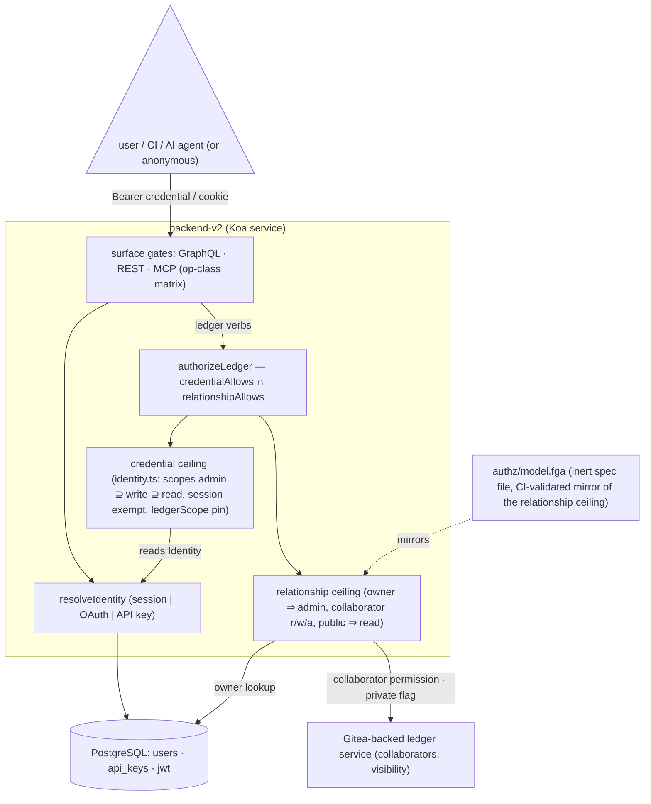

# ADR: Authorization strategy — declarative OpenFGA model for the relationship ceiling, engine adoption behind named triggers

- Status: Accepted
- Date: 2026-08-28
- Decision owners: Backend (`backend-cluster/backend-v2`)
- Scope: the ledger authorization semantics behind the `authorizeLedger` seam, the declarative model under `backend-cluster/backend-v2/authz/`, where the OpenFGA boundary sits (relationship ceiling in the model, credential ceiling in code), whether and when to adopt an OpenFGA-compatible evaluation engine, and which engine if a trigger fires. Extends ADR 0006 (identity, scopes, op classes); does not change any enforced behavior.

## Context

Ledger authorization is enforced by hand-written code with a deliberately small shape (ADR 0006): a closed three-scope vocabulary with implication (`ledger.admin` ⊇ `ledger.write` ⊇ `ledger.read`, `identity.ts`), an op-class matrix consulted by all three surfaces (`op-class.ts`), and one per-ledger seam — `authorizeLedger(identity, ledgerId, rel)` — that intersects two independent ceilings:

- **Credential ceiling** — what the presented credential may do on this request: sessions are capability-exempt, API keys and OAuth tokens carry granted scopes, a credential can be pinned to one ledger (`Identity.ledgerScope`).
- **Relationship ceiling** — what the caller is to the ledger: owner ⇒ admin, collaborator at read/write/admin, public ledger ⇒ read, else nothing.



Two facts constrain any engine adoption:

1. **The relationship data is not ours.** Owner/collaborator/visibility live in the external Gitea-backed ledger service and are resolved per request (`ledger-access-check.ts`); backend-v2's Postgres holds credentials, not relationships. Any tuple-store engine either syncs that data or receives it per check as contextual tuples.
2. **The model is small.** Three ranks × two ceilings, one resource type. The hand-written evaluation is ~30 lines with tests, drift guards, and audit hooks around it.

A survey of the OpenFGA-compatible ecosystem for Node (2026-08) found: no official in-process engine (OpenFGA is Go; embeddable as a Go library only, no WASM build; `@openfga/sdk` is an HTTP client; `@openfga/syntax-transformer` parses/validates the DSL but does not evaluate). A 2026 wave of community in-process engines exists — `@tsfga/core` (conformance-tested against live OpenFGA, Postgres via Kysely, MIT, single-maintainer, pre-1.0), `@zanzibar-ts/core` (OpenFGA model JSON as IR, Workers/D1-targeted, v0.1.x), `pgfga`/`melange` (evaluate `.fga` semantics inside Postgres over your own tables — moot for us while relationships live in Gitea) — all under a year old. The mature path is an OpenFGA server sidecar (CNCF incubating since 2025-10) plus the JS SDK. Same-family-but-different-DSL servers (SpiceDB, Permify, Ory Keto) and non-ReBAC embedded libraries (node-casbin, CASL, Cerbos embedded, OPA-WASM, deprecated Oso OSS) were considered and set aside: the requirement was OpenFGA's model shape.

## Decisions

### D1 — The model file is the specification of the relationship ceiling

`backend-cluster/backend-v2/authz/model.fga` expresses the relationship ceiling — owner/collaborator/public facts and the derived `can_admin ⊇ can_write ⊇ can_read` rank lattice — in the OpenFGA DSL, with a truth-table assertion suite in `model.test.fga.yaml`. Nothing evaluates it at runtime. A semantic change to relationship resolution (`ledger-access-check.ts`, `authorizeRank`) must update the model in the same PR — recorded in `backend-v2/CLAUDE.md`. CI (`.github/workflows/ci-authz-model.yml`) runs `fga model validate` and `fga model test` with a version- and checksum-pinned OpenFGA CLI; `model test` evaluates with the CLI's embedded engine, so CI needs no server, store, or network.

### D2 — The two-ceiling intersection is the canonical shape, composed in code

`effective permission = credential ceiling ∩ relationship ceiling`. The halves stay separate because they answer different questions: the relationship half is about people and ledgers (sharing); the credential half is about a person's own credentials (delegation — a read-only CI key, a ledger-pinned agent key, a scoped OAuth grant must stay weaker than the person). GitHub enforces the same intersection — role × fine-grained-PAT permissions — with the token half outside its authorization graph. The composition lives in `authorizeLedger` and stays in code under any adoption:

```ts
authorizeLedger = credentialAllows(identity, ledgerId, rel)    // identity.ts
               && relationshipAllows(userId, ledgerId, rel)    // today: ledger-access-check
                                                               // future: engine Check
```

### D3 — The model owns only the relationship ceiling

The credential ceiling (scopes, session exemption, `ledgerScope` pin) is deliberately not in the FGA model.

**Rejected alternative:** an earlier draft encoded it as `request_scope_*` relations supplied as contextual tuples, giving one model whose `can_* = rel_* and cap_*` intersection mirrored the full seam. OpenFGA supports that pattern (token claims as contextual tuples), but it was rescinded for three reasons:

1. **The schema cannot protect it.** OpenFGA cannot declare a relation "contextual-tuple-only"; a persisted scope tuple is schema-legal, and one persisted tuple would leak a session's full capability to that user's weakest API key. The design manufactured a security invariant ("never persist these") enforceable only by discipline.
2. **Authority would not move.** `identity.ts` still interprets every credential; a tuple builder would merely translate its verdict into synthetic relationships for the engine to re-intersect — an extra representation layer, no extra trust. The `ledgerScope` pin encoded as "emit no scope tuples" was the clearest smell: policy invisible to the model, expressed as an absence.
3. **It breaks trigger T2.** Scope tuples are per `(user, ledger)`. ListObjects ("which ledgers can this user read?") cannot take contextual tuples for an unknown candidate set, so capability filtering would return to code exactly when the engine is supposed to earn its keep.

Tuple-construction invariants that remain (sentinel anonymous subject, wildcard-only `public_reader`, resolver canonicalization — the model's union is monotonic, so a stale stronger grant is privilege escalation the model cannot detect) are listed in `authz/README.md`.

### D4 — No engine is adopted now

The hand-written seam stays. Adopting an engine today buys nothing: because relationships are resolved from Gitea per request, an engine would evaluate exactly the inputs the current code already evaluates — same lookups, fed back as contextual tuples — swapping ~30 proven lines for a generic graph evaluator plus either an unproven pre-1.0 dependency or a sidecar to operate. The engine's value materializes only when the model outgrows hand-written evaluation.

### D5 — Named triggers reopen the adoption decision

Any one of these reopens engine selection; absent them, proposals to adopt an engine should be declined by pointing here:

- **T1 — Organizations/teams/shared spaces.** The relationship half becomes GitHub-shaped (nested teams, org-default permissions): recursive graph traversal is where hand-rolled authorization breeds bugs and where a Zanzibar engine is the right tool.
- **T2 — Reverse queries.** A product need for "list every ledger this user can read" (ListObjects). Per-ledger request-time checks cannot answer this; it requires a tuple store and syncing (or relocating) the relationship data now held by Gitea.
- **T3 — Resource-type proliferation.** Bank connections, per-file ACLs, or other resources growing their own relation rules beyond the op-class matrix + single-seam structure.

### D6 — Pre-decided engine choice when a trigger fires

To avoid re-litigating the survey: prefer an **OpenFGA server sidecar** (Apache-2.0, CNCF) with Postgres storage — `deploy/bex/` has no persistent disks, so the SQLite backend is not an option there. If in-process evaluation is a hard requirement, take `@tsfga/core` or whatever conformance-tested in-process engine has matured by then, re-verified at that time. Adoption is a one-liner change in shape: `relationshipAllows` swaps its implementation from the Gitea lookup to an engine `Check` on `can_<rel>` (and ListObjects answers T2 directly, since D3 keeps capability out of the object graph); `model.fga` carries over unchanged — that is the point of D1. The relationship half then grows toward the GitHub/Gitea shape additively: widen type restrictions (`[user]` → `[user, team#member]`), add org-default permissions via `from owner_org`; the facts → derived-permissions structure is untouched.

## Follow-up (open)

A **neutral fixture matrix** — rows of (relationship, credential scope, pin, expected read/write/admin) — consumed by both the FGA assertion suite (relationship rows) and a Jest conformance test against the real `authorizeLedger` (all rows, Gitea/Fava dependencies stubbed). Today `fga model test` proves the model agrees with itself, and the same-PR rule is a discipline; the shared fixture is what makes model ↔ implementation agreement machine-checked. The composed two-ceiling truth table lives there, not in the FGA suite.

## Artifacts

- `backend-cluster/backend-v2/authz/model.fga` — the relationship-ceiling model (D1, D3).
- `backend-cluster/backend-v2/authz/model.test.fga.yaml` — 9 scenarios / 30 checks: rank per relationship, wildcard public access, fail-closed no-relation rows, union monotonicity.
- `backend-cluster/backend-v2/authz/README.md` — boundary rationale, implementation mapping, tuple derivation, adoption invariants.
- `.github/workflows/ci-authz-model.yml` — pinned-CLI validation on every change under `authz/`.
