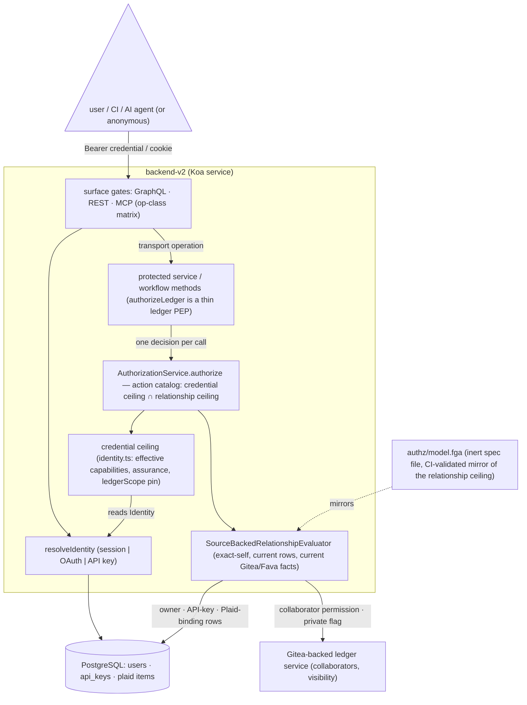

# ADR: Authorization strategy — declarative OpenFGA model for the relationship ceiling, engine adoption behind named triggers

- Status: Accepted
- Date: 2026-08-28
- Decision owners: Backend (`backend-cluster/backend-v2`)
- Scope: the authorization semantics behind the centralized TypeScript policy decision point (PDP) in `backend-cluster/backend-v2/src/server/api/authorization/`, the declarative model under `backend-cluster/backend-v2/authz/`, where the OpenFGA boundary sits (relationship ceiling in the model, credential ceiling in code), whether and when to adopt an OpenFGA-compatible evaluation engine, and which engine if a trigger fires. Extends ADR 0006 (identity, scopes, op classes). No FGA engine is deployed.

## Context

Authorization is enforced by hand-written code with a deliberately small shape (ADR 0006): a closed three-scope vocabulary with implication (`ledger.admin` ⊇ `ledger.write` ⊇ `ledger.read`, `identity.ts`), an op-class matrix consulted by all three surfaces (`op-class.ts`, whose `VERB_TABLE` entries name their canonical `authorizationAction`), and one PDP contract — `authorize({ principal, action, resource })` — that intersects two independent ceilings:

- **Credential ceiling** — what the presented credential may do on this request: sessions compute a full effective-capability set, API keys and OAuth tokens compute capabilities from granted scopes, a credential can be pinned to one ledger (`Identity.ledgerScope`), and internal work carries a distinct service principal.
- **Relationship ceiling** — what the caller is to the resource: exact-self for a user's own resources; for a ledger, owner ⇒ admin, collaborator at read/write/admin, public ledger ⇒ read, else nothing.

```mermaid
flowchart TB
  caller@{ shape: tri, label: "user / CI / AI agent (or anonymous)" }

  subgraph bv2["backend-v2 (Koa service)"]
    gates["surface gates: GraphQL · REST · MCP (op-class matrix)"]
    resolve["resolveIdentity (session | OAuth | API key)"]
    svc["protected service / workflow methods (authorizeLedger is a thin ledger PEP)"]
    pdp["AuthorizationService.authorize — action catalog: credential ceiling ∩ relationship ceiling"]
    cap["credential ceiling (identity.ts: effective capabilities, assurance, ledgerScope pin)"]
    relc["SourceBackedRelationshipEvaluator (exact-self, current rows, current Gitea/Fava facts)"]
  end

  fga["authz/model.fga (inert spec file, CI-validated mirror of the relationship ceiling)"]
  pg[("PostgreSQL: users · api_keys · plaid items")]
  gitea["Gitea-backed ledger service (collaborators, visibility)"]

  caller -->|"Bearer credential / cookie"| gates
  gates --> resolve
  gates -->|"transport operation"| svc
  svc -->|"one decision per call"| pdp
  resolve --> pg
  pdp --> cap
  pdp --> relc
  cap -->|"reads Identity"| resolve
  relc -->|"owner · API-key · Plaid-binding rows"| pg
  relc -->|"collaborator permission · private flag"| gitea
  fga -.->|"mirrors"| relc
```

Two facts constrain any engine adoption:

1. **The ledger relationship data is not ours.** Owner/collaborator/visibility live in the external Gitea-backed ledger service and are resolved per request (`ledger-access-check.ts` and Gitea repository reads in `source-backed-relationship-evaluator.ts`); backend-v2's Postgres holds credentials and bindings, not those relationships. A future tuple-store engine must synchronize that durable data rather than translating each request credential into contextual tuples.
2. **The model is small.** It has two types: `user`, with an exact-self `owner` relation and thirteen permissions derived from it, and `ledger`, with three ranks (`administrator` ⊇ `writer` ⊇ `reader`) and derived capability families. The hand-written relationship evaluations remain small, tested seams.

A survey of the OpenFGA-compatible ecosystem for Node (2026-08) found: no official in-process engine (OpenFGA is Go; embeddable as a Go library only, no WASM build; `@openfga/sdk` is an HTTP client; `@openfga/syntax-transformer` parses/validates the DSL but does not evaluate). A 2026 wave of community in-process engines exists — `@tsfga/core` (conformance-tested against live OpenFGA, Postgres via Kysely, MIT, single-maintainer, pre-1.0), `@zanzibar-ts/core` (OpenFGA model JSON as IR, Workers/D1-targeted, v0.1.x), `pgfga`/`melange` (evaluate `.fga` semantics inside Postgres over your own tables — moot for us while relationships live in Gitea) — all under a year old. The mature path is an OpenFGA server sidecar (CNCF incubating since 2025-10) plus the JS SDK. Same-family-but-different-DSL servers (SpiceDB, Permify, Ory Keto) and non-ReBAC embedded libraries (node-casbin, CASL, Cerbos embedded, OPA-WASM, deprecated Oso OSS) were considered and set aside: the requirement was OpenFGA's model shape.

## Decisions

### D1 — The model file is the specification of the relationship ceiling

`backend-cluster/backend-v2/authz/model.fga` expresses the relationship ceiling — exact-self user ownership plus ledger owner/collaborator/public facts and their derived capability families — in the OpenFGA DSL, with a truth-table assertion suite in `model.test.fga.yaml`. No OpenFGA runtime evaluates it. A semantic change to relationship resolution must update the model in the same PR — recorded in `backend-v2/AGENTS.md`. CI (`.github/workflows/ci-authz-model.yml`) runs `fga model validate` and `fga model test` with a version- and checksum-pinned OpenFGA CLI; `model test` evaluates with the CLI's embedded engine, so CI needs no server, store, or network.

### D2 — The two-ceiling intersection is the canonical shape, composed in code

`effective permission = credential ceiling ∩ relationship ceiling`. The halves stay separate because they answer different questions: the relationship half is about people and resources (sharing); the credential half is about a person's own credentials (delegation — a read-only CI key, a ledger-pinned agent key, a scoped OAuth grant must stay weaker than the person). GitHub enforces the same intersection — role × fine-grained-PAT permissions — with the token half outside its authorization graph.

The composition lives in `AuthorizationService` (`authorization-service.ts`) and stays in code under any adoption. Each action in the catalog (`AUTHORIZATION_ACTIONS` in `authorization-contract.ts`) declares both halves once: a credential requirement (admitted authentication methods, required operation capability, whether the ledger pin applies, whether an account-wide credential is required) and the relationships it needs on each resource type. `authorize` evaluates the credential requirement first, then asks an `IRelationshipEvaluator` for every declared relationship; a composite action names every capability family it needs, and all must hold. Unknown actions, malformed or action-incompatible resources, insufficient credentials, method/principal mismatches, and relationship denials all fail closed.

### D3 — The model owns only the relationship ceiling

The credential ceiling (effective capabilities derived from scopes/session/workload provenance, authentication assurance, and `ledgerScope` pin) is deliberately not in the FGA model. Credential and request facts never become persisted or contextual FGA tuples, in this service or any other.

**Rejected alternative:** an earlier draft encoded it as `request_scope_*` relations supplied as contextual tuples, giving one model whose `can_* = rel_* and cap_*` intersection mirrored the full decision. OpenFGA supports that pattern (token claims as contextual tuples), but it was rescinded for three reasons:

1. **The schema cannot protect it.** OpenFGA cannot declare a relation "contextual-tuple-only"; a persisted scope tuple is schema-legal, and one persisted tuple would leak a session's full capability to that user's weakest API key. The design manufactured a security invariant ("never persist these") enforceable only by discipline.
2. **Authority would not move.** `identity.ts` still interprets every credential; a tuple builder would merely translate its verdict into synthetic relationships for the engine to re-intersect — an extra representation layer, no extra trust. The `ledgerScope` pin encoded as "emit no scope tuples" was the clearest smell: policy invisible to the model, expressed as an absence.
3. **It breaks trigger T2.** Scope tuples are per `(user, ledger)`. ListObjects ("which ledgers can this user read?") cannot take contextual tuples for an unknown candidate set, so capability filtering would return to code exactly when the engine is supposed to earn its keep.

Tuple-construction invariants that remain (sentinel anonymous subject, wildcard-only `public_reader`, resolver canonicalization — the model's union is monotonic, so a stale stronger grant is privilege escalation the model cannot detect) are listed in `authz/README.md`.

### D4 — No engine is adopted now

The hand-written evaluator stays. Adopting an engine today buys nothing: because relationships are resolved from their authoritative sources per request, an engine would evaluate exactly the inputs the current code already evaluates — same lookups, fed back as contextual tuples — swapping a small proven evaluator for a generic graph evaluator plus either an unproven pre-1.0 dependency or a sidecar to operate. The engine's value materializes only when the model outgrows hand-written evaluation.

### D5 — Named triggers reopen the adoption decision

Any one of these reopens engine selection; absent them, proposals to adopt an engine should be declined by pointing here:

- **T1 — Organizations/teams/shared spaces.** The relationship half becomes GitHub-shaped (nested teams, org-default permissions): recursive graph traversal is where hand-rolled authorization breeds bugs and where a Zanzibar engine is the right tool.
- **T2 — Reverse queries.** A product need for "list every ledger this user can read" (ListObjects). Per-ledger request-time checks cannot answer this; it requires a tuple store and syncing (or relocating) the relationship data now held by Gitea.
- **T3 — Resource-type proliferation.** Bank connections, per-file ACLs, or other resources growing their own relation rules beyond the action catalog + single-evaluator structure.

T1 and T2 have not fired. Whether T3 has is an [open question](#open-questions).

### D6 — Pre-decided engine choice when a trigger fires

To avoid re-litigating the survey: prefer an **OpenFGA server sidecar** (Apache-2.0, CNCF) with Postgres storage — `deploy/bex/` has no persistent disks, so the SQLite backend is not an option there. If in-process evaluation is a hard requirement, take `@tsfga/core` or whatever conformance-tested in-process engine has matured by then, re-verified at that time. Adoption is a contained change in shape: the `IRelationshipEvaluator` implementation swaps from source-backed lookups to an engine `Check` on the same `(user, relation, object)` triples and fails closed when the engine is unavailable (and ListObjects answers T2 directly, since D3 keeps capability out of the object graph); `model.fga` carries over — that is the point of D1. The relationship half then grows toward the GitHub/Gitea shape additively: widen type restrictions (`[user]` → `[user, team#member]`), add org-default permissions via `from owner_org`; the facts → derived-permissions structure is untouched.

### D7 — One TypeScript PDP returns the final decision

“Centralized” means that one TypeScript PDP returns the final decision; it does **not** mean centralizing or copying every relationship into another database. This is not an OpenFGA engine adoption: it introduces no OpenFGA service, SDK, tuple store, relationship copy, or new dependency.

**What it covers.** The action catalog spans user profile, lifecycle, credential, billing, social, and public-key actions; ledger catalog, content, repository, pull-request, administration, collaborator, and star actions; bank connection, account, and transaction actions; assisted ingestion (receipt and file parsing, category suggestions, receipt insert); AI model, ask, and agent actions; and temporary-asset upload and download. Protected service and workflow methods call the PDP before domain reads or side effects, and GraphQL/REST/MCP aliases all use those services, so there is no resolver-only authority and no authorization-only wrapper another caller could bypass. Authentication ceremonies (signup, signin, OTP, OIDC, logout) and step-up/confirmation state stay outside it. Public profile discovery, the static tier-quota catalog, and reads of currently public ledgers are explicit exceptions recorded in `backend-v2/AGENTS.md`.

**Principals.** A resolved request identity carries an explicit user principal, computed effective operation capabilities, and authentication assurance. Sessions compute full read/write/admin capabilities; OAuth and API keys compute the same vocabulary from their granted scopes, and OAuth preserves `auth_time`, `acr`, and `amr` when present so later step-up policy does not require another identity-envelope migration. Internal scheduled work uses the `system` method with a service principal and an explicit on-behalf-of stable user ID rather than a fabricated session; it has a full capability ceiling while the user's current durable relationship still constrains the requested resource. Plaid webhook and scheduler work uses a module-issued background principal admitted only by actions that name its provenance. Callers without an identity are represented by a module-issued anonymous principal: the catalog admits it only for actions that declare anonymous access, the evaluator grants it only content and asset reads on a ledger that is currently public, and any denial surfaces as “Authentication required”.

**Relationship sources.** `SourceBackedRelationshipEvaluator` derives each relationship from its authoritative source on every call:

| Resource | Source of the relationship |
| --- | --- |
| `user` | Exact-self: the resource ID equals the stable resolved `users.id`. |
| `api_key` | The current `api_keys` row, resolved to its owner's User credentials permission; missing, blank, and foreign IDs return the same not-found result. |
| `ledger` | Ranks (`reader`, `writer`, `administrator`) from the Gitea/Fava permission through `ledger-access-check.ts`; capability families and visibility from the current Gitea repository read; `can_leave` from a current collaborator check. |
| `bank_connection` | The ledger's administrator relationship plus current Plaid item rows bound to the same user and ledger repository. |
| `temp_asset` | The object key's `tmp/{userId}/…` prefix, a trusted runtime key invariant. |

The evaluator stores no tuple, receives no contextual tuple, and keeps no decision memo or cross-request cache: every authorization call evaluates again. PostgreSQL, Gitea/Fava, and the resolved identity remain authoritative.

**`authorizeLedger`.** `src/features/ledger/utils/authorize-ledger.ts` is a thin policy enforcement point used by ledger-content services. It passes the canonical action, the identity (or the anonymous principal when none is supplied), and the ledger resource to the PDP, and contains no relationship policy of its own.

**Credential rules that live in the catalog.** Profile reads keep their read ceiling; profile search and update are session-only; deletion is session-or-OAuth and denies API keys (`ledger.admin` is authority over a ledger, not over the user's identity); API-key management requires the admin capability, and key creation additionally denies API-key callers. Paid-plan, scope-narrowing, ledger-pin, expiry, and secret-handling rules remain domain constraints after the PDP decision.

**Failure and audit.** Relationship-source failures are not disguised as policy denials: they are logged at error level, audited with outcome `error`, and surface as service unavailable. Every denial and allowed write/admin call emits an audit event with the exact transport operation ID when request-bound, or the canonical action for a direct service call, plus the ledger involved, without resource arguments or secrets. GraphQL, REST, and MCP gates propagate the transport operation ID through isolated AsyncLocalStorage child contexts, so concurrent operations cannot overwrite one another. Audit persistence itself remains fail-open.

## Open questions

- **Has T3 fired?** The facts: `model.fga` still has only the `user` and `ledger` types. Bank connections, assets, and AI appear in it as ledger-derived permission families (`can_read_bank_connections`, `can_write_bank_connections`, `can_read_assets`, `can_write_assets`, `can_write_ai`), not as types with their own relations. The runtime, however, evaluates three resource types the model does not declare — `api_key`, `bank_connection`, and `temp_asset` — each with a source-backed rule of its own (an owner row, a Plaid binding joined to ledger administration, a key-prefix invariant). T3 names bank connections explicitly. Reading T3 as "a new FGA type with its own relations" it has not fired; reading it as "resources with relation rules the model does not specify" it arguably has. The owner must decide which reading governs, and, if the second, whether those three rules belong in the model or stay documented runtime invariants.

## Follow-up (open)

A **neutral fixture matrix** — rows of (relationship, credential scope, pin, expected read/write/admin) — consumed by both the FGA assertion suite (relationship rows) and a Jest conformance test against the real PDP (all rows, Gitea/Fava dependencies stubbed). Today `fga model test` proves the model agrees with itself, the Jest suites under `src/server/api/authorization/__tests__/` prove the runtime agrees with itself, and the same-PR rule is a discipline; the only direct link is one evaluator test that mirrors the model's exact-self ownership. The shared fixture is what makes model ↔ implementation agreement machine-checked. The composed two-ceiling truth table lives there, not in the FGA suite.

## Artifacts

- `backend-cluster/backend-v2/authz/model.fga` — the relationship-ceiling model (D1, D3).
- `backend-cluster/backend-v2/authz/model.test.fga.yaml` — truth-table scenarios for exact-self User permissions, rank per ledger relationship, wildcard public access, fail-closed no-relation rows, and union monotonicity.
- `backend-cluster/backend-v2/authz/README.md` — boundary rationale, implementation mapping, tuple derivation, adoption invariants.
- `backend-cluster/backend-v2/src/server/api/authorization/authorization-contract.ts` — action catalog, relationship vocabulary, resource and principal types (D2, D7).
- `backend-cluster/backend-v2/src/server/api/authorization/authorization-service.ts` — the PDP: per-action credential and relationship requirements, decision, audit (D2, D7).
- `backend-cluster/backend-v2/src/server/api/authorization/source-backed-relationship-evaluator.ts` — `IRelationshipEvaluator` and its source-backed implementation, the D6 replacement seam.
- `backend-cluster/backend-v2/src/features/ledger/utils/authorize-ledger.ts` — the ledger PEP over the PDP.
- `.github/workflows/ci-authz-model.yml` — pinned-CLI validation on every change under `authz/`.
