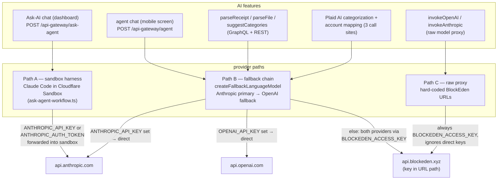

# ADR: AI API usage — three provider paths, explicit credentials per path

- Status: Accepted — documents the as-built architecture plus decisions from the 2026-09-07 receipt-parse outage; open items tracked in [Follow-up](#follow-up-open)
- Date: 2026-09-07
- Decision owners: Backend (`backend-cluster/backend-v2`); Mobile for the client-side error-surfacing item
- Scope: which features call which LLM provider through which code path, how each path resolves credentials, where spend and quota are gated, and what a provider failure looks like to callers. Motivated by an outage in which the Ask-AI assistant stayed healthy while every fallback-chain feature (receipt parse, file parse, category suggestions, Plaid AI, the mobile agent chat) failed with a masked error — because the paths share no credential resolution and nothing documented that. Related: ADR 0002 (mobile) for the mobile agent client, ADR 0010 for the authz PDP that gates every AI action.

## Context

backend-v2 talks to LLM providers through **three independent call paths**. They were built at different times for different needs, resolve credentials differently, and share nothing but the per-user AI CFO quota service. Until this ADR, the only place that knowledge lived was the code.

**Path A — sandbox harness** (`src/features/ai-agent/workflow/ask-agent-workflow.ts`, route `ask-agent-route.ts`). Runs Claude Code inside a Cloudflare Sandbox. Anthropic only. Credentials are the `ANTHROPIC_API_KEY` / `ANTHROPIC_AUTH_TOKEN` env vars forwarded into the sandbox via `credentialEnv`, with `ANTHROPIC_BASE_URL` / `ANTHROPIC_MODEL` forwarded non-secret so local stacks can point at an Ollama-style server. Never touches `BLOCKEDEN_ACCESS_KEY`.

**Path B — fallback chain** (`src/features/llm/utils/fallback-language-model.ts`, wrapped by `LLMClient`). An Anthropic-primary (`claude-sonnet-4-5-20250929`) → OpenAI-fallback (`gpt-4o`) `LanguageModel` for the Vercel `ai` SDK. Per provider: direct to the vendor API when its env key is set, otherwise routed through the BlockEden gateway with `BLOCKEDEN_ACCESS_KEY` in the URL path. `doGenerate`/`doStream` try providers in order and throw only when the last one fails non-retriably. Consumers: `parseReceipt`, `parseFile`, `suggestCategories` (`llm-service.ts`), the three Plaid AI call sites (`plaid-item-service.ts`), and `SelfHostedAgentHandler` behind `POST /api-gateway/agent` — which is the route the **mobile agent screen** calls (ADR 0002; `mobile/src/screens/agent-screen/use-agent-chat.ts`).

**Path C — raw proxy** (`invokeOpenAI` / `invokeAnthropic` in `llm-service.ts`). Caller-selected provider, request body passed through. Both URLs hard-code the BlockEden gateway; direct keys are never consulted.

Two asymmetries in credential resolution are the sharp edges:

1. **Path B reads `ANTHROPIC_API_KEY` only — never `ANTHROPIC_AUTH_TOKEN`.** A deployment configured the sandbox way (AUTH_TOKEN set, API_KEY empty — the `deploy/dev-sandbox/.env` pattern) has a fully working Path A and a Path B whose two providers both silently collapse onto the BlockEden key.
2. **`BLOCKEDEN_ACCESS_KEY` is required to boot but not required to be valid.** `LLMClient` is constructed eagerly in service constructors; an empty key throws `LoadAPIKeyError` at startup, so `deploy/docker/.env.example` and `bex.yaml` seed the placeholder `local-dev-placeholder` — which boots the server and silently disables every Path B/C feature until a user hits one.

### The 2026-09-07 outage that motivated this document

Mobile receipt scanning failed for every attempt with the client's catch-all "Upload failed. Please try again." An authenticated replay of the mobile flow against production isolated it: presigned-URL mint ✅, S3 PUT ✅, ledger accounts fetch ✅, `parseReceipt` ❌ in under half a second — faster than the accounts query alone, i.e. the LLM leg rejected immediately. Production had the seeded placeholder as its only Path B credential; both fallback providers 401'd at the BlockEden gateway (~145 ms each, measured), the non-retriable `APICallError` was masked to `INTERNAL_SERVER_ERROR` on both GraphQL and REST, and the mobile client — whose quota/parse error classification is dead code under Apollo's default `errorPolicy` — rendered everything as an upload failure. Path A, holding its own Anthropic credential, kept the Ask-AI assistant working throughout, which sent the diagnosis in the wrong direction for hours. A sibling probe of `parseFile` escaped the request error boundary entirely and **crashed the production process** (edge 502 for ~10 s until Compose health-gating restarted it).

## Decisions

### D1 — The three paths are named and closed

Path A (sandbox harness), Path B (fallback chain via `LLMClient` / `createFallbackLanguageModel`), Path C (raw BlockEden proxy). A new AI feature must state which path it uses; the default is Path B through `LLMClient`. Adding a fourth path — or a call site that constructs its own provider client — requires amending this ADR. This is what makes "which features die when credential X dies" answerable from documentation instead of a production incident.

### D2 — Credential resolution is per-path and deliberately asymmetric

| Path | Reads | Ignores | Upstream when unset |
|---|---|---|---|
| A | `ANTHROPIC_API_KEY`, `ANTHROPIC_AUTH_TOKEN`, `ANTHROPIC_BASE_URL` (forwarded into sandbox) | `BLOCKEDEN_ACCESS_KEY`, `OPENAI_API_KEY` | none — sandbox agent fails |
| B | `ANTHROPIC_API_KEY`, `OPENAI_API_KEY` (direct, per provider) | `ANTHROPIC_AUTH_TOKEN` | BlockEden with `BLOCKEDEN_ACCESS_KEY` |
| C | `BLOCKEDEN_ACCESS_KEY` only | all direct keys | n/a — always BlockEden |

The Path B ↔ `ANTHROPIC_AUTH_TOKEN` exclusion is intentional: OAuth subscription tokens are rate-limited and subscription-scoped, suitable for the interactive sandbox harness but not for server-side extraction volume. Operators must know that configuring "Anthropic works" for Path A proves nothing about Path B.

### D3 — Production must give Path B a credential that does not share fate with its fallback

The fallback chain only delivers availability when its two providers can fail independently. A deployment where both route through one BlockEden key has a fallback in name only — one revoked key is a full Path B outage. Production sets at least one direct key (`ANTHROPIC_API_KEY` preferred, since it is the primary), and treats the BlockEden key as either a real second path or explicitly accepts Path C as down. The seeded placeholder is a boot aid, never a production value; a deployment checklist item, not a code check, because boot-time remote validation is out (D6 covers detection).

### D4 — Every Path B/C call is quota-gated per user; aggregate spend is bounded upstream only

All consumers check `aiCfoUsageService` before the provider call and record token usage after it. That caps **per-user** spend at the tier quota. There is deliberately no application-side aggregate cap — the ceiling is the provider/gateway account itself — so enabling a valid key re-activates real billing across six features at once (receipt parse, file parse, category suggestions, Plaid ×2 flavors, mobile agent chat). Operators watch the upstream usage dashboard after any credential change.

### D5 — Provider failures are masked to clients but must be observable to operators

Non-domain provider errors surface to callers as `INTERNAL_SERVER_ERROR` — correct for clients (upstream error bodies can leak gateway keys embedded in URLs), insufficient for operators. Two consequences, one implemented pattern and one required change: `suggestCategories`' explicit not-configured guard (`llm-service.ts:263`) becomes the norm — `parseReceipt` and `parseFile` gain the same guard so a placeholder credential produces a clear domain error instead of a masked 500 — and the underlying error is logged with the request id before masking. Additionally, error logging in the fallback model must redact the BlockEden key, which appears inside provider `baseURL`s and therefore inside logged `APICallError` objects.

### D6 — A request must never kill the process, and a dead credential must not wait for a user to be discovered

The `parseFile` boundary escape (one request → process exit → ~10 s full-site 502) is a defect, not a tolerated behavior: every Path B/C call site must contain provider failures within the request. Detection is synthetic, not structural: a startup or scheduled probe exercises Path B with a trivial call and surfaces failure to logs/alerting, because the boot-with-placeholder design (D3) means nothing else distinguishes "AI configured" from "AI silently dead."

## Amendment — 2026-09-08: image-path root cause confirmed from production logs

After a valid `BLOCKEDEN_ACCESS_KEY` was deployed, text-only Path B/C calls recovered but `parseReceipt` kept failing. Production logs (`fallback-language-model` warn + the masked GraphQL error) show **two independent defects, one per provider**, so the fallback chain cannot rescue:

1. **Anthropic-via-BlockEden rejects every AI-SDK-shaped request.** BlockEden's cost estimator parses the request with a Go struct typing `messages[].content` as `string`; the AI SDK always sends content as an **array of blocks**, so the gateway 400s (`json: cannot unmarshal array into Go struct field .messages.content of type string`) before the request ever reaches Anthropic. This breaks not just images but every Path B Anthropic call routed through BlockEden — hand-rolled Path C bodies with string content pass, which is why the text probe succeeded.
2. **OpenAI fallback fails strict-schema validation.** The extraction schema declares `date` optional (deliberate — "omit if no date visible"), but OpenAI's `response_format` strict mode requires every property to appear in `required` (`Invalid schema … Missing 'date'`). The standard strict-mode encoding is required-but-nullable.

Consequences: D3 is sharpened — **a direct `ANTHROPIC_API_KEY` is required in production**, not merely recommended, because the BlockEden Anthropic route cannot carry AI-SDK multimodal/array bodies at all (config-only fix restoring the primary for all Path B consumers). The OpenAI schema fix (make `date` required + nullable) moves to the follow-up list, as does migrating off the AI SDK's deprecated `"image"` content part (warned at runtime; replaced by `file` parts with a `mediaType`).

**Resolution (2026-09-08):** the direct `ANTHROPIC_API_KEY` was deployed and verified end-to-end against production — a real receipt fixture parsed in ~10 s with account recommendations populated. Receipt parsing and every other Path B consumer are restored. Two standing realities until their follow-ups land: the fallback chain is **effectively single-legged** (the OpenAI fallback still fails strict `response_format` validation, so an Anthropic outage takes Path B down), and the gateway's array-content defect is **filed on the vendor's own board** — once fixed upstream, D3's "required" relaxes back to "recommended (independent failure domains)". One nuance from the same logs: the OpenAI attempt reached OpenAI's own schema validator, so the gateway's OpenAI route evidently tolerated the array-content body its Anthropic route rejects — the two vendor routes do not share the defect's observable behavior.

## Amendment — 2026-09-08: tier-1 vendor cleanup

Three low-risk reductions of the surface this ADR documents, shipped together after the outage closed:

1. **Path C is pruned to its one real consumer.** The Anthropic raw-proxy route (`POST /api-gateway/ai/anthropic/v1/messages` → `invokeAnthropic`) is deleted: it had zero first-party callers and appeared in no public contract (not in the IDL, not in docs). The OpenAI-compatible route remains as `bea ask`'s quota-metered endpoint — that is now the whole of Path C. The `ai.anthropicMessages` verb was retired from the op-class table and the accepted parity baseline in the same change; this is a deliberate product removal of a dead operation, not a parity-gap adjustment.
2. **The `sk-ant-oat` OAuth-token branch is gone from the fallback factory.** Servers authenticate with real API keys (its own comment said as much); Path B's Anthropic provider is now a plain `createAnthropic({ apiKey })`.
3. **`PlaidItemService` constructs its `LLMClient` once** through a lazy, memoized seam instead of three per-call constructions — future provider-wiring changes touch one line, and an unconfigured LLM still cannot block service construction.

Remaining tier-2/3 candidates (guard-message fix, removing Path B's implicit BlockEden fallback branch, retiring the boot placeholder, the OpenAI-fallback decision) stay in Follow-up.

## Amendment — 2026-09-08: tier-2 cleanup — Path B leaves BlockEden, unconfigured becomes a legal state

This amendment supersedes the D2 table's Path B row and the placeholder convention D3 tolerated:

1. **Path B is direct-keys-only.** `createFallbackLanguageModel()` no longer takes a gateway key and has no BlockEden branches: `ANTHROPIC_API_KEY` (primary) and `OPENAI_API_KEY` (fallback) are the entire credential story. The shared-fate trap — both providers silently collapsing onto one gateway credential — is now structurally impossible. `BLOCKEDEN_ACCESS_KEY` exists only for Path C, where `invokeModelProxy` guards it with its own clear error ("Model proxy is not configured").
2. **Construction never throws; unconfigured fails clearly per call.** With no key set the factory returns a stub model whose calls raise "LLM is not configured. Set ANTHROPIC_API_KEY or OPENAI_API_KEY." — and `parseReceipt` / `parseFile` / `suggestCategories` fail fast with the same message as a domain error (visible to clients, per D5) before any quota, S3, or ledger work. The stale "set BLOCKEDEN_ACCESS_KEY" guard message is gone.
3. **The boot placeholder is retired.** `local-dev-placeholder` is deleted from `deploy/docker/.env.example`, `deploy/docker-mac/.env.example`, `deploy/dev-sandbox/.env.example`, and `bex.yaml`; all LLM env vars may be empty and the server boots regardless. "AI not configured" is now a visible, legitimate state instead of a boots-but-silently-dead trap. `PlaidItemService` lost its config dependency entirely (its `LLMClient` is a plain field), and the D5 key-in-logged-URL redaction concern is moot for Path B — its provider URLs can no longer carry a gateway key.

D2's table should now be read as: Path B reads `ANTHROPIC_API_KEY` / `OPENAI_API_KEY`, ignores everything else, and has **no** upstream when unset — calls fail with the not-configured error. D3's operational rule simplifies to: set at least `ANTHROPIC_API_KEY` in any environment that should serve AI features.

## Follow-up (open)

- Contain the `parseFile` unhandled-rejection escape; add a regression test that the process survives a failing LLM upstream (D6).
- Implement the Path B synthetic probe (D6).
- Mobile: fix the dead error-classification path in `use-receipt-workflow.ts` (Apollo default `errorPolicy` means `result.errors` is never populated; classify via `ApolloError.graphQLErrors[].extensions.code` or pass `errorPolicy: "all"`), split upload-leg vs parse-leg vs quota messages, and report the raw error to Sentry.
- Refresh the pinned models (`claude-sonnet-4-5-20250929` primary, `gpt-4o` fallback) and consider a small-model tier for extraction workloads.
- Make the extraction schema's `date` field required + nullable so the OpenAI fallback passes strict `response_format` validation — until then the fallback chain is single-legged (see the 2026-09-08 resolution).
- Replace the deprecated `"image"` content part with a `file` part carrying `mediaType` (AI SDK runtime deprecation warning observed in production).

## Artifacts

- `backend-cluster/backend-v2/src/features/llm/utils/fallback-language-model.ts` — Path B provider construction and fallback loop
- `backend-cluster/backend-v2/src/features/llm/utils/llm-client.ts` — `LLMClient` wrapper (eager construction; boot behavior)
- `backend-cluster/backend-v2/src/features/llm/service/llm-service.ts` — `parseReceipt` / `parseFile` / `suggestCategories`, Path C proxies, quota gating
- `backend-cluster/backend-v2/src/features/plaid/service/plaid-item-service.ts` — Plaid AI call sites (Path B)
- `backend-cluster/backend-v2/src/features/ai-agent/workflow/ask-agent-workflow.ts` — Path A sandbox harness and credential forwarding
- `backend-cluster/backend-v2/src/features/ai-agent/api/agent-route.ts` — `/api-gateway/agent` (Path B) — the mobile agent client's route (ADR 0002)
- `deploy/docker/.env.example`, `bex.yaml` — the boot-placeholder convention this ADR's D3 constrains
- `mobile/src/screens/receipt-capture-screen/use-receipt-workflow.ts` — client-side error mapping (follow-up)
