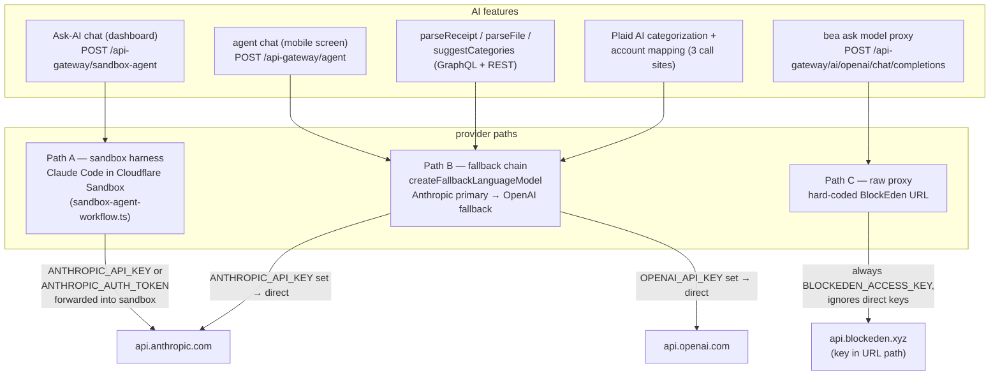

# ADR: AI API usage — three provider paths, explicit credentials per path

- Status: Accepted — documents the as-built architecture plus decisions from the 2026-09-07 receipt-parse outage; open items tracked in [Follow-up](#follow-up-open)
- Date: 2026-09-07
- Decision owners: Backend (`backend-cluster/backend-v2`); Mobile for the client-side error surfacing
- Scope: which features call which LLM provider through which code path, how each path resolves credentials, where spend and quota are gated, and what a provider failure looks like to callers. Motivated by an outage in which the Ask-AI assistant stayed healthy while every fallback-chain feature (receipt parse, file parse, category suggestions, Plaid AI, the mobile agent chat) failed with a masked error — because the paths share no credential resolution and nothing documented that. Related: ADR 0002 (mobile) for the mobile agent client, ADR 0010 for the authz PDP that gates every AI action.

## Context

backend-v2 talks to LLM providers through **three independent call paths**. They were built at different times for different needs, resolve credentials differently, and share nothing but the per-user AI CFO quota service. Until this ADR, the only place that knowledge lived was the code.

```mermaid
flowchart TB
  subgraph features["AI features"]
    ask["Ask-AI chat (dashboard)\nPOST /api-gateway/sandbox-agent"]
    agent["agent chat (mobile screen)\nPOST /api-gateway/agent"]
    receipt["parseReceipt / parseFile /\nsuggestCategories (GraphQL + REST)"]
    plaid["Plaid AI categorization +\naccount mapping (3 call sites)"]
    proxy["bea ask model proxy\nPOST /api-gateway/ai/openai/chat/completions"]
  end

  subgraph paths["provider paths"]
    A["Path A — sandbox harness\nClaude Code in Cloudflare Sandbox\n(sandbox-agent-workflow.ts)"]
    B["Path B — fallback chain\ncreateFallbackLanguageModel\nAnthropic primary → OpenAI fallback"]
    C["Path C — raw proxy\nhard-coded BlockEden URL"]
  end

  anthropic["api.anthropic.com"]
  openai["api.openai.com"]
  blockeden["api.blockeden.xyz\n(key in URL path)"]

  ask --> A
  agent --> B
  receipt --> B
  plaid --> B
  proxy --> C

  A -->|"ANTHROPIC_API_KEY or\nANTHROPIC_AUTH_TOKEN\nforwarded into sandbox"| anthropic
  B -->|"ANTHROPIC_API_KEY set → direct"| anthropic
  B -->|"OPENAI_API_KEY set → direct"| openai
  C -->|"always BLOCKEDEN_ACCESS_KEY,\nignores direct keys"| blockeden
```

**Path A — sandbox harness** (`src/features/ai-agent/workflow/sandbox-agent-workflow.ts`, route `POST /api-gateway/sandbox-agent` in `sandbox-agent-route.ts`). Runs Claude Code inside a Cloudflare Sandbox. Anthropic only. Credentials are the `ANTHROPIC_API_KEY` / `ANTHROPIC_AUTH_TOKEN` env vars forwarded into the sandbox via `credentialEnv`, with `ANTHROPIC_BASE_URL` / `ANTHROPIC_MODEL` / `ANTHROPIC_SMALL_FAST_MODEL` forwarded non-secret so local stacks can point at an Ollama-style server. Never touches `BLOCKEDEN_ACCESS_KEY`.

**Path B — fallback chain** (`src/features/llm/utils/fallback-language-model.ts`, wrapped by `LLMClient`). An Anthropic-primary → OpenAI-fallback `LanguageModel` for the Vercel `ai` SDK, each provider constructed only when its direct key is set. `doGenerate`/`doStream` try providers in order and throw only when the last one fails non-retriably. Consumers: `parseReceipt`, `parseFile`, `suggestCategories` (`llm-service.ts`), the three Plaid AI call sites (`plaid-item-service.ts`), the liveness probe (`llm-probe.ts`), and `SelfHostedAgentHandler` behind `POST /api-gateway/agent` — which is the route the **mobile agent screen** calls (ADR 0002; `mobile/src/screens/agent-screen/use-agent-chat.ts`).

**Path C — raw proxy** (`invokeOpenAI` in `llm-service.ts`, route `POST /api-gateway/ai/openai/chat/completions` in `openai-chat-completions-route.ts`). An OpenAI-compatible request body passed through to a hard-coded BlockEden gateway URL; direct keys are never consulted. Its one consumer is `bea ask`'s quota-metered endpoint. The Anthropic twin of this proxy had no first-party caller and appeared in no public contract, so it was deleted together with its `ai.anthropicMessages` verb — a deliberate product removal of a dead operation, not a parity-gap adjustment.

### The 2026-09-07 outage that motivated this document

Mobile receipt scanning failed for every attempt with the client's catch-all "Upload failed. Please try again." An authenticated replay of the mobile flow against production isolated it: presigned-URL mint ✅, S3 PUT ✅, ledger accounts fetch ✅, `parseReceipt` ❌ in under half a second — faster than the accounts query alone, i.e. the LLM leg rejected immediately. Path A, holding its own Anthropic credential, kept the Ask-AI assistant working throughout, which sent the diagnosis in the wrong direction for hours. A sibling probe of `parseFile` escaped the request error boundary entirely and **crashed the production process** (edge 502 for ~10 s until Compose health-gating restarted it).

At the time Path B fell back to the BlockEden gateway for any provider without a direct key, and deployments seeded a placeholder gateway key so the server could boot. Production logs showed **two independent defects, one per provider**, so the fallback chain could not rescue:

1. **Anthropic-via-BlockEden rejected every AI-SDK-shaped request.** With no `ANTHROPIC_API_KEY`, the primary rode the gateway. BlockEden's cost estimator parses the request with a Go struct typing `messages[].content` as `string`; the AI SDK always sends content as an **array of blocks**, so the gateway returned 400 before the request reached Anthropic. Hand-rolled Path C bodies with string content passed, which is why a text probe succeeded.
2. **The OpenAI fallback failed strict-schema validation.** Production had a direct `OPENAI_API_KEY`, so the fallback leg reached OpenAI — and was rejected because the extraction schema declared `date` optional, while OpenAI's `response_format` strict mode requires every property to appear in `required`. The outage logs therefore say nothing about BlockEden's OpenAI route either way.

The last provider's non-retriable error was masked to `INTERNAL_SERVER_ERROR` on both GraphQL and REST, and the mobile client — whose quota/parse error classification was dead code under Apollo's default `errorPolicy` — rendered everything as an upload failure. Deploying a direct `ANTHROPIC_API_KEY` restored the primary; the decisions below remove the conditions that let the outage happen and hide.

## Decisions

### D1 — The three paths are named and closed

Path A (sandbox harness), Path B (fallback chain via `LLMClient` / `createFallbackLanguageModel`), Path C (raw BlockEden proxy, OpenAI-compatible only). A new AI feature must state which path it uses; the default is Path B through `LLMClient`. Adding a fourth path — or a call site that constructs its own provider client — requires amending this ADR. `fallback-language-model.ts` is the only file in `src/` that constructs a provider client. This is what makes "which features die when credential X dies" answerable from documentation instead of a production incident.

### D2 — Credential resolution is per-path and deliberately asymmetric

| Path | Reads | Ignores | Upstream when unset |
|---|---|---|---|
| A | `ANTHROPIC_API_KEY`, `ANTHROPIC_AUTH_TOKEN`, `ANTHROPIC_BASE_URL` (forwarded into sandbox) | `BLOCKEDEN_ACCESS_KEY`, `OPENAI_API_KEY` | none — sandbox agent fails |
| B | `ANTHROPIC_API_KEY`, `OPENAI_API_KEY` (direct, per provider) | `ANTHROPIC_AUTH_TOKEN`, `BLOCKEDEN_ACCESS_KEY` | none — calls fail with the not-configured error |
| C | `BLOCKEDEN_ACCESS_KEY` only | all direct keys | none — "Model proxy is not configured" |

Path B is direct-keys-only. `createFallbackLanguageModel()` takes no gateway key and has no BlockEden branch, so both providers silently collapsing onto one gateway credential is structurally impossible. Its Anthropic provider is a plain `createAnthropic({ apiKey })`: servers authenticate with real API keys, and the Path B ↔ `ANTHROPIC_AUTH_TOKEN` exclusion is intentional — OAuth subscription tokens are rate-limited and subscription-scoped, suitable for the interactive sandbox harness but not for server-side extraction volume. Operators must know that configuring "Anthropic works" for Path A proves nothing about Path B.

Provider models are config, not code: `LLM_MODEL` / `LLM_FALLBACK_MODEL` (deliberately not `ANTHROPIC_MODEL` — that belongs to the Path A sandbox) select them, defaulting to the aliases `claude-sonnet-4-5` / `gpt-4o`.

### D3 — "AI not configured" is a legal, visible state; the fallback must be a real second leg

Construction never throws. With no key set the factory returns a stub model whose calls raise "LLM is not configured. Set ANTHROPIC_API_KEY or OPENAI_API_KEY.", so `LLMClient` — a thin `generateText` wrapper holding the model returned by `createFallbackLanguageModel()` — can be built in service constructors and field initializers (`PlaidItemService` holds one as a plain field) without any credential. Every LLM env var may be empty in `deploy/docker/.env.example`, `deploy/docker-mac/.env.example`, `deploy/dev-sandbox/.env.example`, and `bex.yaml`, and the server boots regardless. There is no boot placeholder: a value that boots the server while silently disabling AI is exactly the trap that hid in production.

The fallback chain only delivers availability when its two providers can fail independently. With direct keys they do. Operational rule: set at least `ANTHROPIC_API_KEY` (the primary) in any environment that should serve AI features, and `OPENAI_API_KEY` to have a fallback at all. The OpenAI leg is kept honest by CI: the receipt schema's `date` is required + nullable (the standard strict-mode encoding), and a static gate (`structured-output-strict-compat.test.ts`) walks every registered `Output.object` schema, fails on any strict-mode violation, and asserts the set of `Output.object` call sites is exactly the four registered.

### D4 — Calls are quota-gated per user; aggregate spend is bounded upstream only

`parseReceipt`, `parseFile`, `suggestCategories`, the mobile agent chat (`SelfHostedAgentHandler`), the sandbox harness route, and the Path C proxy check `aiCfoUsageService` before the provider call and record token usage after it. That caps **per-user** spend at the tier quota. The three Plaid AI call sites in `plaid-item-service.ts` call the model without an `aiCfoUsageService` check of their own; see [Follow-up](#follow-up-open). There is deliberately no application-side aggregate cap — the ceiling is the provider account itself — so enabling a valid key re-activates real billing across every Path B feature at once. Operators watch the upstream usage dashboard after any credential change.

### D5 — Provider failures are masked to clients but must be observable to operators

Non-domain provider errors surface to callers as `INTERNAL_SERVER_ERROR` — correct for clients, insufficient for operators. Three mechanisms close the gap:

- **Not-configured is a clear error, not a masked one.** `parseReceipt`, `parseFile`, and `suggestCategories` call `assertLlmConfigured()` (`llm-service.ts`) immediately after authorization and before any quota, S3, or ledger work, failing with the not-configured message. Path C guards its own key in `invokeModelProxy` with "Model proxy is not configured. Set BLOCKEDEN_ACCESS_KEY."
- **Provider failures are logged before fallback.** The fallback model logs each failed provider at warn level with its model id. Path B provider URLs no longer carry a gateway key, so those logged errors cannot leak one; Path C's URL still embeds `BLOCKEDEN_ACCESS_KEY`, so that URL must never be logged or returned to a caller.
- **The mobile client shows the real cause.** `use-receipt-workflow.ts` classifies the parse leg from the thrown `ApolloError` through `parseErrorCode` in `receipt-utils.ts` (`RESOURCE_LIMIT_REACHED` → quota, else parse) and reports every leg to Sentry via a thin `captureError` seam.

### D6 — A request must never kill the process, and a dead credential must not wait for a user to be discovered

Every Path B/C call site must contain provider failures within the request. `parseFile` awaits extraction directly. `parseReceipt` runs receipt extraction and the ledger accounts fetch concurrently under `Promise.all`: the first rejection fails the request, and `Promise.all` has already attached a handler to the sibling promise, so a later sibling rejection cannot escape as an unhandled rejection. A child-process gate (`upstream-survival.test.ts`) runs the real AI SDK extraction utilities against hostile upstreams (auth reject, socket destroyed mid-body, garbage body, connection reset) under `--unhandled-rejections=strict` and asserts every failure surfaces as a thrown error with the process alive.

Detection is synthetic, not structural. A probe (`llm-probe.ts`) fires once at boot (fire-and-forget, `start-server.ts`) and hourly (`llm-probe` scheduler job): unconfigured logs one quiet info line and makes no traffic; configured-but-dead logs a loud warning within the first minute.

## Follow-up (open)

- Replace the deprecated `"image"` content part in `src/features/llm/utils/prepare-llm-message.ts` with a `file` part carrying `mediaType` (AI SDK runtime deprecation warning observed in production; a warning, not a failure).
- Run the Haiku-vs-Sonnet extraction eval (w2/m30/t006) and record a keep/switch decision — blocked on an operator `ANTHROPIC_API_KEY`; the code prerequisite (`LLM_MODEL` passthrough) is already in place.
- Decide whether the Plaid AI call sites should be quota-gated like the other Path B consumers (D4), or record why they are exempt.
- The survival gate exercises the extraction utilities, not `LLMService` itself; a service-level test of the concurrent `parseReceipt` pair would make D6's containment claim machine-checked at the layer where the concurrency lives.

## Artifacts

- `backend-cluster/backend-v2/src/features/llm/utils/fallback-language-model.ts` — Path B provider construction, model config, not-configured stub, and fallback loop
- `backend-cluster/backend-v2/src/features/llm/utils/llm-client.ts` — `LLMClient`, a `generateText` wrapper over the fallback model; construction never throws
- `backend-cluster/backend-v2/src/features/llm/utils/llm-probe.ts`, `backend-cluster/backend-v2/src/scheduler/jobs/llm-probe-job.ts` — Path B liveness probe (boot + hourly)
- `backend-cluster/backend-v2/src/features/llm/service/llm-service.ts` — `parseReceipt` / `parseFile` / `suggestCategories`, the Path C proxy, quota gating
- `backend-cluster/backend-v2/src/features/llm/utils/__tests__/upstream-survival.test.ts`, `backend-cluster/backend-v2/src/features/llm/utils/__tests__/structured-output-strict-compat.test.ts` — the D6 and D3 gates
- `backend-cluster/backend-v2/src/features/plaid/service/plaid-item-service.ts` — Plaid AI call sites (Path B)
- `backend-cluster/backend-v2/src/features/ai-agent/workflow/sandbox-agent-workflow.ts`, `backend-cluster/backend-v2/src/features/ai-agent/api/sandbox-agent-route.ts` — Path A sandbox harness and credential forwarding
- `backend-cluster/backend-v2/src/features/ai-agent/api/agent-route.ts` — `/api-gateway/agent` (Path B) — the mobile agent client's route (ADR 0002)
- `backend-cluster/backend-v2/src/features/ai-agent/api/openai-chat-completions-route.ts` — Path C route for `bea ask`
- `deploy/docker/.env.example`, `bex.yaml` — LLM env vars, all optional at boot
- `mobile/src/screens/receipt-capture-screen/use-receipt-workflow.ts`, `mobile/src/screens/receipt-capture-screen/receipt-utils.ts` — client-side error classification
