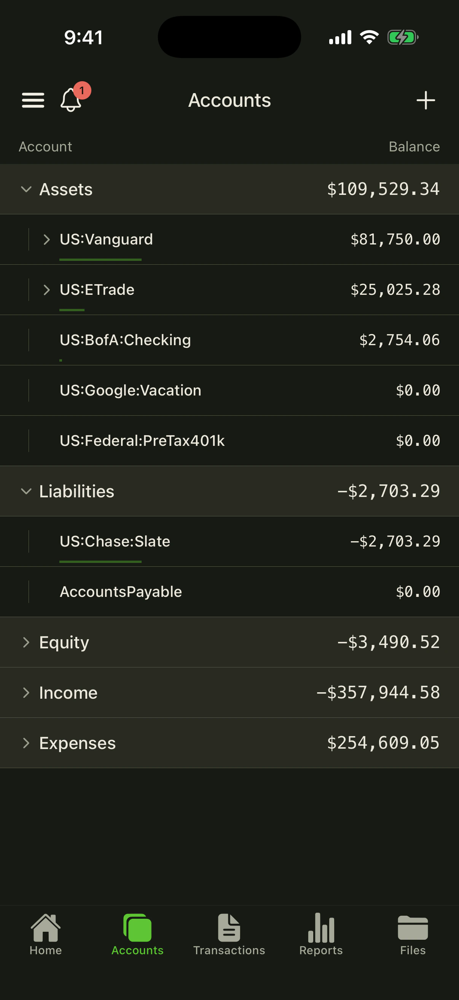
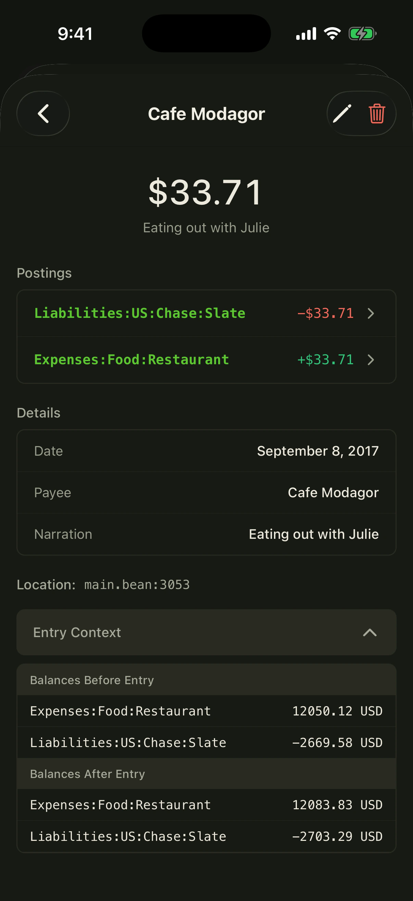
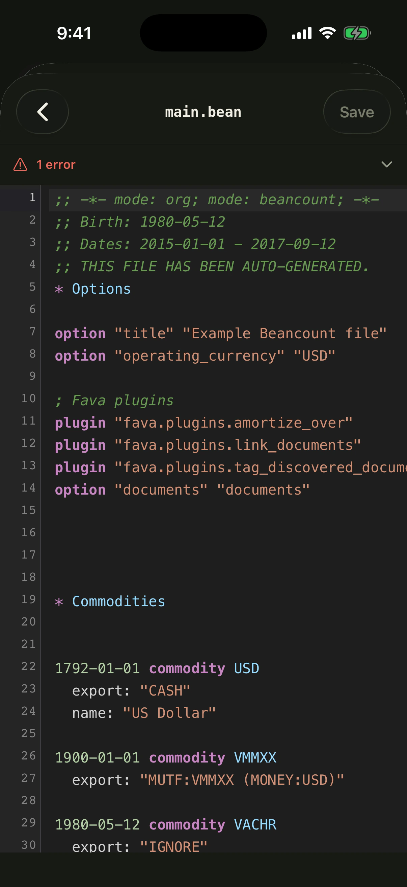
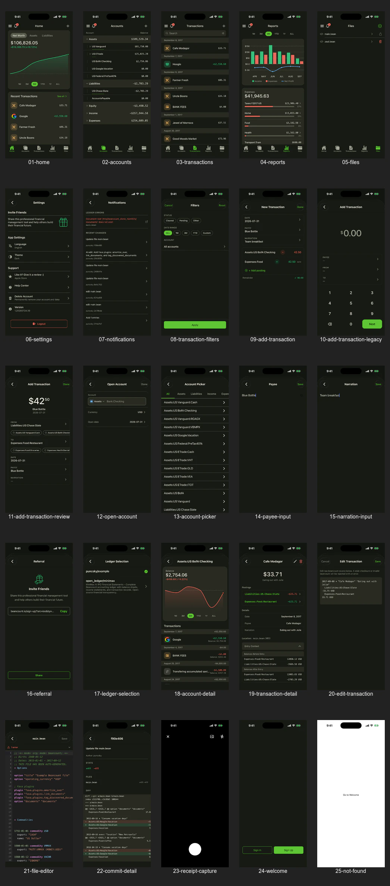

<p align="center">
  <a href="https://beancount.io/?utm_source=github.com&utm_medium=readme&utm_campaign=mobile_oss">
    
  </a>
</p>

<h1 align="center">Beancount Mobile</h1>

<p align="center">
  <strong>Plain-text accounting in your pocket.</strong>
  <br>
  The open-source iOS and Android client for Beancount.io, built with Expo and React Native.
</p>

<p align="center">
  <a href="https://github.com/bex-co/beancount-io"><strong>⭐ Star the project</strong></a>
  ·
  <a href="#product-tour">Product tour</a>
  ·
  <a href="#development">Run locally</a>
  ·
  <a href="../CONTRIBUTING.md">Contribute</a>
</p>

<p align="center">
  <a href="https://github.com/bex-co/beancount-io"></a>
  <a href="https://github.com/bex-co/beancount-io/actions/workflows/ci.yml"></a>
  <a href="../LICENSE"></a>
</p>

<p align="center">
  <a href="https://apps.apple.com/us/app/beancount/id1527950512"></a>
  &nbsp;
  <a href="https://play.google.com/store/apps/details?id=io.beancount.android"></a>
</p>

<p align="center"><sub>If open, programmable personal finance matters to you, starring the repository is the simplest way to help more people discover it.</sub></p>

## Built for daily financial work

Beancount Mobile Community Edition turns a Beancount.io ledger into a native workspace for checking your position, recording activity, and working directly with the source behind your books.

<p align="center">
  <a href="./docs/marketing-showcase/webp/01-home.webp"></a>
  <a href="./docs/marketing-showcase/webp/02-accounts.webp"></a>
  <a href="./docs/marketing-showcase/webp/04-reports.webp"></a>
</p>

- **Understand the whole picture** — follow net worth, assets, liabilities, spending, and account-level trends.
- **Set and track budgets** — give any account a spending or income target, then watch actuals against it period by period, with overages called out.
- **Record clean transactions** — enter balanced multi-posting transactions, reuse account suggestions, and scan receipts.
- **Investigate every entry** — search and filter the journal, inspect postings and balance context, then edit the underlying directive.
- **Work with the ledger itself** — browse and edit `.bean` files with syntax highlighting and review Git commit diffs.
- **Stay connected** — switch ledgers, review notifications, invite collaborators, and use light or dark themes.
- **Use your language** — the app ships with 13 locales and follows the device language when supported.

## Product tour

<p align="center">
  <a href="./docs/marketing-showcase/webp/09-add-transaction.webp"></a>
  <a href="./docs/marketing-showcase/webp/19-transaction-detail.webp"></a>
  <a href="./docs/marketing-showcase/webp/21-file-editor.webp"></a>
</p>

<details>
<summary><strong>See all 25 captured screens</strong></summary>

<br>

<a href="./docs/marketing-showcase/contact-all.webp"></a>

The individual full-resolution WebP files are in [`docs/marketing-showcase/webp/`](./docs/marketing-showcase/webp/).

</details>

## Development

Requires Node.js 20.19.4 or newer and Yarn Classic 1.22.

```zsh
git clone https://github.com/bex-co/beancount-io.git
cd beancount-io/mobile
yarn install
cp .env.template .env.local
yarn start
```

Expo will guide you to an iOS simulator, Android emulator, or connected device.

| Command                  | Purpose                                   |
| ------------------------ | ----------------------------------------- |
| `yarn ios`               | Build and launch the iOS app              |
| `yarn android`           | Build and launch the Android app          |
| `yarn lint`              | Run TypeScript and ESLint checks          |
| `yarn typecheck`         | Run strict TypeScript checking            |
| `yarn test:unit`         | Run the unit test suite                   |
| `yarn test`              | Run lint, typecheck, and unit tests       |
| `yarn codegen`           | Regenerate GraphQL types and hooks        |
| `yarn metadata:validate` | Validate localized App Store metadata     |
| `yarn screenshots:build` | Build all localized App Store screenshots |

The mobile client defaults to the hosted Beancount.io API. A signed-out user can tap the server icon on the welcome screen to connect the standard app to a compatible self-hosted Beancount.io deployment; enter its base URL (for example `https://ledger.example.com/`) and use **Test connection** for an advisory compatibility check. HTTPS is required in release builds. Development builds may use `http://localhost` for a local stack.

`EXPO_PUBLIC_SERVER_URL` remains the build-time default for development and branded builds. It is not a credential; keep actual credentials and private configuration out of committed `.env` files.

### Mobile OAuth contract

New sign-ins open the selected server in the iOS or Android system browser and
return to the app through `io.beancount.ios:/oauth/callback` or
`io.beancount.android:/oauth/callback`. The app discovers RFC 9728 protected
resource metadata and RFC 8414 authorization-server metadata from that selected
server, then validates the exact resource, issuer, endpoint origin, code-only
response support, S256 PKCE, and authorization-response issuer. A legacy server
that only passes the GraphQL health check is reported as incompatible.

The native client is public and has no client secret. Access and rotating
refresh credentials live only in the OS keychain/keystore. Concurrent requests
share one refresh; transient offline failures retain the account for retry,
while `invalid_grant` clears the server-scoped session and Apollo data. Tokens
are treated as opaque—the user is resolved by an authenticated GraphQL profile
query after the code exchange, never by decoding token claims in the app.

Logout attempts refresh-token revocation before clearing all local
server-scoped state. Because API access tokens are self-contained and last at
most one hour, one already issued token can remain valid until its expiry even
after refresh revocation; logout prevents the app from refreshing or reusing
it locally.

Existing installations with a valid legacy session JWT continue to work on
their issuing server. Once they log out, the app uses OAuth exclusively; there
is no session-to-refresh-token exchange. The dashboard's old WebView bridge is
compatibility-only. Remove it after both conditions hold: the stores' minimum
supported version is at least the first OAuth release, and the bounded
`legacy_mobile_auth_completed` event is zero for 30 consecutive days. That
event contains only the flow category—never a token, user, URL, or server. If
OAuth discovery or callback failures rise during rollout, keep the bridge for
older builds while rolling the new build back; do not route the new build back
to embedded authentication.

## Languages

English, Simplified Chinese, Bulgarian, Catalan, German, Spanish, Persian, French, Dutch, Portuguese, Russian, Slovak, and Ukrainian.

The app UI supports all 13. Canonical App Store metadata covers the 11 languages
Apple accepts through 14 regional localizations; Bulgarian and Persian inherit
the primary English store listing because App Store Connect offers neither
metadata locale. See the [localized App Store release workflow](./docs/app-store-localization.md).

## Contributing and support

Contributions are welcome across product UI, accessibility, translations, tests, and developer experience. Read the [contributing guide](../CONTRIBUTING.md), browse [mobile issues](https://github.com/bex-co/beancount-io/issues), or join the [Telegram community](https://t.me/beancount).

If you want this open-source mobile client to reach more people, [star Beancount.io on GitHub](https://github.com/bex-co/beancount-io).
